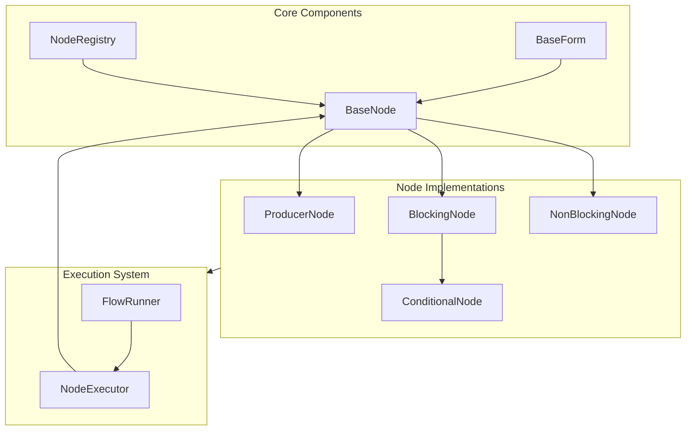
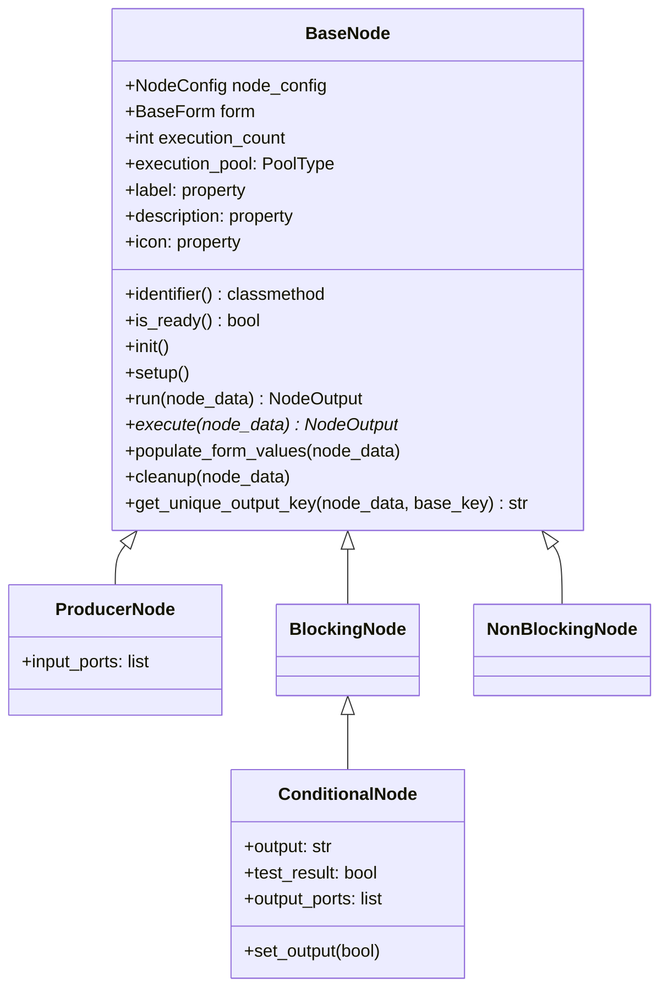
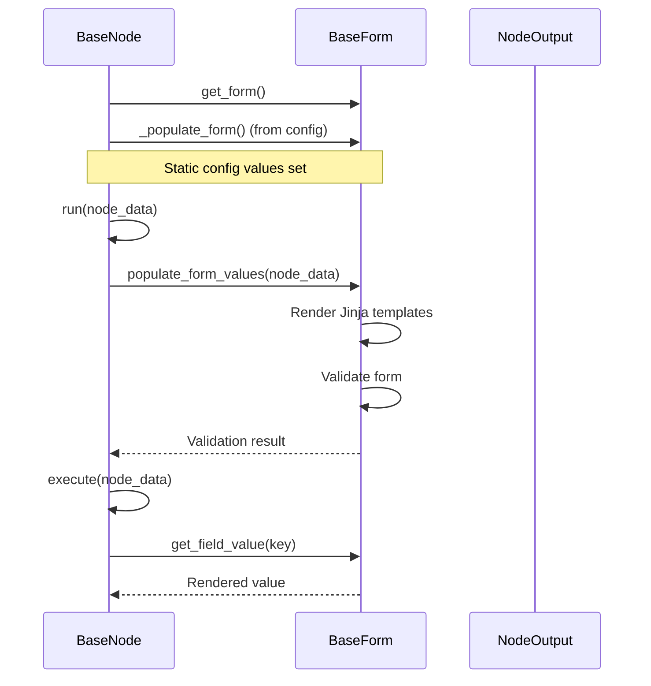
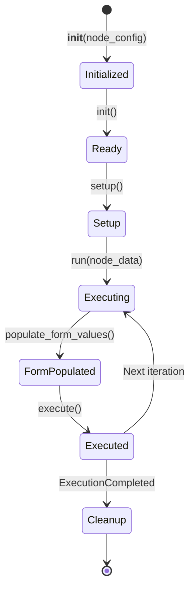
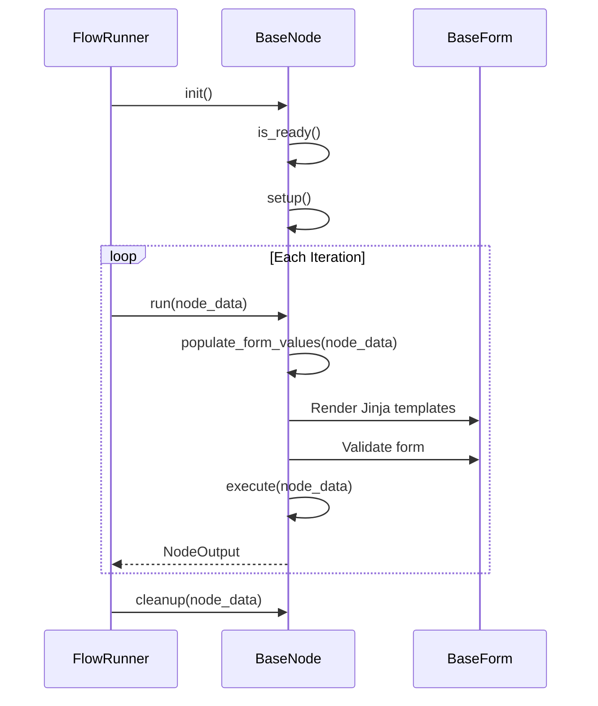
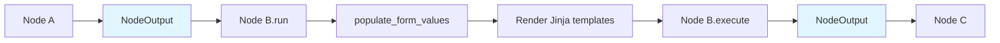

# Node System

The Node System is the extensible architecture that allows developers to create custom workflow steps. This document explains the BaseNode hierarchy, node types, lifecycle, core components, and all available node implementations.

## Overview

Nodes are the smallest executable units in a workflow. Each node inherits from `BaseNode` and implements an async `execute()` method. The system supports four fundamental node types, each with distinct execution semantics:

- **ProducerNode**: Starts loop iterations, no input ports
- **BlockingNode**: Performs work that must complete before continuation
- **NonBlockingNode**: Creates async boundaries, doesn't block downstream processing
- **ConditionalNode**: Conditional branching operations (extends BlockingNode)

## Architecture Overview

The Node system is organized into two main directories:

### Directory Structure

```
backend/core/Node/
├── Core/                    # Core infrastructure
│   ├── Node/               # Base node classes
│   │   └── Core/
│   │       ├── BaseNode.py          # Base node implementation
│   │       ├── BaseNodeMethod.py    # Node method definitions
│   │       ├── BaseNodeProperty.py  # Node property definitions
│   │       └── Data.py              # NodeConfig, NodeOutput, ExecutionCompleted
│   └── Form/               # Form system
│       └── Core/
│           ├── BaseForm.py           # Base form with dependency support
│           ├── DependencyHandler.py  # Field dependency cascading
│           ├── DependencyInjector.py # Dependency interface
│           └── FormSerializer.py    # Form serialization
└── Nodes/                  # Node implementations
    ├── Browser/            # Browser automation nodes
    ├── Data/                # Data processing nodes
    ├── Logical/             # Conditional logic nodes
    ├── System/              # System operation nodes
    ├── GoogleSheets/        # Google Sheets integration
    ├── WebPageParsers/      # Web page parsing
    ├── Counter/             # Counter operations
    ├── Delay/               # Delay/timing nodes
    └── Store/               # Storage operations
```

### System Architecture



## Core Components

### BaseNode System

The `BaseNode` class provides the foundation for all node implementations. It combines properties and methods from `BaseNodeProperty` and `BaseNodeMethod`.

#### Node Hierarchy

The base node implementation is defined in:

```35:305:backend/core/Node/Core/Node/Core/BaseNode.py
class BaseNode(BaseNodeProperty, BaseNodeMethod, ABC):
    """
    Dont Use This Class Directly. Use One of the Subclasses Instead.
    This class is used to define the base node class and is not meant to be instantiated directly.
    use for type hinting and inheritance.
    """
    
    def __init__(self, node_config: NodeConfig):
        self.node_config = node_config
        self.form = self.get_form()
        self._populate_form()
        self.execution_count = 0
    
    # ... lifecycle methods ...
    
    async def run(self, node_data: NodeOutput) -> NodeOutput:
        """
        Main entry point for node execution.
        Populates form values with runtime data, then executes the node.
        
        Args:
            node_data: The NodeOutput from previous node.
            
        Returns:
            NodeOutput: The result of node execution.
        """
        if isinstance(node_data, ExecutionCompleted):
            await self.cleanup(node_data)
            logger.warning("Cleanup completed", node_id=self.node_config.id, identifier=f"{self.__class__.__name__}({self.identifier()})")
            return node_data

        self.populate_form_values(node_data)
        output = await self.execute(node_data)
        self.execution_count += 1
        return output

# Node type definitions
class ProducerNode(BaseNode, ABC):
    """
    Marks loop start. Called first each iteration.
    Starts and controls the loop. Controls timing and triggers downstream nodes.
    """
    
    @property
    def input_ports(self) -> list:
        """Producer nodes have no input ports - they start the flow."""
        return []

class BlockingNode(BaseNode, ABC):
    """
    Performs work that must be completed prior to continuation.
    The LoopManager awaits the Blocking node and all downstream Blocking children 
    in its async chain to complete before proceeding.
    """
    pass

class NonBlockingNode(BaseNode, ABC):
    """
    Semantically marks loop-end in the execution model.
    Performs a computation or transformation but does not force the Producer 
    to wait for downstream operations.
    """
    pass

class ConditionalNode(BlockingNode, ABC):
    """
    Base class for logical/conditional nodes that perform decision-making operations.
    Inherits from BlockingNode, ensuring logical operations complete before continuation.
    """
    def __init__(self, config: NodeConfig):
        super().__init__(config)
        self.output: Optional[str] = None
        self.test_result = False

    @property
    def output_ports(self) -> list:
        """Conditional nodes have 'yes' and 'no' output branches."""
        return [
            {"id": "yes", "label": "Yes"},
            {"id": "no", "label": "No"}
        ]

    def set_output(self, output: bool):
        self.test_result = output
        self.output = "yes" if output else "no"
```



#### Node Types

**ProducerNode**
- **Purpose**: Starts loop iterations. Called first each iteration.
- **Characteristics**:
  - Marks loop start
  - Controls timing and triggers downstream nodes
  - No input ports (starts the flow)
  - When iteration completes, FlowRunner returns control to Producer
- **Examples**: `QueueReader`, `CounterNode`, `StringIterator`

**BlockingNode**
- **Purpose**: Performs work that must complete before continuation.
- **Characteristics**:
  - Executes sequentially in the async chain
  - FlowRunner awaits Blocking node and all downstream Blocking children
  - Forms strict sequential async paths
  - Must complete before Producer continues
- **Examples**: `WebPageLoader`, `GoogleSheetsGetRow`, `IfCondition`, `FileWriter`

**NonBlockingNode**
- **Purpose**: Creates async boundaries. Does not block downstream processing.
- **Characteristics**:
  - Does not force Producer to wait
  - Execution continues after NonBlockingNode
  - Useful for offloading long side-effects asynchronously
- **Examples**: `QueueWriter`

**ConditionalNode**
- **Purpose**: Conditional branching operations. Extends BlockingNode.
- **Characteristics**:
  - Inherits from BlockingNode
  - Provides `set_output(bool)` method
  - Routes execution to "yes" or "no" branch
  - `output` property holds branch direction ("yes" or "no")
  - Has `output_ports` property with "yes" and "no" branches
- **Examples**: `IfCondition`

### Form System

The Form system provides configuration and validation for nodes using Django forms with Jinja template support.

#### Key Features

- **Jinja Template Rendering**: Form fields can contain `{{ data.key }}` templates that are rendered at runtime
- **Field Dependencies**: Cascading field dependencies for related fields
- **Validation**: Full Django form validation after template rendering
- **Location**: `Core/Form/Core/BaseForm.py`

The base form implementation is in:

```35:255:backend/core/Node/Core/Form/Core/BaseForm.py
class BaseForm(DependencyInjector, forms.Form, metaclass=FormABCMeta):
    """
    Base form class that provides cascading field dependency functionality.
    All forms with dependent fields should inherit from this class.
    
    Architecture:
    - This class handles: field values, validation, form rebinding
    - DependencyHandler handles: cascading field dependencies
    
    Child forms MUST implement:
    1. get_field_dependencies() - Returns mapping of parent fields to dependent fields
    2. populate_field(field_name, parent_value) - Returns choices for dependent field
    """
    
    def __init__(self, *args, **kwargs):
        super().__init__(*args, **kwargs)
        self._incremental_data = {}
        # Initialize dependency handler (SRP: separate class for dependencies)
        self._dependency_handler = DependencyHandler(self)
        self._dependency_handler.initialize_dependencies()
    
    def get_field_dependencies(self):
        """
        REQUIRED: Define which fields depend on which parent fields.
        """
        pass

    def populate_field(self, field_name, parent_value, form_values=None):
        """
        REQUIRED: Provide choices for dependent fields based on parent value.
        
        Args:
            field_name: Name of the dependent field to populate
            parent_value: Value of the immediate parent field
            form_values: All current form values for multi-parent access (optional)
            
        Returns:
            list: List of (value, label) tuples for field choices
        """
        return []
    
    # ... more methods ...
```

#### Form Lifecycle



#### Template Rendering Example

```python
# Form field with Jinja template
{
  "form": {
    "url": "https://example.com/user/{{ data.user_id }}",
    "message": "Hello {{ data.user_name }}, your score is {{ data.score }}"
  }
}

# Rendered at runtime with NodeOutput.data
{
  "url": "https://example.com/user/123",
  "message": "Hello John, your score is 95"
}
```

### Node Registry

The `NodeRegistry` automatically discovers all node classes in the `Node.Nodes` package.

#### Discovery Process

```mermaid
flowchart TD
    A[NodeRegistry.create_node] --> B{Registry Loaded?}
    B -->|No| C[_discover_node_classes]
    B -->|Yes| D[Get Node Class]
    C --> E[Walk Node.Nodes Package]
    E --> F[Import Modules]
    F --> G[Find Node Classes]
    G --> H[Check Inheritance]
    H --> I[Get identifier()]
    I --> J[Build Registry Dict]
    J --> D
    D --> K[Instantiate Node]
    K --> L[Return BaseNode]
```

#### Discovery Algorithm

1. **Walk Packages**: Uses `pkgutil` to walk through all subpackages of `Node.Nodes`
2. **Import Modules**: Imports each module in the package tree
3. **Filter Classes**: Identifies classes that inherit from `ProducerNode`, `BlockingNode`, or `NonBlockingNode`
4. **Exclude Abstract**: Filters out abstract base classes
5. **Register**: Maps each node's `identifier()` to its class

## Node Execution Flow

### Lifecycle

Every node follows a well-defined lifecycle managed by FlowRunner (Production Mode) or FlowEngine (Development Mode).



### Lifecycle Methods

| Method | When Called | Purpose |
|--------|-------------|---------|
| `__init__(node_config)` | Workflow loading | Initialize node with static configuration |
| `init()` | Before first execution | Validate node readiness and call `setup()` |
| `setup()` | Called by `init()` | Initialize resources (DB connections, API clients) |
| `run(node_data)` | Each iteration | Entry point - populates form values, then calls `execute()` |
| `populate_form_values(node_data)` | During `run()` | Render Jinja templates in form fields |
| `execute(node_data)` | Each iteration | Core business logic implementation |
| `cleanup(node_data)` | Shutdown or ExecutionCompleted | Release resources (connections, file handles) |

### Execution Flow



### Data Flow Between Nodes



### NodeOutput Structure

The NodeOutput data structure is defined in:

```48:75:backend/core/Node/Core/Node/Core/Data.py
class NodeOutput(BaseModel):
    """
    Runtime payload for the iteration.
    """

    id: str = Field(
        default_factory=lambda: str(uuid4()),
        description="Unique identifier for this unit of work",
    )
    data: Dict[str, Any] = Field(default_factory=dict, description="Main data payload")

    metadata: Optional[Union[NodeOutputMetaData, Dict[str, Any]]] = Field(
        default_factory=dict, description="Optional metadata"
    )

    def to_dict(self) -> Dict[str, Any]:
        return self.model_dump()


class ExecutionCompleted(NodeOutput):
    """
    Sentinel signal indicating that the workflow execution should stop/cleanup.
    Unlike normal NodeOutput, this payload triggers cleanup() instead of execute().
    """
    metadata: Optional[Union[NodeOutputMetaData, Dict[str, Any]]] = Field(
        default_factory=lambda: {"__execution_completed__": True}
    )
```

## Available Nodes

### Browser Nodes

Browser nodes provide web automation capabilities using Playwright.

#### WebPageLoader
- **Identifier**: `playwright-web-page-loader`
- **Type**: BlockingNode
- **Goal**: Load webpages using Playwright browser automation
- **Execution Pool**: ASYNC
- **Key Features**:
  - Persistent browser sessions
  - Configurable wait modes (load, networkidle)
  - Extracts page title and content
- **Output**: `webpage_loader` with url, title, content, session_name

#### SendConnectionRequest
- **Identifier**: `linkedin-send-connection-request`
- **Type**: BlockingNode
- **Goal**: Send LinkedIn connection requests via browser automation
- **Execution Pool**: ASYNC
- **Key Features**:
  - LinkedIn profile automation
  - Send connection requests
  - Follow profiles
- **Output**: `send_connection_request` with connection_request_status, follow_status, profile_url

### Data Nodes

Data nodes handle data processing and iteration.

#### StringIterator
- **Identifier**: `string-iterator-producer`
- **Type**: ProducerNode
- **Goal**: Iterate over string data with configurable separators
- **Execution Pool**: ASYNC
- **Key Features**:
  - Supports newline, comma, or custom separators
  - Yields one item per iteration
  - Returns ExecutionCompleted when done
- **Output**: `string_iterator` with value and iteration_index

### Logical Nodes

Logical nodes provide conditional branching and decision-making.

#### IfCondition
- **Identifier**: `if-condition`
- **Type**: ConditionalNode
- **Goal**: Evaluate conditional expressions for workflow branching
- **Execution Pool**: ASYNC
- **Key Features**:
  - Evaluates Python expressions with `data` context
  - Routes to "yes" or "no" branch
  - Supports complex conditional logic
- **Output**: `if_condition` with route, expression, result

### System Nodes

System nodes provide system-level operations and queue management.

#### QueueReader
- **Identifier**: `queue-reader-dummy`
- **Type**: ProducerNode
- **Goal**: Pop workflow data from queues to start loop iterations
- **Execution Pool**: ASYNC
- **Key Features**:
  - Blocks until data is available
  - Detects ExecutionCompleted sentinel
  - Starts workflow loop iterations
- **Output**: NodeOutput from queue or ExecutionCompleted

#### QueueWriter
- **Identifier**: `queue-node-writer`
- **Type**: NonBlockingNode
- **Goal**: Push workflow data to queues for cross-loop communication
- **Execution Pool**: ASYNC
- **Key Features**:
  - Non-blocking queue writes
  - Pushes sentinel pill on cleanup
  - Enables cross-loop communication
- **Output**: Passes through input data unchanged

### GoogleSheets Nodes

Google Sheets nodes provide integration with Google Sheets for data operations.

#### GoogleSheetsGetRow
- **Identifier**: `google-sheets-get-row`
- **Type**: BlockingNode
- **Goal**: Retrieve a specific row from a Google Spreadsheet with header mapping
- **Execution Pool**: THREAD
- **Key Features**:
  - Row retrieval by row number
  - Header mapping for easy access
  - Supports custom header row
- **Output**: `google_sheets` with values, headers, data (dict), row_number, sheet_name, spreadsheet_id

#### GoogleSheetsGetRecordByQuery
- **Identifier**: `google-sheets-get-record-by-query`
- **Type**: BlockingNode
- **Goal**: Query records from Google Sheet by column conditions
- **Execution Pool**: THREAD
- **Key Features**:
  - Query by multiple column conditions
  - Supports operators: equals, contains, etc.
  - Returns first matching row
- **Output**: `google_sheets` with matched row data

#### GoogleSheetsGetRecordByQueryProvider
- **Identifier**: `google-sheets-get-record-by-query-provider`
- **Type**: ProducerNode
- **Goal**: Provider node for query-based record retrieval
- **Execution Pool**: THREAD
- **Key Features**:
  - Acts as ProducerNode for query-based workflows
  - Similar query capabilities to GetRecordByQuery

#### GoogleSheetsUpdateRow
- **Identifier**: `google-sheets-update-row`
- **Type**: BlockingNode
- **Goal**: Update a specific row in a Google Spreadsheet using header mapping
- **Execution Pool**: THREAD
- **Key Features**:
  - Updates by row number
  - Header-based column mapping
  - Returns update results
- **Output**: `google_sheets` with updated_cells, updated_range, row_number, matched_headers

### WebPageParsers Nodes

WebPageParsers nodes provide specialized web scraping and parsing capabilities.

#### LinkedinProfileParser
- **Identifier**: `linkedin-profile-parser`
- **Type**: BlockingNode
- **Goal**: Parse LinkedIn profile HTML content
- **Execution Pool**: ASYNC
- **Key Features**:
  - Extracts structured data from LinkedIn profiles
  - Uses specialized LinkedIn extractors
  - Returns parsed profile information
- **Output**: `parsed_linkedin_profile` with extracted profile data

### Counter Nodes

Counter nodes provide counting and iteration functionality.

#### CounterNode
- **Identifier**: `counter`
- **Type**: ProducerNode
- **Goal**: Stateful counter that iterates between min and max values
- **Execution Pool**: ASYNC
- **Key Features**:
  - Increment or decrement modes
  - Configurable step size
  - Returns ExecutionCompleted when bounds exceeded
- **Output**: `counter` with current, min, max, step, direction, iteration

### Delay Nodes

Delay nodes introduce timing and delays in workflows.

#### StaticDelay
- **Identifier**: `static-delay-node`
- **Type**: BlockingNode
- **Goal**: Block execution for a fixed time interval
- **Execution Pool**: ASYNC
- **Key Features**:
  - Fixed delay duration
  - Supports seconds, minutes, hours, days, months
  - Useful for rate limiting
- **Output**: Passes through input data with delay metadata

#### DynamicDelay
- **Identifier**: `dynamic-delay-node`
- **Type**: BlockingNode
- **Goal**: Randomized delays that sum to exact target time
- **Execution Pool**: ASYNC
- **Key Features**:
  - Pre-computes randomized delays
  - Ensures exact total time across executions
  - Configurable jitter percentage
  - Stores delay list in Redis cache
- **Output**: Passes through input data with delay metadata

### Store Nodes

Store nodes handle file and storage operations.

#### FileWriter
- **Identifier**: `file-writer`
- **Type**: BlockingNode
- **Goal**: Write workflow data to files
- **Execution Pool**: ASYNC
- **Key Features**:
  - Write or append modes
  - JSON serialization support
  - Writes to `bin/FileWritter/` directory
- **Output**: Passes through input data unchanged

## Node Discovery System

### Auto-Discovery

All nodes are automatically discovered by `NodeRegistry` when first accessed. The discovery process:

1. Walks the `Node.Nodes` package tree
2. Imports all modules
3. Finds classes inheriting from `ProducerNode`, `BlockingNode`, or `NonBlockingNode`
4. Excludes abstract base classes
5. Maps `identifier()` to class in registry

### Node Identifier Convention

- Use **kebab-case** for identifiers (e.g., `"queue-reader"`, `"if-condition"`)
- The identifier in the workflow JSON `type` field must match exactly
- Example: `identifier()` returns `"http-request"` → JSON uses `"type": "http-request"`

### Registration Flow

```mermaid
flowchart TD
    A[Node.Nodes Package] --> B[NodeRegistry Discovery]
    B --> C[Walk Package Tree]
    C --> D[Import Modules]
    D --> E[Find Node Classes]
    E --> F[Check Inheritance]
    F --> G[Get identifier()]
    G --> H[Register in Dict]
    H --> I[Available for Use]
```

## Implementation Details

### Execution Pools

Nodes specify their execution pool via the `execution_pool` property:

- **ASYNC**: Default for I/O-bound operations (HTTP, database, file I/O)
- **THREAD**: For CPU-bound tasks that can release GIL (e.g., Google Sheets API calls)
- **PROCESS**: For CPU-intensive Python code requiring true parallelism (rarely used)

### Form Validation

The `is_ready()` method validates nodes before execution:

- **For non-template fields**: Performs full Django field validation
- **For Jinja template fields** (containing `{{ }}`): Only checks that required fields are not empty
- **Full validation** of template fields occurs after rendering in `populate_form_values()`

### Error Handling

- **Form Validation**: Raises `FormValidationError` if form validation fails after template rendering
- **Node Not Ready**: Raises `ValueError` if `is_ready()` returns False
- **Execution Errors**: Logged by FlowRunner, iteration continues with fail-fast policy

### Unique Output Keys

Nodes use `get_unique_output_key()` to prevent overwriting data when multiple instances of the same node type are used:

```python
output_key = self.get_unique_output_key(node_data, "google_sheets")
# Returns: "google_sheets", "google_sheets_2", "google_sheets_3", etc.
```

### Best Practices

1. **Use async/await**: All I/O operations should be async
2. **Initialize in setup()**: Don't initialize resources in `__init__()`
3. **Clean up resources**: Implement `cleanup()` for connections, file handles
4. **Validate forms**: Use Django form validation
5. **Use unique output keys**: Call `get_unique_output_key()` to avoid overwriting data
6. **Single Responsibility**: Each node should do one thing well
7. **Proper Type**: Choose correct node type (Producer, Blocking, NonBlocking, Conditional)

## Related Documentation

- [Node System Documentation](../../docs/04-Node-System.md) - Detailed node architecture
- [Node Types Documentation](../../docs/05-Node-Types.md) - Available node implementations
- [Execution System](../../docs/03-Execution-System.md) - How nodes are executed
- [Form System](../../docs/07-Form-System.md) - Form architecture and Jinja templates
- [Adding New Nodes](../../docs/09-Adding-New-Nodes.md) - Step-by-step guide for creating nodes

