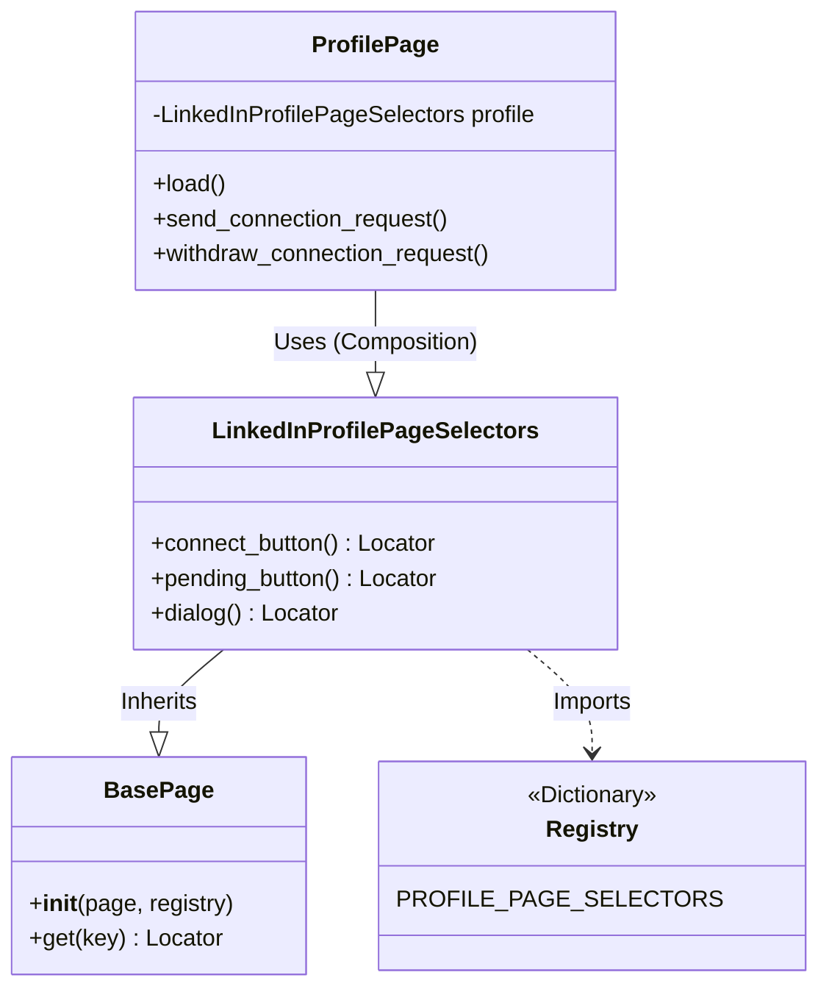
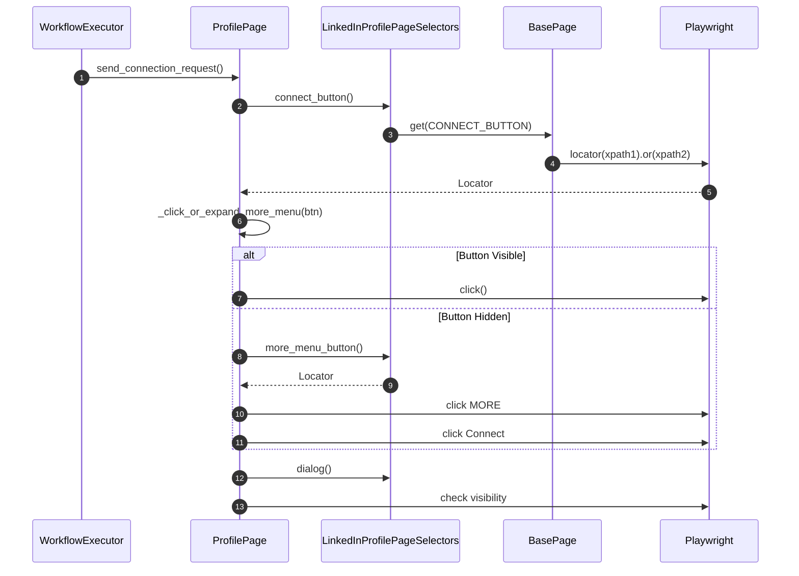

# LinkedIn Connection Automation Architecture

## Overview
This module provides a robust, asynchronous system for automating LinkedIn interactions, specifically focusing on sending connection requests, following/unfollowing, and withdrawing requests. It leverages **Playwright** for browser automation and strictly separates **Business Logic** from **Selector Implementation**.

## Directory Structure

```text
automation/
├── linkedin/
│   ├── __init__.py                 # Exports ProfilePage
│   ├── profile_page.py             # Business Logic: Managing interactions (Connect, Follow, etc.)
│   └── selectors/                  # Selector Layer
│       ├── base_page.py            # Base Selector Class: Handles resolution and caching
│       ├── profile_page.py         # Profile Selectors: Typed accessors for Profile Page elements
│       └── core/                   # Core definitions
│           ├── profile_page.py     # Registry: Raw XPath mappings
│           └── keys/               # Keys
│               └── profile_page.py # Enum keys for selectors
```

## Key Components

### 1. Business Logic (`automation/linkedin/profile_page.py`)
- **Class**: `ProfilePage`
- **Responsibility**: Manages high-level user flows and decision making. It does *not* contain XPaths.
- **Features**:
    - **Status Management**: Checks `ConnectionStatus` (Connected, Pending, Not Connected) and `FollowingStatus`.
    - **Actions**: `load()`, `send_connection_request()`, `withdraw_connection_request()`, `follow_profile()`, `unfollow_profile()`.
    - **Smart Interaction**: Handles "More" menus automatically (if a button is hidden) and manages Dialogs (e.g., "Add a note").

### 2. Selector Layer (`automation/linkedin/selectors/`)
This layer is responsible for finding elements on the page. It abstracts the raw XPaths away from the business logic.

- **`BasePage` (`selectors/base_page.py`)**:
    - The foundation for selector classes.
    - **Registry-Based Resolution**: Takes a `registry` dict and resolves selectors by key.
    - **Chained Fallbacks**: If a key has multiple selectors (e.g., different XPaths for A/B tests), it combines them using Playwright's `.or_()` to create a robust locator.
    - **Caching**: Caches resolved locators for performance.

- **`LinkedInProfilePageSelectors` (`selectors/profile_page.py`)**:
    - Inherits from `BasePage`.
    - Provides **Typed Methods** (e.g., `connect_button() -> Locator`) instead of generic `get()`.
    - Uses `ProfilePageKey` to look up definitions in the registry.

- **Registry (`selectors/core/profile_page.py`)**:
    - A dictionary mapping `ProfilePageKey` to a list of XPaths.
    - Pure data, no logic.

### 3. Execution Entry Point
- **`workflow_executor.py`** (Root Directory):
    - Orchestrates the automation.
    - Launches the browser (using `browser.py`).
    - Instantiates `ProfilePage` and runs the desired methods.

## Diagrams

### 1. Class Relationships
This diagram shows how the Business Logic uses the Selector Layer.



### 2. Interaction Flow
Example: Sending a Connection Request


