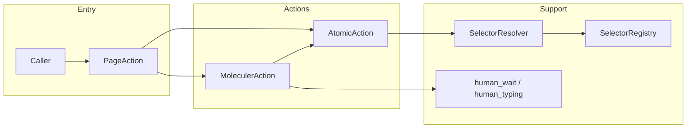
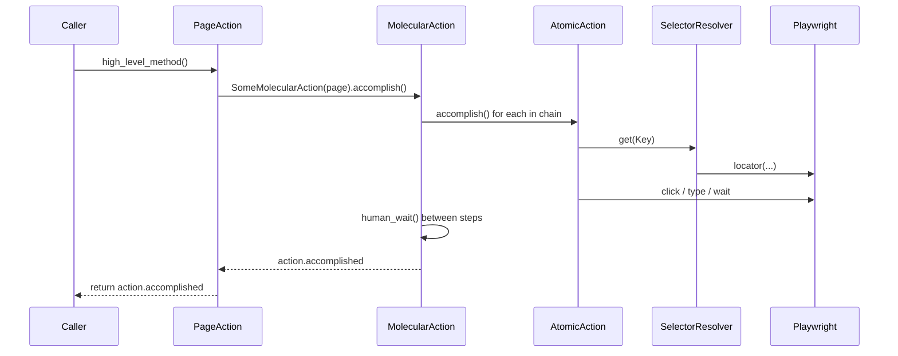

# Browser Automation Architecture

## Overview

This module provides an asynchronous, multi-site browser automation framework built on **Playwright**. A **core** package supplies reusable building blocks: an action hierarchy (atomic, molecular, page-level), a selector resolution system, delay configuration, and human-like wait/typing helpers. **Site packages** implement specific domains and pages by defining selectors and actions that use core. Adding a new site or page follows a consistent pattern so anyone can extend the automation to more targets.

## Directory structure

Generic layout:

```text
automation/
├── core/                          # Site-agnostic framework
│   ├── actions.py                 # AtomicAction, MoleculerAction, PageAction
│   ├── selector_resolver.py       # SelectorResolver
│   ├── models.py                  # SelectorEntry, SelectorRegistry
│   ├── delays.py                  # DelayConfig, jitter_ms
│   └── human_behavior.py          # human_wait, human_typing
├── <site>/                        # One package per site (e.g. linkedin)
│   ├── utils.py                   # Site-level helpers (e.g. URL validation)
│   └── page/
│       └── <page_name>/           # One folder per page (e.g. profile_page)
│           ├── actions/          # base_action, atomic_action, molecular_action, page_action
│           └── selectors/         # selector_keys, selector_registry, selector_resolver
└── test/                          # Example scripts
```

**Example: LinkedIn** implements a profile page with connection and follow/unfollow flows. It follows the pattern above: `linkedin/page/profile_page/actions/` (base_action, atomic_action, molecular_action, page_action, profile_state) and `linkedin/page/profile_page/selectors/` (selector_keys, selector_registry, selector_resolver).

---

## Core package

The core package lives under `core/` and has no dependency on any specific site. All site implementations depend on it.

### Actions (`core/actions.py`)

- **AtomicAction:** A single browser step. Subclasses implement `perform_action()` and `verify_action()`. The base method `accomplish()` runs both in sequence and **centralizes exception handling**: on any exception it logs (with traceback) and sets `_accomplished = False`. Callers check `action.accomplished` after `await action.accomplish()`.
- **MoleculerAction:** Subclass of AtomicAction. Holds a `chain_of_actions` list. `execute_chain_of_actions()` runs each action’s `accomplish()` with `human_wait()` between steps and stops on first failure. `perform_action()` runs the chain; `verify_action()` returns the resulting `_accomplished` state.
- **PageAction (ABC):** Abstract base with a `page` (Playwright Page) and `is_valid_page()`. Concrete page implementations (e.g. a profile page orchestrator) extend PageAction and expose high-level methods that build and run the appropriate Molecular or Atomic actions.

### Selector system

- **Models** (`core/models.py`):  
  - **SelectorEntry:** Pydantic model with `key` (enum), `selectors` (list of XPath/CSS strings), and optional `parent` key for scoping. First selector is primary; others are used as fallbacks via `.or_()`.  
  - **SelectorRegistry:** Generic over the key enum. You `register(SelectorEntry)` for each key; the registry validates that parent keys are registered before children. Duplicate key raises.
- **SelectorResolver** (`core/selector_resolver.py`): Takes a Playwright `Page` and a `SelectorRegistry`. `get(key)` resolves the parent hierarchy from the registry, builds a Playwright locator (with fallbacks), and caches by key. Any site can subclass SelectorResolver, pass its own registry, and add typed accessors (e.g. `connect_button()`) that call `get(SomeKey)`.

### Delays (`core/delays.py`)

- **DelayConfig:** Pydantic model with `min_ms` and `max_ms` (validated: min ≤ max). Used wherever a bounded random delay is needed.
- **jitter_ms(config):** Returns a random integer in `[min_ms, max_ms]` for use in custom flows or by human_behavior.

### Human behavior (`core/human_behavior.py`)

- **human_wait(page, config):** Waits a random delay (via `jitter_ms(config)`) to mimic human pause. Uses `DelayConfig`.
- **human_typing(locator, text, config):** Types text character-by-character with a random delay per key. Uses `DelayConfig` and `jitter_ms`. Both are reusable across any site.

---

## Pattern for adding a site and a page

To add automation for a new site or a new page type:

1. **Site package:** Create a top-level package (e.g. `mysite/`). Add `utils.py` for site-level helpers (e.g. URL validation, ID extraction). Optionally add `__init__.py` that exports the main page action(s).

2. **Page layout:** Under the site, use `page/<page_name>/` with two subpackages:
   - **actions:**  
     - `base_action.py`: A mixin that injects a page-specific SelectorResolver (e.g. `self.selectors = MyPageSelectors(self.page)`) and any page-specific helpers (e.g. status checks, wait-for-dialog). Define base classes that combine this mixin with core `AtomicAction` and `MoleculerAction` so concrete actions have access to selectors and helpers.  
     - `atomic_action.py`: Concrete atomic steps (e.g. click button, fill input) that use the resolver and implement `perform_action()` and `verify_action()`.  
     - `molecular_action.py`: Concrete chains that compose atomic actions and optionally check page state before running the chain.  
     - `page_action.py`: Concrete `PageAction` that exposes high-level methods (e.g. `send_request()`, `withdraw_request()`); each method builds the right Molecular/Atomic action, calls `await action.accomplish()`, and returns `action.accomplished`.  
     - Optional: a small module (e.g. `profile_state.py`) for page-specific enums used by actions (e.g. connection status, follow status).
   - **selectors:**  
     - `selector_keys.py`: An enum of all selector keys for that page (e.g. `CONNECT_BUTTON`, `DIALOG`).  
     - `selector_registry.py`: Build a `SelectorRegistry`, create `SelectorEntry` per key (with key, selectors list, optional parent), and call `registry.register(entry)` for each. Export the filled registry (e.g. `PAGE_SELECTORS`).  
     - `selector_resolver.py`: Subclass core `SelectorResolver`; in `__init__` pass the page and the registry. Expose `get(Key)` and optionally typed methods that delegate to `get(SomeKey)`.

3. **Flow:** The caller obtains a Playwright `Page` (e.g. after navigating to a URL), instantiates the page’s PageAction with that page, and calls high-level methods. PageAction builds the corresponding Molecular or Atomic actions and calls `accomplish()`. Those actions use the page’s resolver to get locators and perform/verify steps; molecular actions use `human_wait()` between steps (from core).

---

## Key components (summary)

| Layer | Responsibility |
|-------|----------------|
| **Core actions** | AtomicAction (one step, perform + verify, centralized exception handling); MoleculerAction (chain + human_wait); PageAction (abstract entry point). |
| **Core selectors** | SelectorEntry (key, selectors, parent); SelectorRegistry (register entries, validate order); SelectorResolver (get(key) → locator, cache, parent resolution). |
| **Core delays / human** | DelayConfig, jitter_ms; human_wait, human_typing. |
| **Site** | Utils (e.g. URL validation); one or more pages. |
| **Page** | base_action (mixin + resolver + helpers); atomic_action; molecular_action; page_action; selectors (keys, registry, resolver). |

---

## Class relationships


```mermaid
flowchart LR
  subgraph entry [Entry]
    Caller[Caller]
    PageAction[PageAction]
  end
  subgraph actions [Actions]
    Atomic[AtomicAction]
    Molecular[MoleculerAction]
  end
  subgraph support [Support]
    Resolver[SelectorResolver]
    Registry[SelectorRegistry]
    Human[human_wait / human_typing]
  end
  Caller --> PageAction
  PageAction --> Molecular
  PageAction --> Atomic
  Molecular --> Atomic
  Atomic --> Resolver
  Molecular --> Human
  Resolver --> Registry
```

---

## Interaction flow (generic)


```mermaid
sequenceDiagram
  participant Caller
  participant PageAction
  participant Molecular as MolecularAction
  participant Atomic as AtomicAction
  participant Resolver as SelectorResolver
  participant Playwright as Playwright

  Caller->>PageAction: high_level_method()
  PageAction->>Molecular: SomeMolecularAction(page).accomplish()
  Molecular->>Atomic: accomplish() for each in chain
  Atomic->>Resolver: get(Key)
  Resolver->>Playwright: locator(...)
  Atomic->>Playwright: click / type / wait
  Molecular->>Molecular: human_wait() between steps
  Molecular-->>PageAction: action.accomplished
  PageAction-->>Caller: return action.accomplished
```

---

## Design notes

- **Exception handling:** Centralized in `AtomicAction.accomplish()`. Implementations of `perform_action()` and `verify_action()` do not need their own try/except; failures are logged with traceback and `_accomplished` is set to False.
- **Selectors:** Registry, resolver, and keys are defined per page; core only defines the contract (SelectorEntry, SelectorRegistry, SelectorResolver). Each site/page builds its own registry and resolver subclass.
- **Molecular flows:** A molecular action can check page-specific state (e.g. connection status) before running its chain. If the state does not allow the flow, it logs and does not set `_accomplished` to True. This pattern is reusable for any site that has gated flows.
