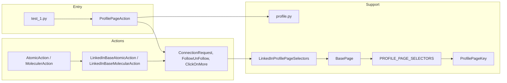
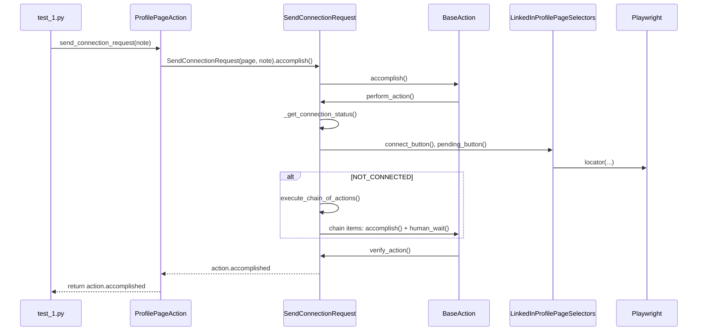

# LinkedIn Connection Automation Architecture

## Overview
This module provides an asynchronous system for automating LinkedIn profile interactions: sending and withdrawing connection requests, and following or unfollowing profiles. It uses **Playwright** for browser automation and separates **orchestration** (ProfilePageAction), **actions** (atomic and molecular), **validation** (profile URL), and **selectors**.

## Entry points
- **Public API:** `linkedin/__init__.py` exports `ProfilePageAction`.
- **Usage:** Callers (e.g. `test/test_1.py`) obtain a Playwright `Page` (after navigating to a LinkedIn profile URL), create `ProfilePageAction(page)`, then call:
  - `send_connection_request(note="")`
  - `withdraw_connection_request()`
  - `follow_profile()`
  - `unfollow_profile()`
- **Flow:** Each method instantiates the corresponding action with `self.page`, calls `await action.accomplish()`, logs success or failure, and returns `action.accomplished`.

## Directory structure

```text
automation/
├── linkedin/
│   ├── __init__.py              # Exports ProfilePageAction
│   ├── profile.py                # URL validation: is_valid_linkedin_profile_url, extract_profile_user_id
│   ├── profile_page.py           # Orchestration: ProfilePageAction
│   ├── actions/
│   │   ├── BaseAction.py         # AtomicAction, MoleculerAction, PageAction
│   │   ├── LinkedInBaseAction.py # LinkedInProfilePageMixin, LinkedInBaseAtomicAction, LinkedInBaseMolecularAction
│   │   ├── ClickOnMoreButtonAction.py
│   │   ├── ConnectionRequest.py  # Connection-related atomic and molecular actions
│   │   ├── FollowUnFollow.py     # Follow/unfollow actions
│   │   └── utils.py              # human_type, human_wait
│   ├── enums/
│   │   └── Status.py             # ConnectionStatus, FollowingStatus
│   └── selectors/
│       ├── base_page.py          # BasePage: get(key), parent resolution, cache, .or_() fallbacks
│       ├── profile_page.py       # LinkedInProfilePageSelectors (typed accessors)
│       └── core/
│           ├── profile_page.py  # PROFILE_PAGE_SELECTORS registry
│           └── keys/profile_page.py  # ProfilePageKey enum
└── test/
    ├── test_1.py                 # Example test script
    └── setup_logging.py          # Optional: Rich console logging for tests
```

## Key components

### 1. Validation (`linkedin/profile.py`)
- **Responsibility:** Determine if a URL is a valid LinkedIn profile and extract the profile user id.
- **Functions:**
  - `is_valid_linkedin_profile_url(url: str) -> bool`
  - `extract_profile_user_id(url: str) -> str | None` (path must be `in/<id>` on `www.linkedin.com`).

### 2. Orchestration: ProfilePageAction (`linkedin/profile_page.py`)
- **Responsibility:** Orchestrate profile flows; delegate to action classes. Does not contain selectors or URL parsing logic.
- **Constructor:** Uses `is_valid_linkedin_profile_url` and `extract_profile_user_id` from `profile.py`; sets `profile_url`, `user_id`; raises `ValueError` if URL is invalid.
- **Public methods:** `follow_profile()`, `unfollow_profile()`, `send_connection_request(note="")`, `withdraw_connection_request()` — each builds the corresponding action and calls `accomplish()`.

### 3. Actions (`linkedin/actions/`)

**BaseAction.py**
- **AtomicAction:** One browser step. Subclasses implement `perform_action()` and `verify_action()`. `accomplish()` runs both, sets `_accomplished`, and **centralizes exception handling** (try/except; on exception logs and sets `_accomplished = False`).
- **MoleculerAction(AtomicAction):** Holds `chain_of_actions`. `execute_chain_of_actions()` runs each action’s `accomplish()` and `human_wait()` between them; stops on first failure. `perform_action()` runs the chain; `verify_action()` returns `_accomplished`.
- **PageAction(ABC):** Abstract base with `page` and `is_valid_page()`; used by ProfilePageAction.

**LinkedInBaseAction.py**
- **LinkedInProfilePageMixin:** Injects `self.profile = LinkedInProfilePageSelectors(self.page)` and helpers:
  - `_get_connection_status() -> ConnectionStatus`
  - `_get_following_status() -> FollowingStatus`
  - `_wait_for_dialog(context) -> Locator | None`
- **LinkedInBaseAtomicAction:** For atomic actions that need the profile and the three helpers.
- **LinkedInBaseMolecularAction:** For molecular actions that need the same.

**Concrete actions**
- **ConnectionRequest.py:** ClickOnConnectButton, ClickOnAddNoteButton, ClickOnSendWithoutNoteButton, FillAddNoteInput, SubmitInvitationNote (atomic); SendConnectionRequest, WithdrawConnectionRequest (molecular, each with status-check then run chain).
- **FollowUnFollow.py:** FollowProfile (atomic: opens More menu then clicks follow), ClickOnUnfollowButton, ClickOnDialogUnfollowButton (atomic); UnfollowProfile (molecular).
- **ClickOnMoreButtonAction.py:** ClickOnMoreButton (atomic).

**verify_action:** All implementations use only instant checks (`is_visible()`, `input_value()`); no `wait_for` or `wait_for_timeout` inside verify_action.

### 4. Selectors (`linkedin/selectors/`)
- **ProfilePageKey** (core/keys/profile_page.py): Enum of selector keys.
- **PROFILE_PAGE_SELECTORS** (core/profile_page.py): Registry mapping keys to `selectors` (XPath list) and optional `parent` key.
- **BasePage:** `get(key)` resolves parent recursively, builds locator with `.or_()` for fallbacks, caches result. `clear_cache()` available.
- **LinkedInProfilePageSelectors(BasePage):** Typed methods (e.g. `connect_button()`, `dialog()`, `more_menu_button()`) that call `get(ProfilePageKey.XXX)`.

### 5. Enums (`linkedin/enums/Status.py`)
- **ConnectionStatus:** NOT_CONNECTED, CONNECTED, PENDING.
- **FollowingStatus:** NOT_FOLLOWING, FOLLOWING.

## Class relationships


```mermaid
flowchart LR
  subgraph entry [Entry]
    Test[test_1.py]
    ProfilePage[ProfilePageAction]
  end
  subgraph actions [Actions]
    Base[AtomicAction / MoleculerAction]
    LinkedInBase[LinkedInBaseAtomicAction / LinkedInBaseMolecularAction]
    Concrete[ConnectionRequest, FollowUnFollow, ClickOnMore]
  end
  subgraph support [Support]
    ProfileModule[profile.py]
    Selectors[LinkedInProfilePageSelectors]
    BasePage[BasePage]
    Registry[PROFILE_PAGE_SELECTORS]
    Keys[ProfilePageKey]
  end
  Test --> ProfilePage
  ProfilePage --> Concrete
  ProfilePage --> ProfileModule
  Base --> LinkedInBase --> Concrete
  Concrete --> Selectors
  Selectors --> BasePage --> Registry --> Keys
```

## Interaction flow (example: send connection request)


```mermaid
sequenceDiagram
  participant Caller as test_1.py
  participant ProfilePage as ProfilePageAction
  participant Action as SendConnectionRequest
  participant Base as BaseAction
  participant Selectors as LinkedInProfilePageSelectors
  participant Playwright as Playwright

  Caller->>ProfilePage: send_connection_request(note)
  ProfilePage->>Action: SendConnectionRequest(page, note).accomplish()
  Action->>Base: accomplish()
  Base->>Action: perform_action()
  Action->>Action: _get_connection_status()
  Action->>Selectors: connect_button(), pending_button()
  Selectors->>Playwright: locator(...)
  alt NOT_CONNECTED
    Action->>Action: execute_chain_of_actions()
    Action->>Base: chain items: accomplish() + human_wait()
  end
  Base->>Action: verify_action()
  Action-->>ProfilePage: action.accomplished
  ProfilePage-->>Caller: return action.accomplished
```

## Design notes
- **Exception handling:** Centralized in `AtomicAction.accomplish()`; no need for try/except inside individual `perform_action` implementations.
- **Validation:** Lives in `profile.py`; ProfilePageAction uses it in `__init__` and `is_valid_page()`.
- **Molecular status pattern:** SendConnectionRequest, WithdrawConnectionRequest, and UnfollowProfile each get status (connection or following), then run their chain only when the condition holds; otherwise they log and do not set `_accomplished` to True.
