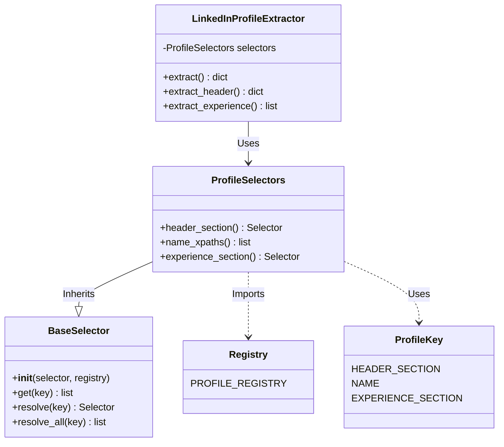
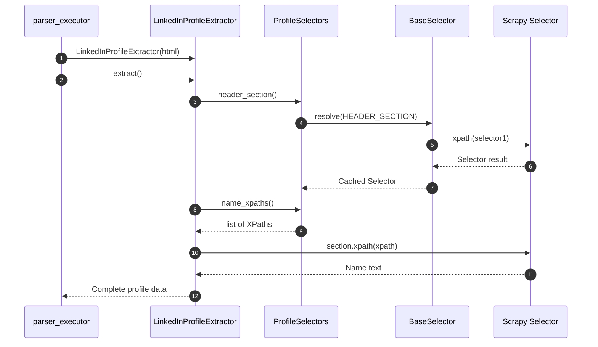
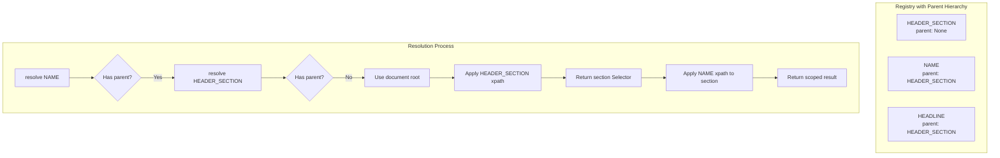

# LinkedIn Profile Extractor Architecture

## Overview
This module provides a robust system for extracting data from LinkedIn profile HTML pages using **Scrapy Selectors**. It strictly separates **Business Logic** from **Selector Implementation**, following the same architectural pattern as the `automation/` module.

## Directory Structure

```text
extractors/
├── __init__.py                           # Exports LinkedInProfileExtractor
├── core/                                 # Domain-agnostic infrastructure
│   ├── __init__.py
│   ├── base_selector.py                  # Base Selector Class: handles resolution and caching
│   └── utils.py                          # Utility functions: clean_text, parse_int
│
└── linkedin/                             # LinkedIn-specific implementation
    ├── __init__.py                       # Exports LinkedInProfileExtractor
    ├── profile_extractor.py              # Business Logic: single class with all extraction methods
    └── selectors/                        # Selector Layer
        ├── __init__.py
        ├── profile.py                    # Profile Selectors: typed accessors for profile elements
        └── core/                         # Core definitions
            ├── __init__.py
            ├── keys.py                   # Enum keys for selectors (ProfileKey)
            └── registry.py               # Registry: XPath mappings with parent hierarchy
```

## Key Components

### 1. Business Logic (`linkedin/profile_extractor.py`)
- **Class**: `LinkedInProfileExtractor`
- **Responsibility**: Manages high-level extraction flows. Does *not* contain XPaths.
- **Features**:
    - **Single Class Pattern**: One class with multiple methods (like `automation/ProfilePage`)
    - **Methods**: `extract()`, `extract_header()`, `extract_about()`, `extract_experience()`, `extract_education()`, `extract_skills()`, etc.
    - **Clean API**: `extractor = LinkedInProfileExtractor(html); data = extractor.extract()`

### 2. Selector Layer (`linkedin/selectors/`)
This layer abstracts the raw XPaths away from the business logic.

- **`BaseSelector` (`core/base_selector.py`)**:
    - The foundation for selector classes.
    - **Registry-Based Resolution**: Takes a `registry` dict and resolves selectors by key.
    - **Parent Hierarchy**: Recursively resolves parent selectors (same pattern as `automation/BasePage`).
    - **Caching**: Caches resolved selectors for performance.

- **`ProfileSelectors` (`selectors/profile.py`)**:
    - Inherits from `BaseSelector`.
    - Provides **Typed Methods** (e.g., `header_section() -> Selector`, `name_xpaths() -> list[str]`).
    - Uses `ProfileKey` to look up definitions in the registry.

- **Registry (`selectors/core/registry.py`)**:
    - A dictionary mapping `ProfileKey` to selector definitions.
    - Each entry has `"selectors"` (list of XPaths) and `"parent"` (optional parent key).
    - Pure data, no logic.

### 3. Execution Entry Point
- **`parser_executor.py`** (Root Directory):
    - Orchestrates the extraction.
    - Reads HTML files from `profiles/` directory.
    - Instantiates `LinkedInProfileExtractor` and calls `extract()`.

## Diagrams

### 1. Class Relationships



### 2. Data Flow



### 3. Parent Hierarchy Resolution



## Usage

```python
from extractors import LinkedInProfileExtractor

# Read HTML
with open("profile.html", "r") as f:
    html = f.read()

# Extract
extractor = LinkedInProfileExtractor(html)
data = extractor.extract()

# Access specific sections
header = extractor.extract_header()      # {"name": "...", "headline": "...", "location": "..."}
experience = extractor.extract_experience()  # [{"title": "...", "subtitle": "...", ...}]
skills = extractor.extract_skills()      # ["Python", "JavaScript", ...]
```

## Adding New Fields

To add a new field (e.g., "pronouns"):

1. **Add key** in `selectors/core/keys.py`:
   ```python
   class ProfileKey(Enum):
       PRONOUNS = "pronouns"
   ```

2. **Add XPaths** in `selectors/core/registry.py`:
   ```python
   ProfileKey.PRONOUNS: {
       "selectors": ['//span[contains(@class, "pronouns")]/text()'],
       "parent": ProfileKey.HEADER_SECTION
   }
   ```

3. **Add accessor** in `selectors/profile.py`:
   ```python
   def pronouns_xpaths(self) -> List[str]:
       return self.get(ProfileKey.PRONOUNS)
   ```

4. **Use in extractor** in `profile_extractor.py`:
   ```python
   data["pronouns"] = self._extract_first(self.selectors.pronouns_xpaths(), section)
   ```

## Comparison with Automation Module

| Aspect | Automation (Playwright) | Extractors (Scrapy) |
|--------|------------------------|---------------------|
| **Base Class** | `BasePage` | `BaseSelector` |
| **Resolution** | `get(key) -> Locator` | `resolve(key) -> Selector` |
| **Parent Hierarchy** | ✅ Recursive | ✅ Recursive |
| **Registry Format** | `{key: {"selectors": [...], "parent": ...}}` | Same |
| **Keys** | `ProfilePageKey` enum | `ProfileKey` enum |
| **Typed Accessors** | `LinkedInProfilePageSelectors` | `ProfileSelectors` |
| **Business Logic** | `ProfilePage` | `LinkedInProfileExtractor` |

