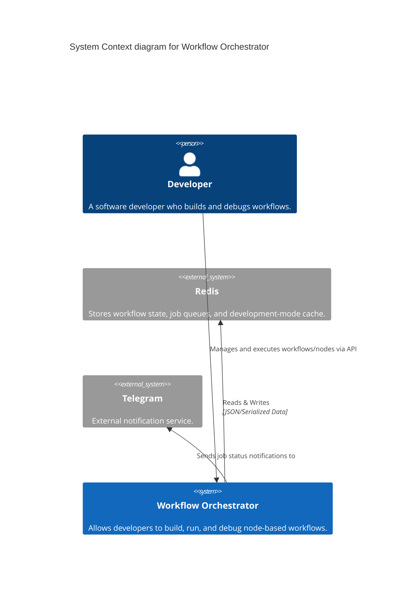

# C4 Model: Level 1 - System Context

This diagram shows the high-level context of the **Workflow Orchestrator**, its users, and the systems it interacts with.

```mermaid
C4Context
  title System Context diagram for Workflow Orchestrator

  Person(developer, "Developer", "A software developer who builds and debugs workflows.")

  System_Ext(redis, "Redis", "Stores workflow state, job queues, and development-mode cache.")
  System_Ext(telegram, "Telegram", "External notification service.")

  System(workflow_orchestrator, "Workflow Orchestrator", "Allows developers to build, run, and debug node-based workflows.")

  Rel(developer, workflow_orchestrator, "Manages and executes workflows/nodes via API")
  Rel(workflow_orchestrator, redis, "Reads & Writes", "JSON/Serialized Data")
  Rel(workflow_orchestrator, telegram, "Sends job status notifications to")
```
