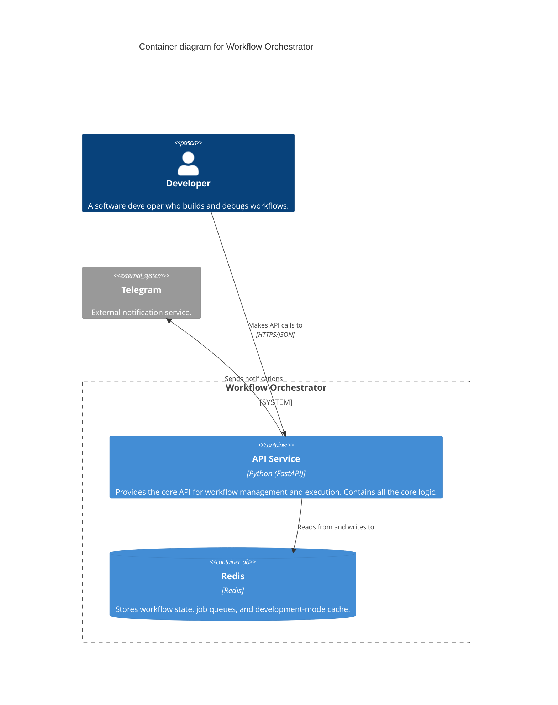

# C4 Model: Level 2 - Container Diagram

This diagram zooms into the **Workflow Orchestrator** system to show its major containers.

```mermaid
C4Container
  title Container diagram for Workflow Orchestrator

  Person(developer, "Developer", "A software developer who builds and debugs workflows.")

  System_Ext(telegram, "Telegram", "External notification service.")

  System_Boundary(c1, "Workflow Orchestrator") {
    Container(api, "API Service", "Python (FastAPI)", "Provides the core API for workflow management and execution. Contains all the core logic.")
    ContainerDb(redis, "Redis", "Redis", "Stores workflow state, job queues, and development-mode cache.")
  }

  Rel(developer, api, "Makes API calls to", "HTTPS/JSON")
  Rel(api, redis, "Reads from and writes to")
  Rel(api, telegram, "Sends notifications")
```
