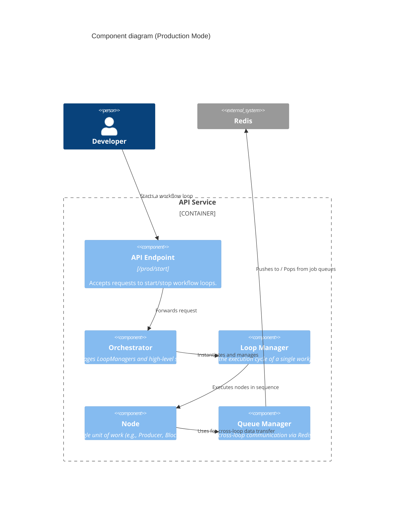
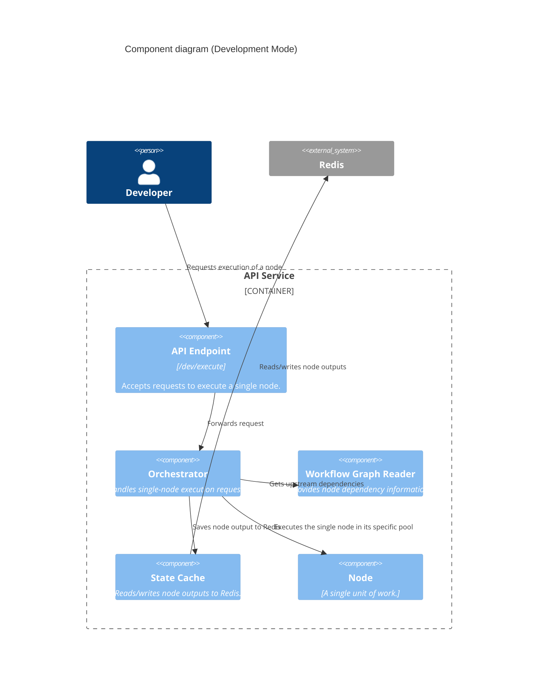

# C4 Model: Level 3 - Component Diagrams

This view zooms into the **API Service** container to show its internal components and how they interact in the two different operating modes.

## Production Mode

In Production Mode, the `Orchestrator` delegates loop execution to `LoopManagers`.

## Development Mode

In Development Mode, the `Orchestrator` directly executes single nodes, using Redis as a state cache. The `LoopManager` is not used.

