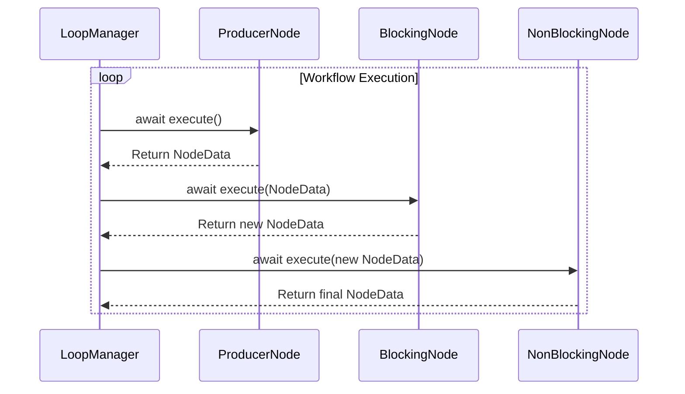
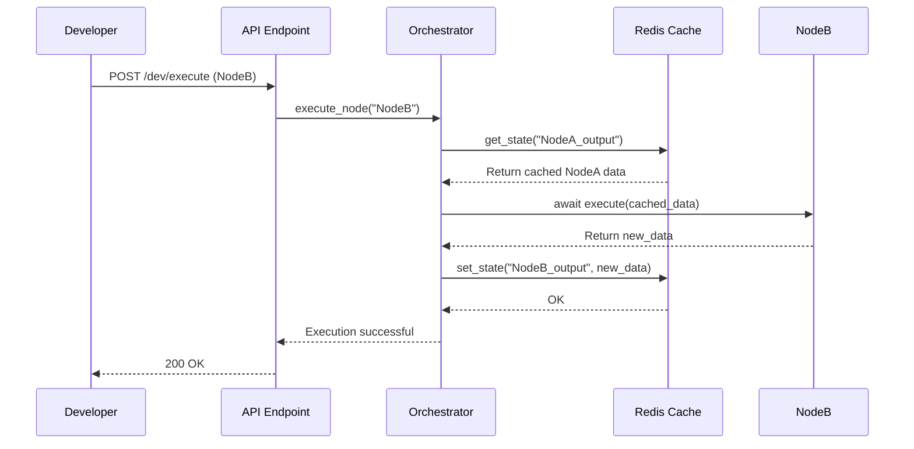

# Sequence Diagrams

These diagrams illustrate the sequence of events during the execution of each operating mode.

## Production Mode

This shows a typical loop execution managed by a `LoopManager`.

## Development Mode

This shows a developer executing a single node (`NodeB`) that depends on the output of a previous node (`NodeA`).

