# Views Package Architecture

This document describes the architecture of the Views package, which provides a Flask-based web interface for the Node Engine.

## Package Structure

```
views/
├── __init__.py               # Package exports
├── app.py                    # Flask application factory
├── architecture.md           # This document
├── routes/                   # HTTP route handlers
│   ├── __init__.py
│   ├── pages.py              # HTML page routes
│   └── api.py                # REST API endpoints
├── services/                 # Business logic layer
│   ├── __init__.py           # ServiceContainer
│   ├── node_registry.py      # Node lookup & caching
│   ├── node_loader.py        # Dynamic class loading
│   ├── form_loader.py        # Form serialization
│   └── node_executor.py      # Node execution
├── scanner/                  # Node scanning layer
│   ├── __init__.py
│   ├── metadata_extractor.py # AST parsing
│   ├── file_scanner.py       # File scanning
│   ├── directory_scanner.py  # Directory traversal
│   └── tree_utils.py         # Tree operations
└── templates/
    └── index.html            # Web UI template
```

## High-Level Architecture

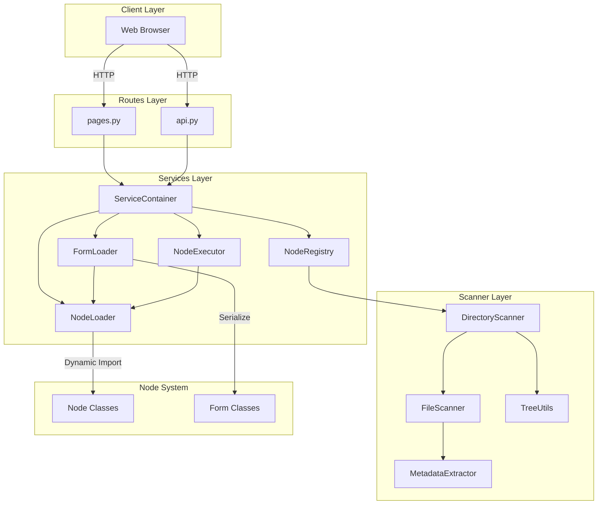

## Layer Responsibilities

### Routes Layer
Thin controllers that handle HTTP requests and delegate to services.

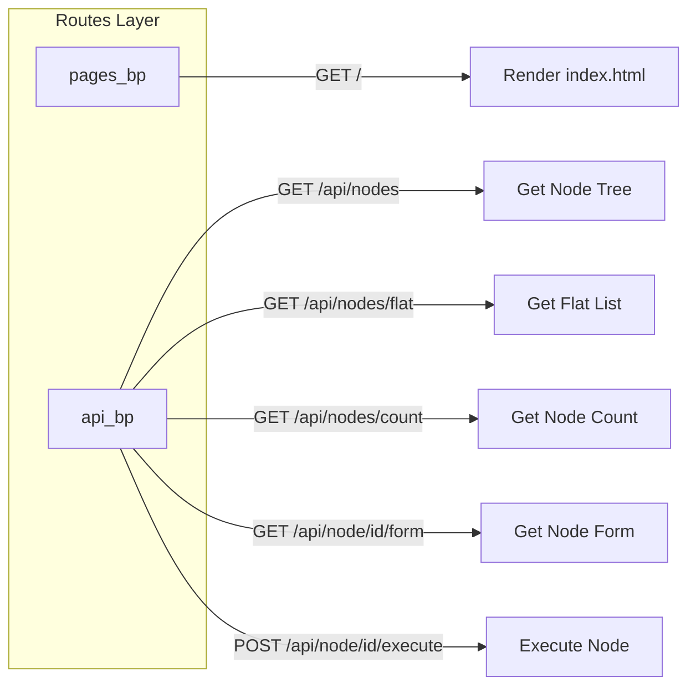

### Services Layer
Business logic with dependency injection via ServiceContainer.

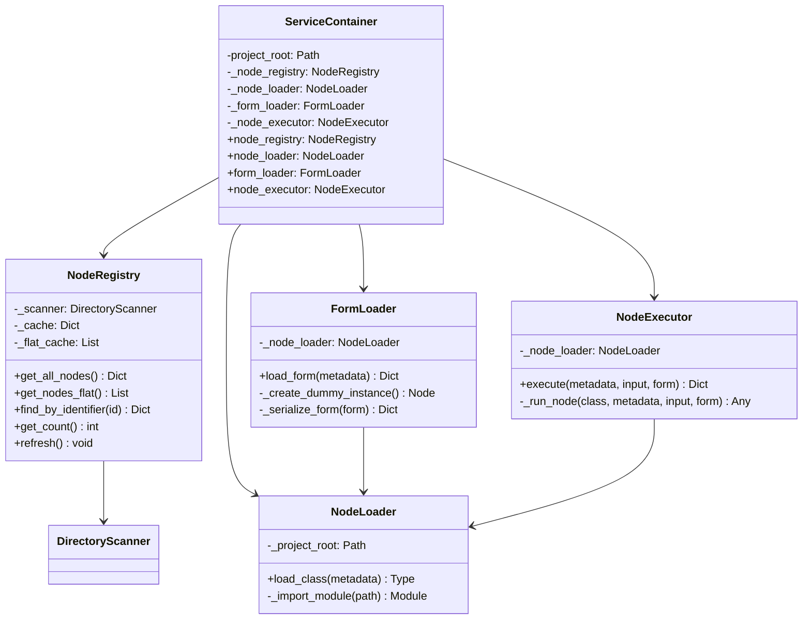

### Scanner Layer
Scans filesystem and extracts node metadata using AST parsing.

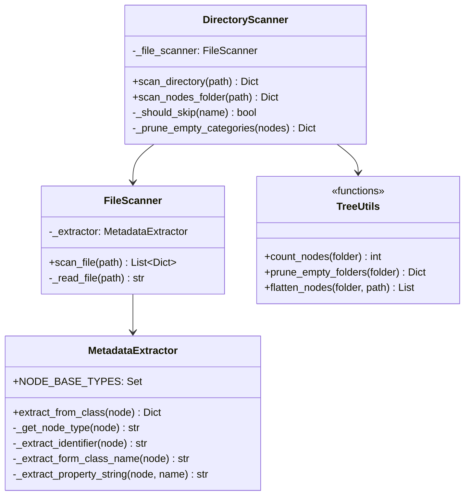

## Request Flow Diagrams

### Page Load Flow

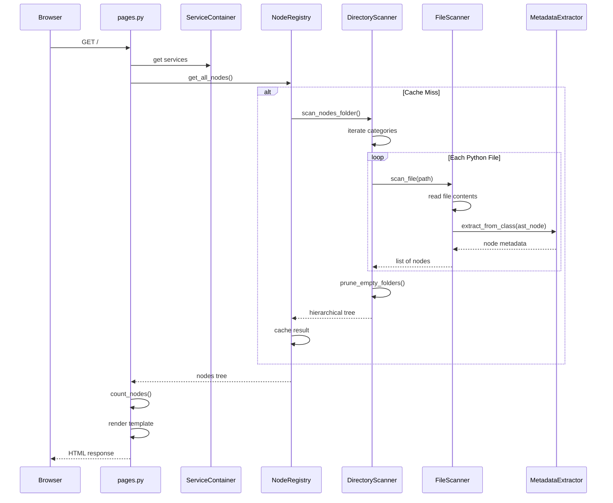

### Get Node Form Flow

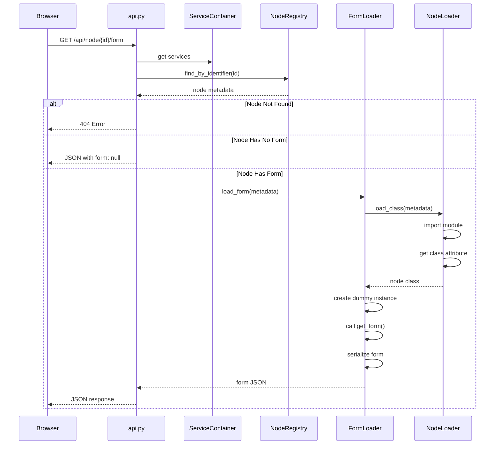

### Execute Node Flow

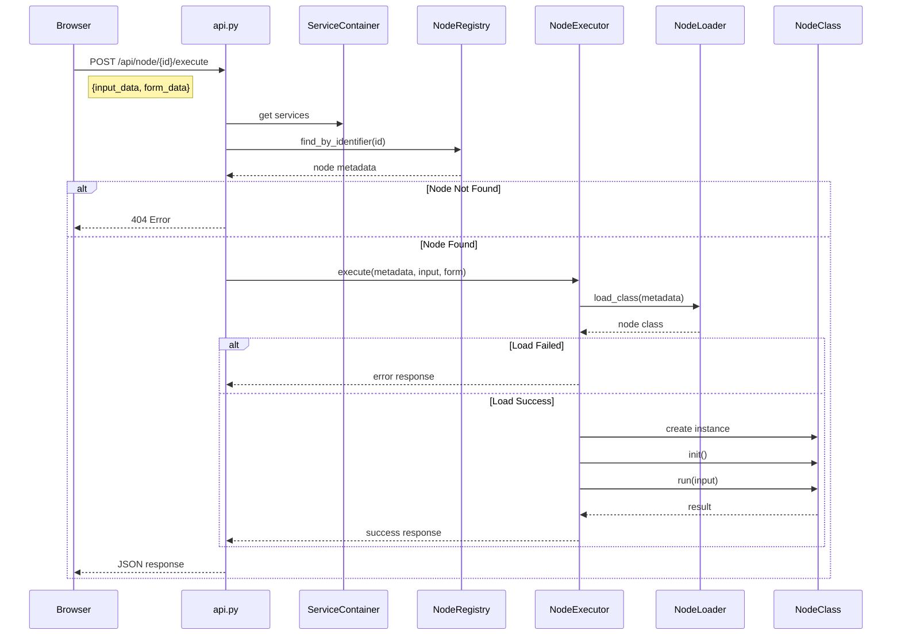

## Data Flow

### Node Metadata Structure

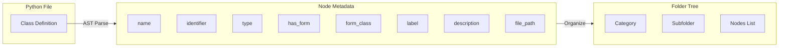

### Hierarchical Tree Structure

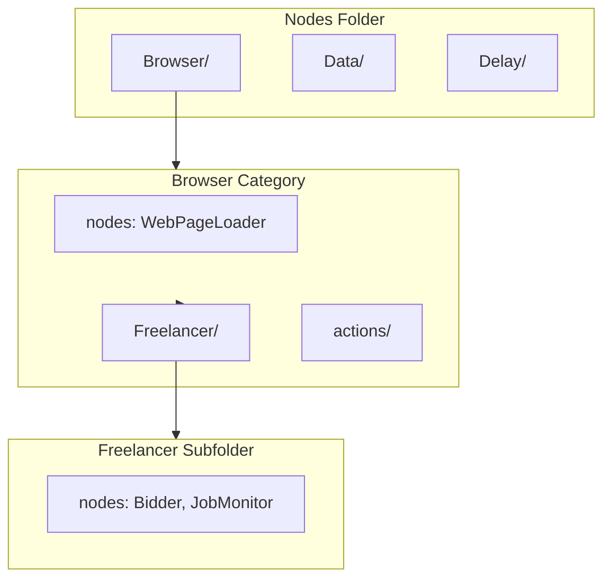

## Dependency Injection

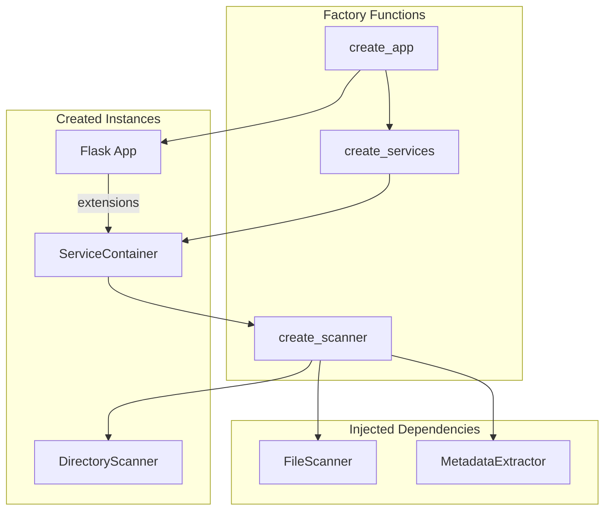

## Caching Strategy

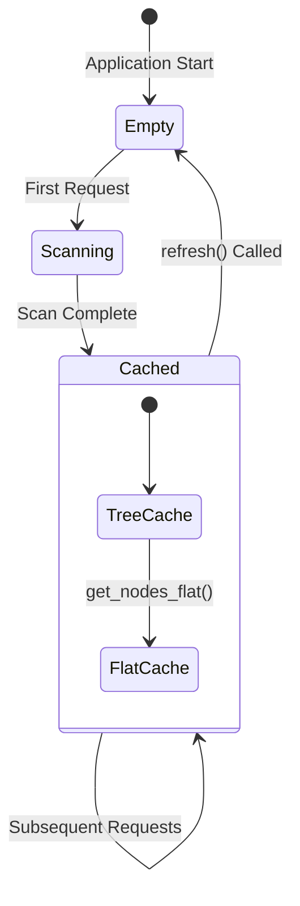

## Error Handling

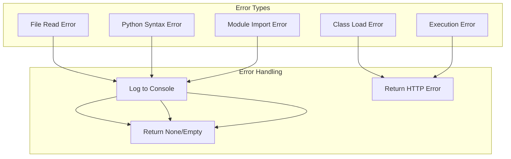

## Design Principles

### Single Responsibility Principle

| Module | Single Responsibility |
|--------|----------------------|
| `MetadataExtractor` | Parse AST and extract class metadata |
| `FileScanner` | Read and scan Python files |
| `DirectoryScanner` | Traverse directories and build tree |
| `TreeUtils` | Operate on tree data structures |
| `NodeRegistry` | Cache and lookup node metadata |
| `NodeLoader` | Dynamically load Python classes |
| `FormLoader` | Load and serialize forms |
| `NodeExecutor` | Execute nodes with input data |
| `pages.py` | Handle HTML page requests |
| `api.py` | Handle API requests |

### Dependency Injection

Services are injected via `ServiceContainer`, enabling:
- Easy mocking for unit tests
- Lazy initialization
- Centralized configuration

### Application Factory Pattern

`create_app()` function allows:
- Multiple app instances for testing
- Custom configuration per instance
- Clean initialization flow

## API Reference

### Routes

| Method | Path | Description |
|--------|------|-------------|
| GET | `/` | Main web interface |
| GET | `/api/nodes` | Get all nodes as tree |
| GET | `/api/nodes/flat` | Get all nodes as flat list |
| GET | `/api/nodes/count` | Get total node count |
| GET | `/api/node/<id>/form` | Get node form JSON |
| POST | `/api/node/<id>/execute` | Execute a node |

### Scanner Factory

```python
from views.scanner import create_scanner

scanner = create_scanner()
nodes = scanner.scan_nodes_folder()
```

### Services Factory

```python
from views.services import create_services

services = create_services()
node = services.node_registry.find_by_identifier('my-node')
```

