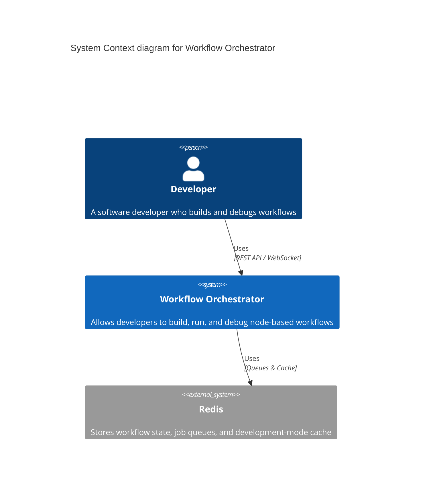
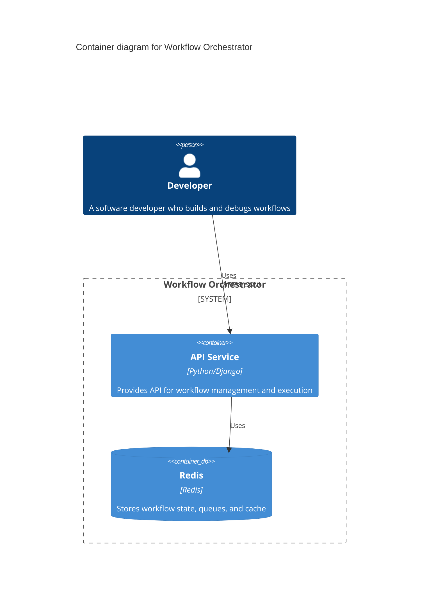
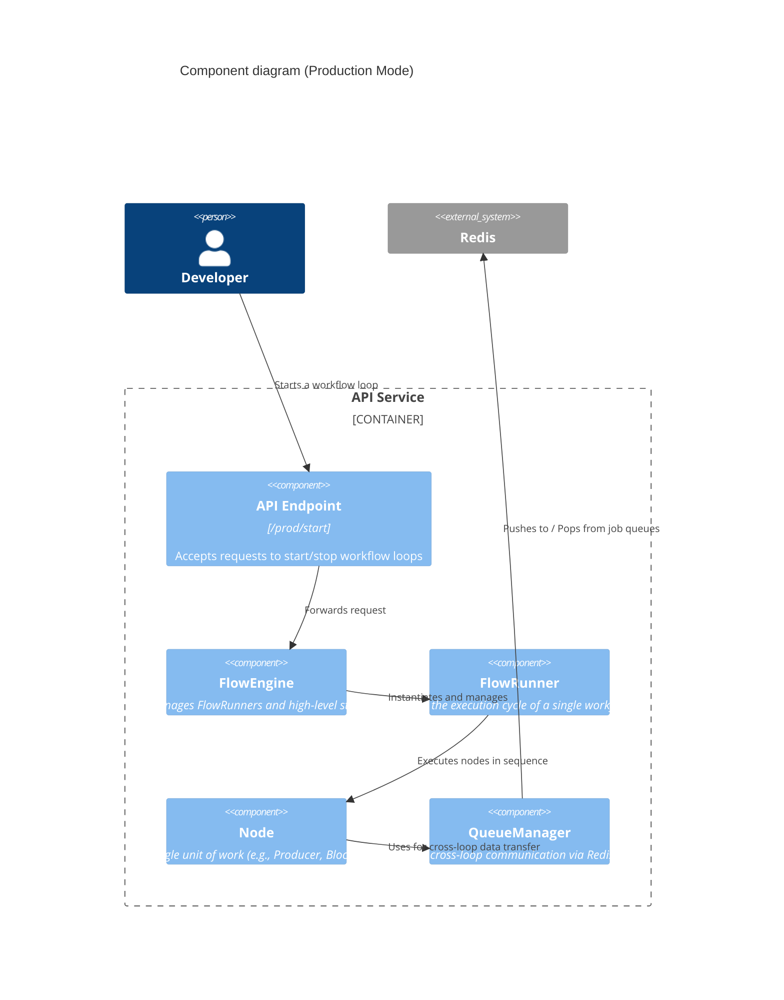
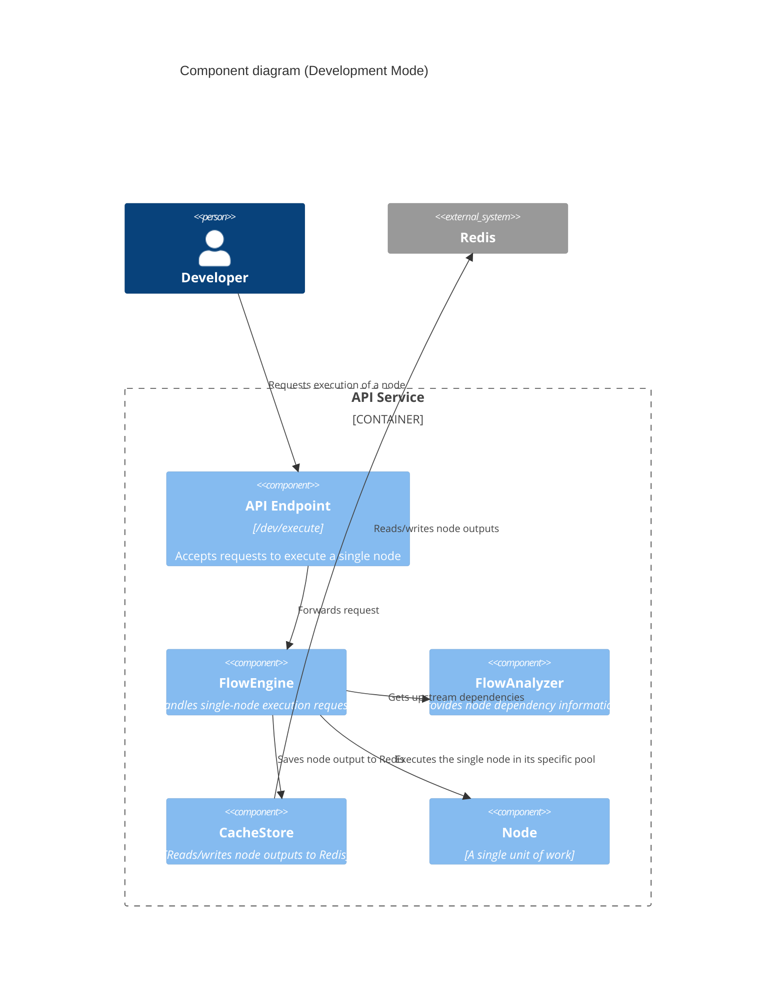
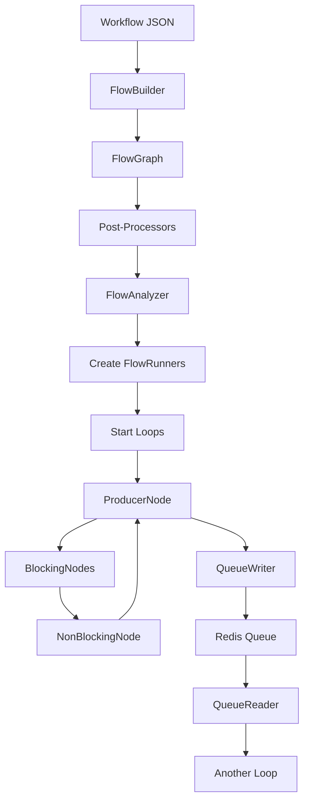
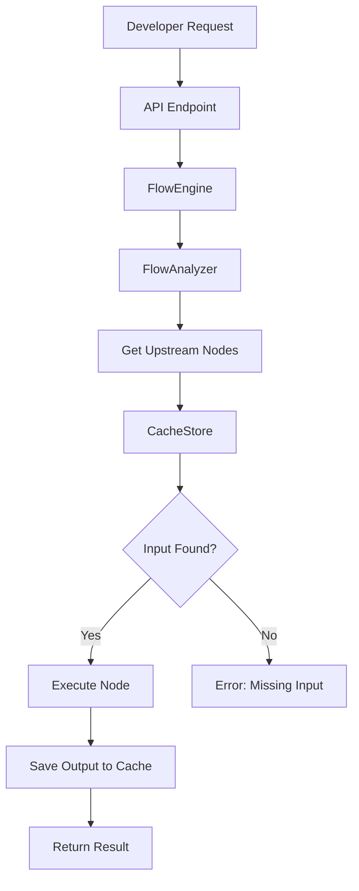

# Architecture Overview

This document provides a high-level view of the Workflow Orchestrator system architecture using the C4 model. It shows how the system fits into the broader context and how its major components interact.

## Navigation

- [← Back to Development Documentation](Development.md)
- [Next: Workflow Engine →](02-Workflow-Engine.md)

## System Context (C4 Level 1)

The Workflow Orchestrator is the central coordination system that enables developers to build, run, and debug node-based workflows.

### Key Interactions

- **Developers** interact with the system via REST API and WebSocket connections
- **Redis** provides persistent storage for queues, caches, and workflow state

## Container Diagram (C4 Level 2)

The system consists of a single deployable container: the API Service, which contains all core logic.

## Component Diagram (C4 Level 3)

The API Service contains several key components that work together to orchestrate workflow execution.

### Production Mode

In Production Mode, the Orchestrator delegates loop execution to LoopManagers (FlowRunners).

### Development Mode

In Development Mode, the Orchestrator directly executes single nodes, using Redis as a state cache.

## Core Components

### FlowEngine (Orchestrator)

The central coordination system that manages workflow loading, execution, and state. It operates in two modes:

- **Production Mode**: Delegates to FlowRunners for autonomous loop execution
- **Development Mode**: Directly executes individual nodes on-demand

**Key Responsibilities:**
- Workflow loading and graph construction
- Loop lifecycle management (Production Mode)
- Single-node execution (Development Mode)
- State and observability management
- QueueManager coordination

**Related Documentation:**
- [Workflow Engine](02-Workflow-Engine.md) - Detailed FlowEngine documentation
- [Execution System](03-Execution-System.md) - FlowRunner and execution details

### FlowGraph

The data structure that holds all FlowNode instances and their connections. It provides operations for:

- Adding and connecting nodes
- Traversing the graph
- Finding upstream/downstream nodes

**Related Documentation:**
- [Workflow Engine](02-Workflow-Engine.md) - FlowGraph operations

### FlowRunner (LoopManager)

Manages a single loop's execution in Production Mode. Each FlowRunner:

- Controls one ProducerNode and its downstream chain
- Determines execution pool for the loop
- Executes nodes sequentially
- Handles errors and recovery

**Related Documentation:**
- [Execution System](03-Execution-System.md) - FlowRunner implementation

### Node System

The extensible node architecture that allows developers to create custom workflow steps.

**Node Types:**
- **ProducerNode**: Starts loop iterations
- **BlockingNode**: Sequential operations
- **NonBlockingNode**: Async boundaries
- **ConditionalNode**: Conditional branching

**Related Documentation:**
- [Node System](04-Node-System.md) - Node architecture and lifecycle
- [Node Types](05-Node-Types.md) - Available node implementations

### Storage System

Provides unified access to Redis for queues and caching.

**Components:**
- **DataStore**: Facade for storage services
- **QueueStore**: Redis Lists for cross-loop communication
- **CacheStore**: Redis Strings for development mode state

**Related Documentation:**
- [Storage System](06-Storage-System.md) - Storage architecture

### Form System

Django-based configuration system for nodes with:

- Cascading field dependencies
- Jinja template rendering
- JSON serialization for API/UI

**Related Documentation:**
- [Form System](07-Form-System.md) - Form architecture and usage

## Operating Modes

### Production Mode

**Goal**: High-performance, autonomous execution of complete workflows

**Mechanism**:
- FlowEngine creates FlowRunners for each ProducerNode
- Each FlowRunner manages an isolated loop
- Loops run continuously until stopped
- Cross-loop communication via Redis queues

**Use Cases**:
- Running production workflows
- Long-running automation tasks
- High-throughput processing

### Development Mode

**Goal**: Flexible, iterative testing and debugging of individual nodes

**Mechanism**:
- FlowEngine directly executes single nodes
- Uses Redis cache to store node outputs
- Resolves dependencies from cache
- No FlowRunner/LoopManager used

**Use Cases**:
- Testing individual nodes
- Debugging workflow logic
- Iterative development

## Data Flow

### Production Mode Flow

### Development Mode Flow

## Key Design Principles

### Single Responsibility Principle (SRP)

Each component has one clear responsibility:

- **FlowEngine**: Orchestration and lifecycle management
- **FlowRunner**: Single loop execution
- **FlowGraph**: Graph structure management
- **DataStore**: Storage facade
- **Node**: Single unit of work

### Isolation

- Loops run in isolated execution pools
- Cross-loop communication only via queues
- Failures in one loop don't affect others

### Async-First

- All I/O operations use async/await
- Nodes implement async `execute()` methods
- FlowRunner uses async control flow

### Fail-Fast

- Zero automatic retries
- Immediate failure policy
- Failed payloads sent to DLQ

## Related Documentation

- [Workflow Engine](02-Workflow-Engine.md) - Detailed FlowEngine documentation
- [Execution System](03-Execution-System.md) - FlowRunner and execution details
- [Node System](04-Node-System.md) - Node architecture
- [Storage System](06-Storage-System.md) - Storage architecture
- [Development Workflow](10-Development-Workflow.md) - Development practices

---

[← Back to Development Documentation](Development.md) | [Next: Workflow Engine →](02-Workflow-Engine.md)

