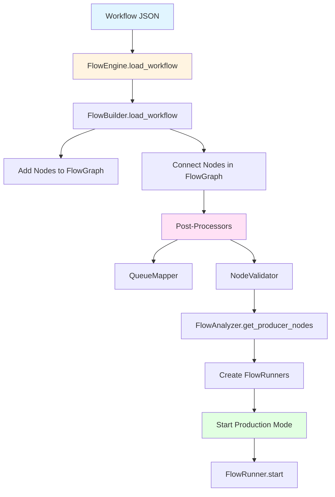
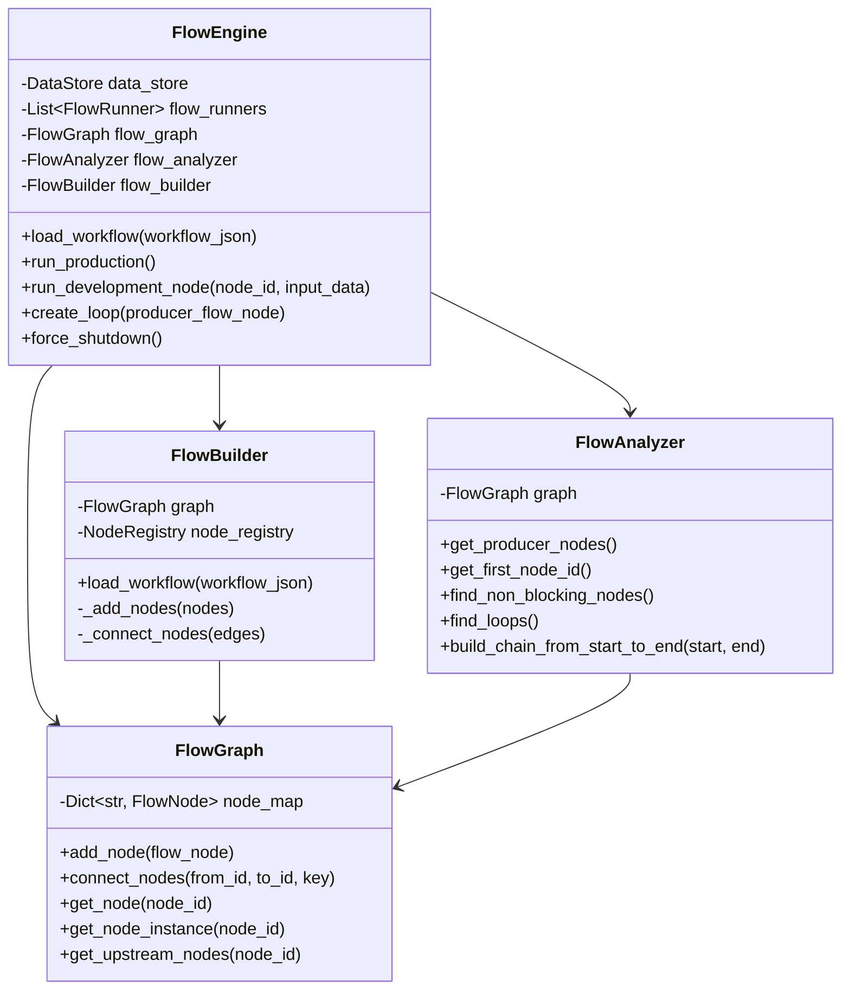
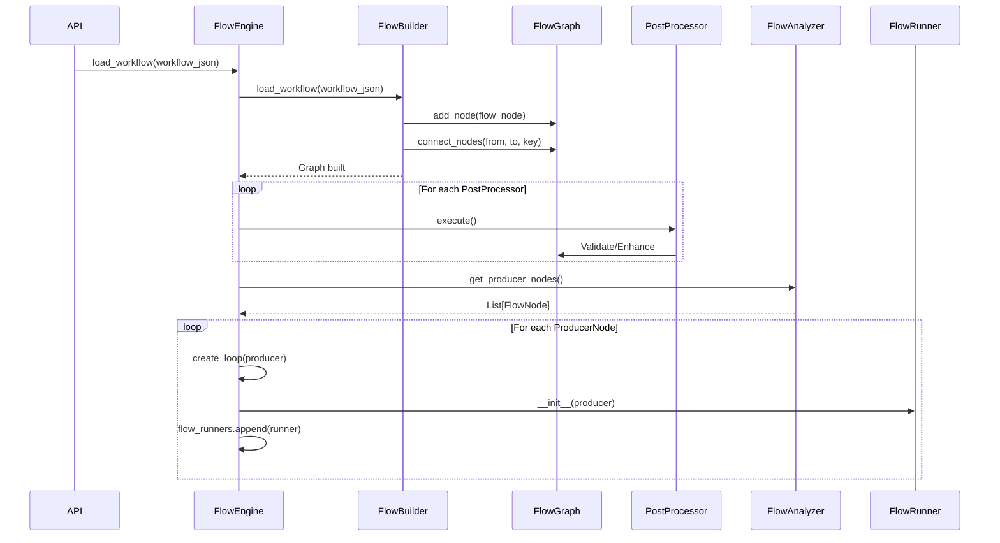
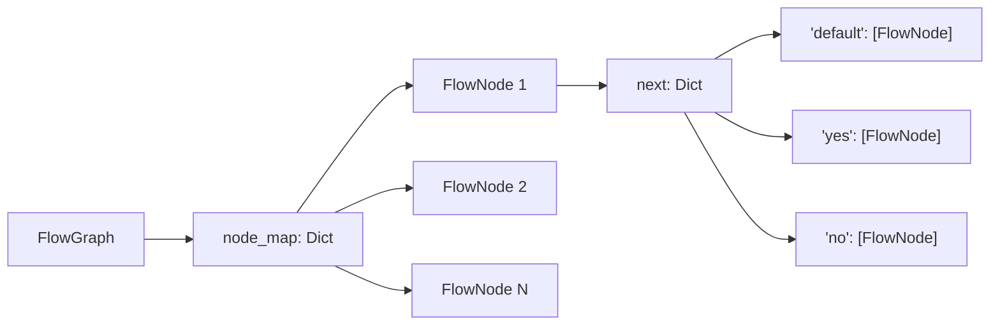
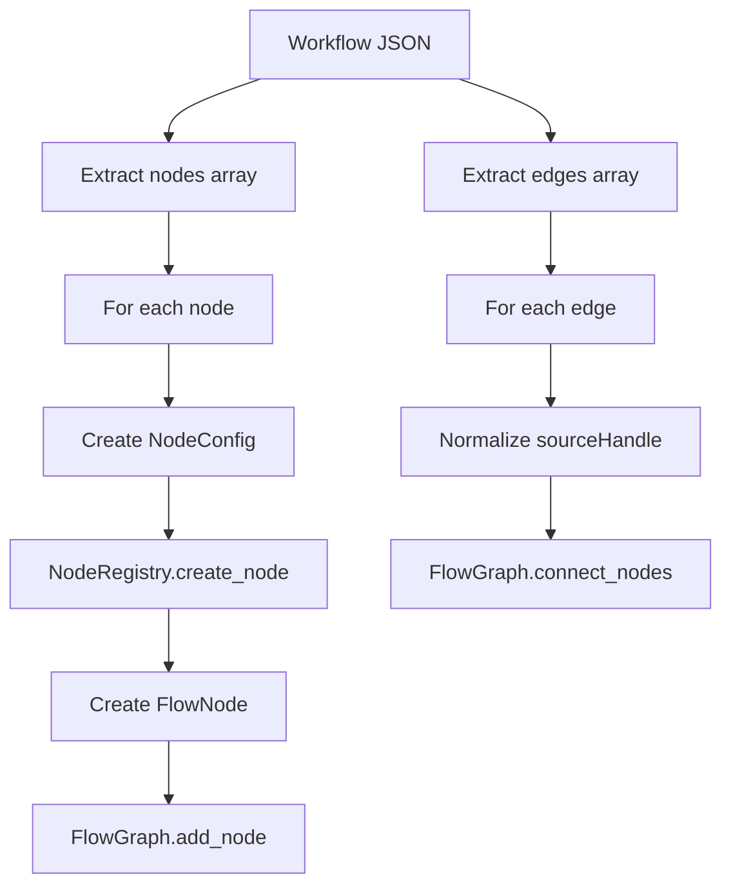
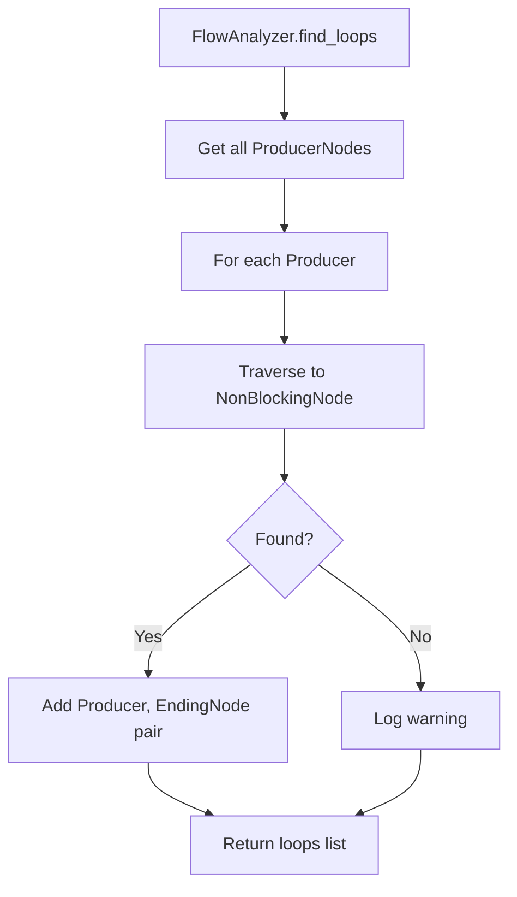
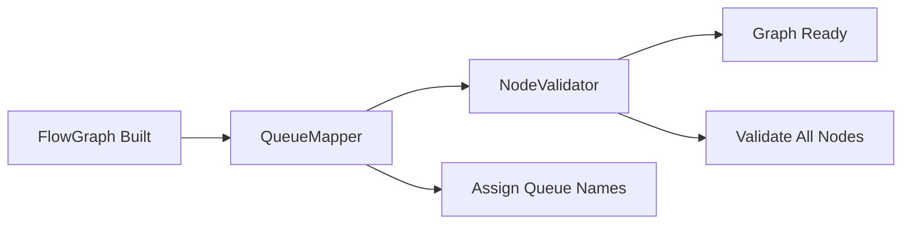
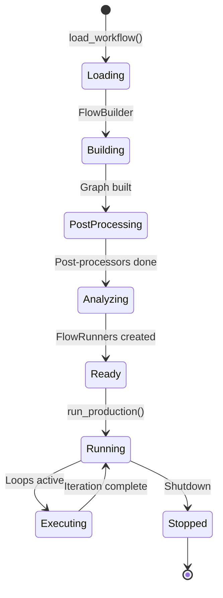

# Workflow Engine

The Workflow Engine is the core orchestration system that manages workflow loading, graph construction, and execution coordination. This document explains the FlowEngine and its supporting components: FlowGraph, FlowBuilder, and FlowAnalyzer.

## Navigation

- [← Back to Development Documentation](Development.md)
- [← Previous: Architecture Overview](01-Architecture-Overview.md)
- [Next: Execution System →](03-Execution-System.md)

## Overview

The Workflow Engine consists of four main components that work together to transform workflow definitions (JSON) into executable graphs:

1. **FlowEngine**: Central orchestrator managing workflow lifecycle
2. **FlowGraph**: Data structure holding nodes and connections
3. **FlowBuilder**: Constructs graph from JSON definitions
4. **FlowAnalyzer**: Provides graph traversal and analysis operations

## FlowEngine Architecture



### FlowEngine Components



## FlowEngine

The central coordination system that manages workflow execution in both Production and Development modes.

### Key Responsibilities

- **Workflow Loading**: Parses JSON and builds executable graph
- **Graph Management**: Maintains FlowGraph structure
- **Loop Lifecycle**: Creates and manages FlowRunners (Production Mode)
- **Direct Execution**: Executes individual nodes (Development Mode)
- **State Management**: Coordinates DataStore for queues and cache
- **Event System**: Emits workflow events for real-time monitoring

### Initialization

```python
flow_engine = FlowEngine(workflow_id="workflow_123")
# Components initialized:
# - data_store: DataStore()
# - flow_graph: FlowGraph()
# - flow_analyzer: FlowAnalyzer(flow_graph)
# - flow_builder: FlowBuilder(flow_graph, NodeRegistry())
# - flow_runners: []
```

### Workflow Loading Process



### Production Mode Execution

```python
async def run_production(self):
    # Initialize state tracker
    self.state_tracker = ExecutionStateTracker(self.workflow_id, total_nodes)
    
    # Wire events to state tracker
    self._wire_events_to_state_tracker()
    
    # Start workflow
    self.state_tracker.start_workflow()
    
    # Create tasks for all FlowRunners
    self.tasks = [asyncio.create_task(runner.start()) 
                  for runner in self.flow_runners]
    
    # Run all loops concurrently
    await asyncio.gather(*self.tasks)
```

### Development Mode Execution

```python
async def run_development_node(self, node_id: str, input_data: NodeOutput) -> NodeOutput:
    # Get node instance from graph
    node = self.flow_graph.get_node_instance(node_id)
    if not node:
        raise ValueError(f"Node {node_id} not found")
    
    # Execute node directly
    result = await node.run(input_data)
    return result
```

## FlowGraph

The data structure that holds all FlowNode instances and their connections. It provides operations for graph management following the Single Responsibility Principle.

### Structure



### Key Operations

| Method | Purpose |
|--------|---------|
| `add_node(flow_node)` | Add a FlowNode to the graph |
| `add_node_at_end_of(node_id, flow_node, key)` | Add node and connect it to existing node |
| `connect_nodes(from_id, to_id, key)` | Connect two existing nodes |
| `get_node(node_id)` | Get FlowNode by ID |
| `get_node_instance(node_id)` | Get BaseNode instance by ID |
| `get_all_next(node_id)` | Get all next nodes for a given node |
| `get_upstream_nodes(node_id)` | Get all parent nodes |

### Multiple Branch Support

FlowGraph supports multiple outgoing edges with the same key:

```python
# Node "1" connects to both "node_10" and "node_14" via default branch
flow_node.next = {
    "default": [node_10, node_14]
}

# LogicalNode with yes/no branches
logical_node.next = {
    "yes": [success_node],
    "no": [failure_node]
}
```

## FlowNode

The core data structure representing a node in the flow graph.

### Structure

```python
@dataclass
class FlowNode:
    id: str                                    # Unique node identifier
    instance: BaseNode                         # The actual node implementation
    next: Dict[str, List[FlowNode]]          # Branch key -> list of next nodes
```

### Branch Keys

- **"default"**: Normal flow connections (sourceHandle is null)
- **"yes"**: LogicalNode true branch
- **"no"**: LogicalNode false branch

Branch keys are normalized by `BranchKeyNormalizer`:
- `null` → `"default"`
- `"Yes"` → `"yes"`
- `"No"` → `"no"`

## FlowBuilder

Constructs the executable graph from workflow JSON definitions.

### Building Process



### Key Methods

**`load_workflow(workflow_json)`**
- Main entry point for building graph
- Calls `_add_nodes()` and `_connect_nodes()`

**`_add_nodes(nodes)`**
- Iterates through node definitions
- Creates NodeConfig from node data
- Uses NodeRegistry to instantiate BaseNode
- Wraps in FlowNode and adds to graph

**`_connect_nodes(edges)`**
- Iterates through edge definitions
- Normalizes sourceHandle to branch key
- Connects nodes in FlowGraph

### Example Workflow JSON

```json
{
  "nodes": [
    {
      "id": "node_1",
      "type": "queue-reader",
      "data": {
        "form": { "queue_name": "input_queue" },
        "config": {}
      }
    },
    {
      "id": "node_2",
      "type": "http-request",
      "data": {
        "form": { "url": "https://api.example.com" },
        "config": {}
      }
    }
  ],
  "edges": [
    {
      "source": "node_1",
      "target": "node_2",
      "sourceHandle": null
    }
  ]
}
```

## FlowAnalyzer

Provides graph traversal and analysis operations. Follows SRP by only handling traversal and querying.

### Key Methods

| Method | Purpose |
|--------|---------|
| `get_producer_nodes()` | Find all ProducerNode instances |
| `get_first_node_id()` | Find entry point (node with no incoming edges) |
| `find_non_blocking_nodes()` | Find all NonBlockingNode instances |
| `find_loops()` | Find all (Producer, EndingNode) pairs |
| `build_chain_from_start_to_end(start, end)` | Build execution chain between two nodes |

### Finding Loops



### Loop Detection Algorithm

```python
def find_loops(self) -> List[Tuple[FlowNode, FlowNode]]:
    loops = []
    for producer_node in self.get_producer_nodes():
        ending_node = self._find_ending_node_from_producer(producer_node)
        if ending_node:
            loops.append((producer_node, ending_node))
    return loops
```

## Post-Processing Pipeline

After the workflow graph is built, post-processors validate and enhance the graph:



### Post-Processors

1. **QueueMapper**: Automatically assigns unique queue names to QueueNode-QueueReader pairs
2. **NodeValidator**: Validates all nodes are ready for execution

**Related Documentation**: [Post-Processing](08-Post-Processing.md)

## Workflow Lifecycle

### Complete Loading and Execution Flow



## Error Handling

### Workflow Loading Errors

- **Invalid Node Type**: Raised by NodeRegistry if type not found
- **Missing Node**: Raised when edge references non-existent node
- **Validation Failure**: Raised by NodeValidator if nodes not ready

### Execution Errors

- **Node Execution Failure**: Logged and iteration continues
- **Loop Failure**: Isolated to that loop, others continue
- **System Failure**: Force shutdown available via `force_shutdown()`

## Related Documentation

- [Execution System](03-Execution-System.md) - FlowRunner and execution details
- [Node System](04-Node-System.md) - Node architecture
- [Storage System](06-Storage-System.md) - DataStore integration
- [Post-Processing](08-Post-Processing.md) - Post-processor details
- [Development Workflow](10-Development-Workflow.md) - Development practices

---

[← Back to Development Documentation](Development.md) | [← Previous: Architecture Overview](01-Architecture-Overview.md) | [Next: Execution System →](03-Execution-System.md)

