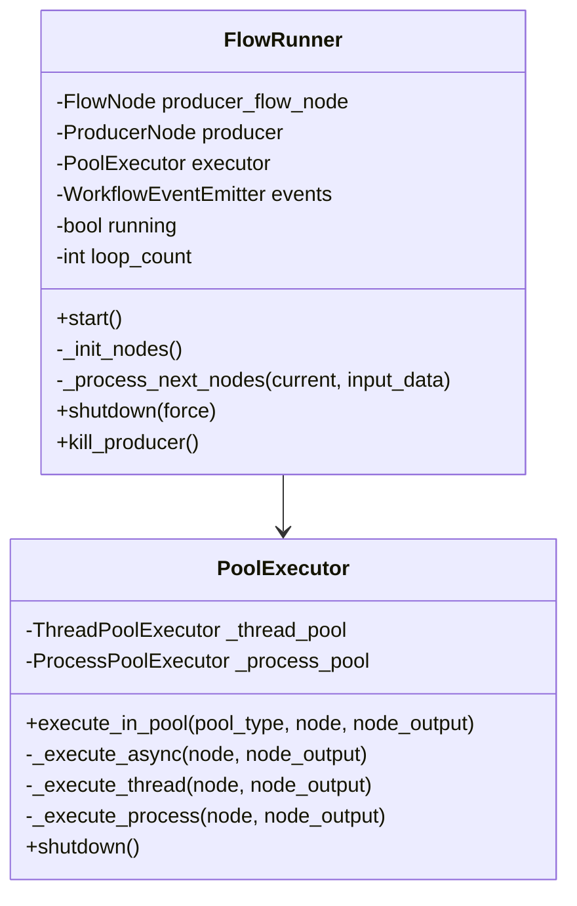
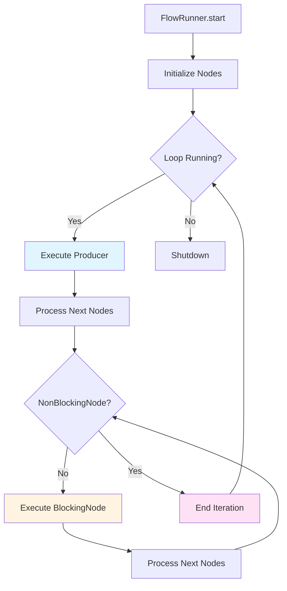
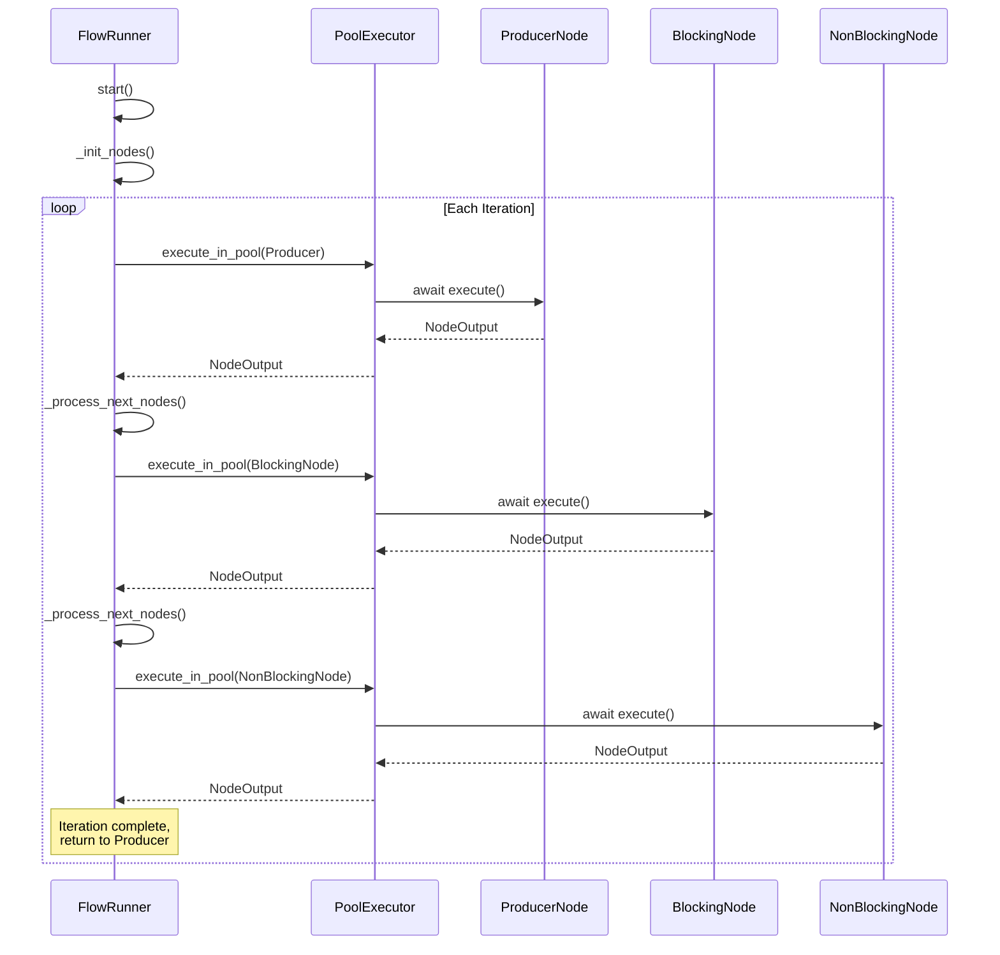
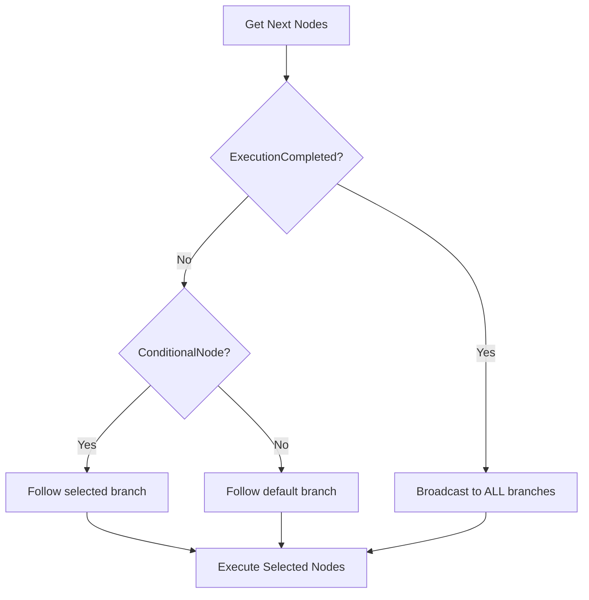
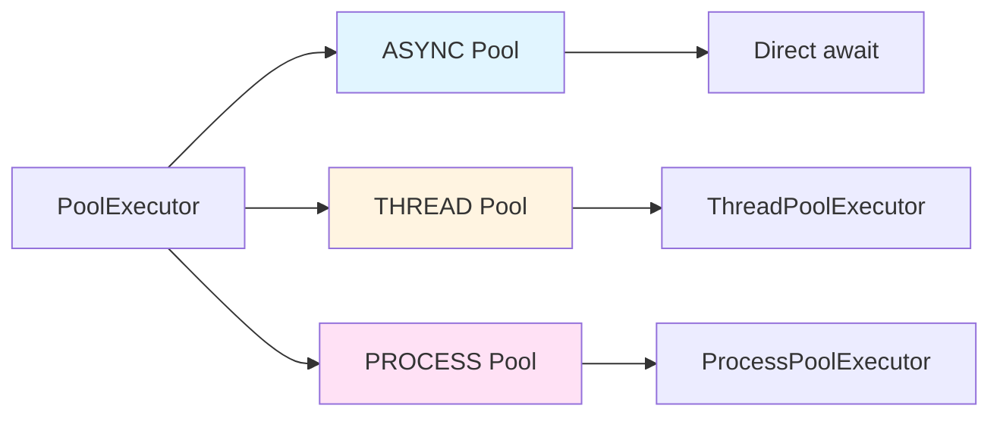
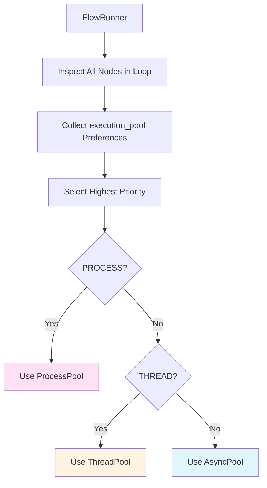
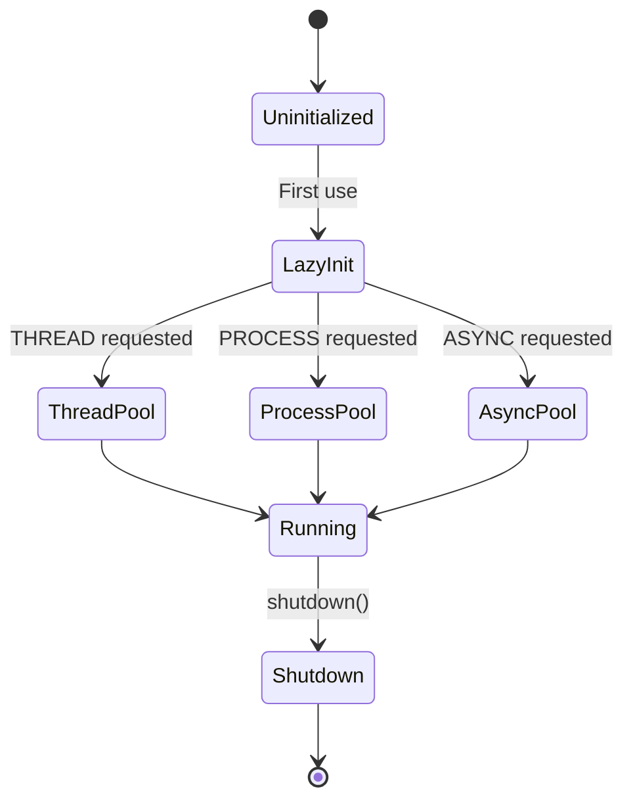
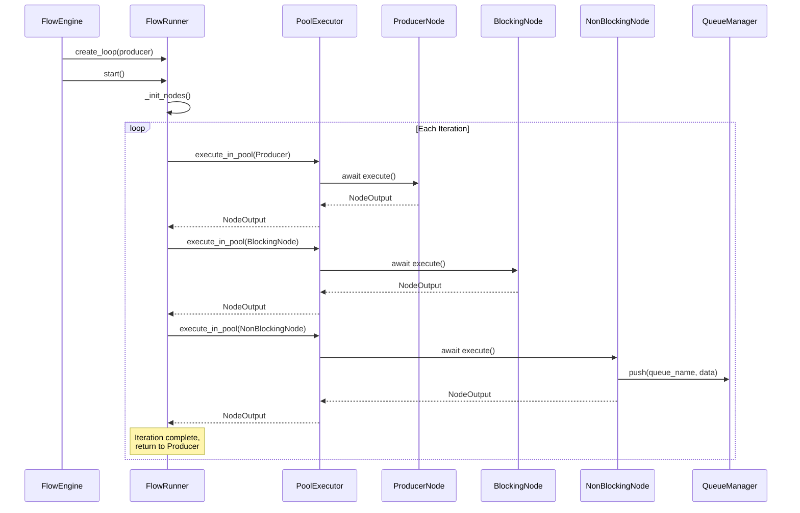
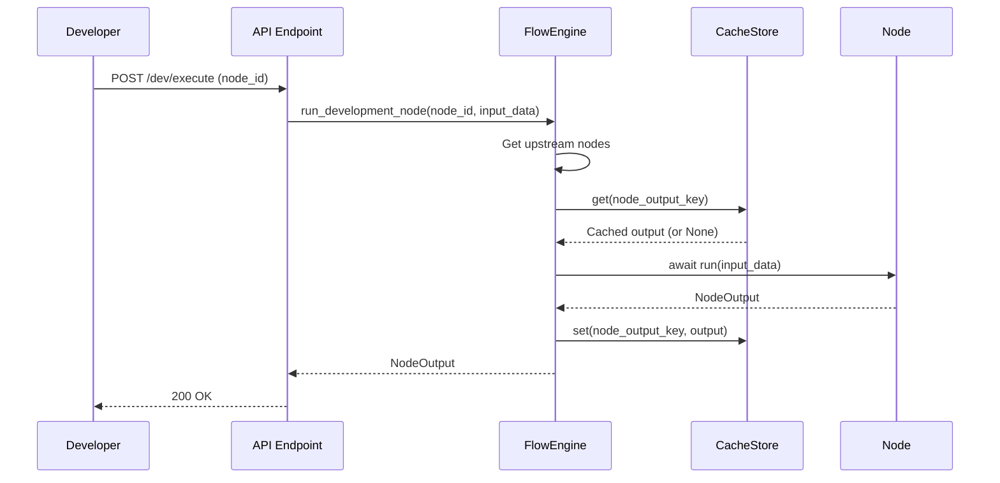

# Execution System

The Execution System handles the actual execution of nodes in different execution pools (ASYNC, THREAD, PROCESS). This document explains FlowRunner (LoopManager) and PoolExecutor, which work together to execute workflows in Production Mode.

## Navigation

- [← Back to Development Documentation](Development.md)
- [← Previous: Workflow Engine](02-Workflow-Engine.md)
- [Next: Node System →](04-Node-System.md)

## Overview

The Execution System consists of two main components:

1. **FlowRunner**: Manages a single loop's execution cycle in Production Mode
2. **PoolExecutor**: Handles execution of nodes in different execution pools

## FlowRunner (LoopManager)

FlowRunner is the concrete implementation of the LoopManager concept. It manages one loop at a time, executing nodes sequentially until reaching a NonBlockingNode.

### Architecture



### Execution Flow



### Loop Execution Sequence



### Node Initialization

Before the loop starts, all nodes in the flow are initialized recursively:

```python
async def _init_nodes(self):
    """Initialize all nodes in the flow by calling their init() method."""
    visited = set()
    await self._init_node_recursive(self.producer_flow_node, visited)

async def _init_node_recursive(self, flow_node: FlowNode, visited: set):
    if flow_node.id in visited:
        return
    visited.add(flow_node.id)
    
    await flow_node.instance.init()  # Calls is_ready() + setup()
    
    for branch_nodes in flow_node.next.values():
        for next_node in branch_nodes:
            await self._init_node_recursive(next_node, visited)
```

### Branch Selection Logic

FlowRunner handles branching based on node type:



**Branch Selection Rules:**

1. **ExecutionCompleted (Sentinel)**: Broadcasts to ALL downstream nodes regardless of logic
2. **ConditionalNode**: Follows the branch specified by `instance.output` ("yes" or "no")
3. **Other Nodes**: Follows the "default" branch

### Error Handling

```python
try:
    # Execute nodes
    await self.executor.execute_in_pool(...)
except asyncio.CancelledError:
    logger.info("FlowRunner loop cancelled")
    self.running = False
    raise
except Exception as e:
    logger.exception("Error in loop", error=str(e))
    await asyncio.sleep(1)  # Brief pause before retry
```

**Error Recovery:**
- Logs exception
- Pauses briefly (1 second)
- Continues to next iteration
- Failed payloads are not automatically retried (fail-fast policy)

## PoolExecutor

PoolExecutor handles the actual execution of nodes in different execution pools. It supports three pool types: ASYNC, THREAD, and PROCESS.

### Pool Types



### Execution Methods

| Pool Type | Method | Mechanism | Use Case |
|-----------|--------|-----------|----------|
| **ASYNC** | Direct await | `await node.run(node_output)` | I/O-bound operations (HTTP, DB, file) |
| **THREAD** | ThreadPoolExecutor | Runs in thread with new event loop | CPU-bound tasks that can release GIL |
| **PROCESS** | ProcessPoolExecutor | Serializes node/data via pickle | CPU-intensive tasks, true parallelism |

### ASYNC Execution (Default)

```python
if pool == PoolType.ASYNC:
    return await node.run(node_output)
```

**Characteristics:**
- Direct async execution in current event loop
- Best for I/O-bound operations
- No serialization overhead
- Shares memory space

### THREAD Execution

```python
@staticmethod
def _run_in_thread(node: BaseNode, node_output: NodeOutput) -> NodeOutput:
    new_loop = asyncio.new_event_loop()
    asyncio.set_event_loop(new_loop)
    try:
        return new_loop.run_until_complete(node.run(node_output))
    finally:
        new_loop.close()

async def _execute_thread(self, node, node_output):
    loop = asyncio.get_event_loop()
    return await loop.run_in_executor(
        self._thread_pool, 
        PoolExecutor._run_in_thread, 
        node, 
        node_output
    )
```

**Characteristics:**
- Creates new event loop in thread
- Uses ThreadPoolExecutor
- Good for CPU-bound tasks that can release GIL
- Shares memory but separate execution context

### PROCESS Execution

```python
@staticmethod
def _run_in_process(serialized_node: bytes, serialized_data: bytes) -> bytes:
    node = pickle.loads(serialized_node)
    node_data = pickle.loads(serialized_data)
    new_loop = asyncio.new_event_loop()
    asyncio.set_event_loop(new_loop)
    try:
        result = new_loop.run_until_complete(node.run(node_data))
        return pickle.dumps(result)
    finally:
        new_loop.close()

async def _execute_process(self, node, node_output):
    serialized_node = pickle.dumps(node)
    serialized_data = pickle.dumps(node_output)
    result_bytes = await loop.run_in_executor(
        self._process_pool,
        PoolExecutor._run_in_process,
        serialized_node,
        serialized_data
    )
    return pickle.loads(result_bytes)
```

**Characteristics:**
- True parallelism (bypasses GIL)
- Requires serialization (pickle)
- Isolated memory space
- Best for CPU-intensive tasks

### Pool Selection

The execution pool for a loop is determined dynamically by the FlowRunner:



**Priority Order:**
1. **PROCESS** (highest) - True parallelism
2. **THREAD** (medium) - Parallel execution possible
3. **ASYNC** (lowest) - Default, best for I/O

**Example:**
If a loop contains nodes with preferences `[ASYNC, THREAD, ASYNC]`, the entire loop will run in a **ThreadPool** for that cycle.

### Serialization Requirements

**Process Pool Constraints:**

- Node classes must be **picklable**:
  - No lambdas, closures, or unpicklable attributes
  - Resources (connections, file handles) cannot be serialized
- `NodeOutput` and all nested data must be:
  - JSON-serializable, or
  - Picklable
- Resources must be initialized in-process:
  - Use `setup()` method to initialize connections, clients, etc.

### Pool Lifecycle



**Lazy Initialization:**
Pools are created on first use to conserve resources:

```python
def __init__(self, max_workers_thread: int = 10, max_workers_process: int = 4):
    self._thread_pool: Optional[ThreadPoolExecutor] = None
    self._process_pool: Optional[ProcessPoolExecutor] = None
```

## Production Mode Execution

### Complete Execution Flow



### Loop Characteristics

- **Isolation**: Each loop runs in its own execution pool
- **Continuous**: Loops run until explicitly stopped
- **Sequential**: Nodes execute in order within a loop
- **Async**: All operations use async/await
- **Fail-Fast**: Errors don't stop the loop, failed payloads go to DLQ

## Development Mode Execution

In Development Mode, FlowRunner is not used. FlowEngine directly executes nodes:



**Key Differences:**
- No FlowRunner/LoopManager
- Direct node execution
- Redis cache for state
- Dependency resolution from cache

## Cleanup and Shutdown

### Graceful Shutdown

```python
def shutdown(self, force: bool = False):
    self.running = False
    if force:
        # Cancel all running tasks
        # Force shutdown executors
    else:
        # Wait for current iteration to complete
        # Shutdown executors gracefully
```

### Pool Cleanup

```python
def shutdown(self) -> None:
    if self._thread_pool:
        self._thread_pool.shutdown(wait=True)
    if self._process_pool:
        self._process_pool.shutdown(wait=True)
```

## Best Practices

### Choosing Execution Pools

1. **Use ASYNC** for:
   - HTTP requests
   - Database operations
   - File I/O
   - Queue operations

2. **Use THREAD** for:
   - CPU-bound tasks that can release GIL
   - External process calls
   - Image processing (with PIL)

3. **Use PROCESS** for:
   - CPU-intensive Python code
   - Heavy computation
   - Tasks requiring true parallelism

### Node Implementation

- Always use `async def execute()`
- Use `setup()` for resource initialization
- Ensure picklability if using PROCESS pool
- Handle errors gracefully (don't crash the loop)

## Related Documentation

- [Workflow Engine](02-Workflow-Engine.md) - FlowEngine and graph management
- [Node System](04-Node-System.md) - Node architecture and lifecycle
- [Storage System](06-Storage-System.md) - QueueManager and cross-loop communication
- [Development Workflow](10-Development-Workflow.md) - Development practices

---

[← Back to Development Documentation](Development.md) | [← Previous: Workflow Engine](02-Workflow-Engine.md) | [Next: Node System →](04-Node-System.md)

