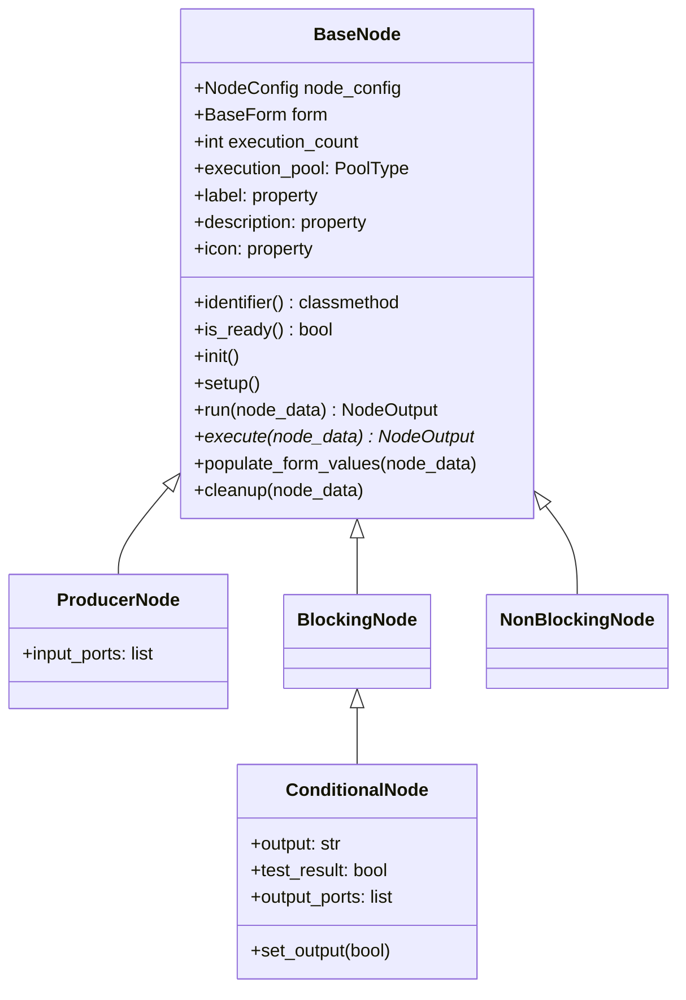
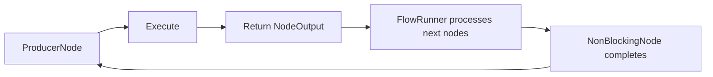
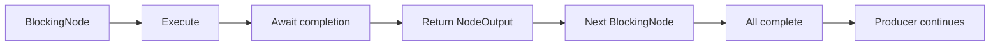
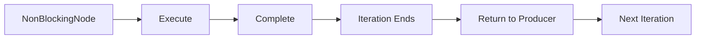
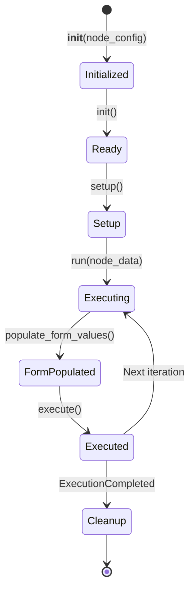
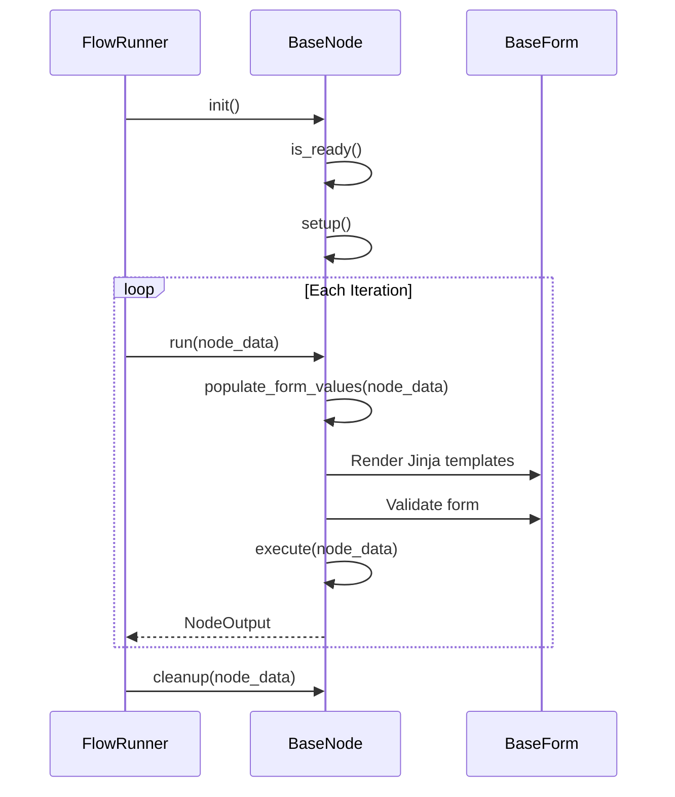
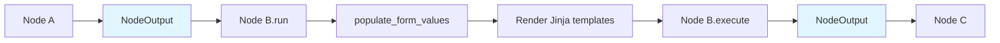

# Node System

The Node System is the extensible architecture that allows developers to create custom workflow steps. This document explains the BaseNode hierarchy, node types, lifecycle, and the NodeRegistry auto-discovery system.

## Navigation

- [← Back to Development Documentation](Development.md)
- [← Previous: Execution System](03-Execution-System.md)
- [Next: Node Types →](05-Node-Types.md)

## Overview

Nodes are the smallest executable units in a workflow. Each node inherits from `BaseNode` and implements an async `execute()` method. The system supports four fundamental node types, each with distinct execution semantics.

## Node Hierarchy



## Node Types

### ProducerNode

**Purpose**: Starts loop iterations. Called first each iteration.

**Characteristics**:
- Marks loop start
- Controls timing and triggers downstream nodes
- No input ports (starts the flow)
- When iteration completes, FlowRunner returns control to Producer

**Examples**:
- `QueueReader`: Reads from Redis queue to start loop
- `TimerNode`: Starts loop on schedule
- `WebhookNode`: Starts loop on HTTP request

**Execution Model**:


### BlockingNode

**Purpose**: Performs work that must complete before continuation.

**Characteristics**:
- Executes sequentially in the async chain
- FlowRunner awaits Blocking node and all downstream Blocking children
- Forms strict sequential async paths
- Must complete before Producer continues

**Examples**:
- `HttpRequestNode`: HTTP API calls
- `DatabaseQueryNode`: Database operations
- `DataTransformNode`: Data processing

**Execution Model**:


### NonBlockingNode

**Purpose**: Marks loop-end in the execution model. Creates async boundaries.

**Characteristics**:
- Semantically marks iteration end
- Does not force Producer to wait
- From FlowRunner's perspective: awaits node execution, then iteration ends
- Useful for offloading long side-effects asynchronously

**Examples**:
- `QueueNode`: Writes to Redis queue (loop end marker)
- `NotificationNode`: Sends notifications
- `LogNode`: Logging operations

**Execution Model**:


### ConditionalNode (LogicalNode)

**Purpose**: Conditional branching operations. Extends BlockingNode.

**Characteristics**:
- Inherits from BlockingNode
- Provides `set_output(bool)` method
- Routes execution to "yes" or "no" branch
- `output` property holds branch direction ("yes" or "no")

**Examples**:
- `IfCondition`: Evaluates conditions and routes accordingly
- `CompareNode`: Compares values and branches

**Execution Model**:
```mermaid
flowchart TD
    A[ConditionalNode] --> B[Evaluate Condition]
    B --> C{Result?}
    C -->|True| D[set_output(True)]
    C -->|False| E[set_output(False)]
    D --> F[output = "yes"]
    E --> G[output = "no"]
    F --> H[FlowRunner follows "yes" branch]
    G --> I[FlowRunner follows "no" branch]
```

**Implementation Example**:
```python
class IfCondition(ConditionalNode):
    async def execute(self, node_data: NodeOutput) -> NodeOutput:
        condition_result = self._evaluate_condition(node_data)
        self.set_output(condition_result)  # Sets "yes" or "no"
        return node_data
```

## Node Lifecycle

Every node follows a well-defined lifecycle managed by FlowRunner (Production Mode) or FlowEngine (Development Mode).

### Lifecycle Phases



### Lifecycle Methods

| Method | When Called | Purpose |
|--------|-------------|---------|
| `__init__(node_config)` | Workflow loading | Initialize node with static configuration |
| `init()` | Before first execution | Validate node readiness and call `setup()` |
| `setup()` | Called by `init()` | Initialize resources (DB connections, API clients) |
| `run(node_data)` | Each iteration | Entry point - populates form values, then calls `execute()` |
| `populate_form_values(node_data)` | During `run()` | Render Jinja templates in form fields |
| `execute(node_data)` | Each iteration | Core business logic implementation |
| `cleanup(node_data)` | Shutdown or ExecutionCompleted | Release resources (connections, file handles) |

### Execution Flow



### Form Value Population

The `run()` method handles Jinja template rendering before execution:

```python
async def run(self, node_data: NodeOutput) -> NodeOutput:
    self.populate_form_values(node_data)  # Render templates
    return await self.execute(node_data)
```

**Template Rendering Flow**:
1. Receives `NodeOutput` from previous node
2. Calls `populate_form_values(node_data)` to render Jinja templates
3. Validates the form after template rendering
4. Calls `execute(node_data)` with processed input

### Validation with `is_ready()`

The `is_ready()` method validates the node before execution:

- **For non-template fields**: Performs full Django field validation
- **For Jinja template fields** (containing `{{ }}`): Only checks that required fields are not empty
- **Full validation** of template fields occurs after rendering in `populate_form_values()`

## Node Properties & Registration

### BaseNodeProperty Interface

All nodes must implement the following properties defined in `BaseNodeProperty`:

| Property/Method | Type | Required | Purpose |
|-----------------|------|----------|---------|
| `execution_pool` | `PoolType` | Yes | Preferred execution environment (ASYNC, THREAD, PROCESS) |
| `identifier()` | `classmethod` | Yes | Unique string identifier for node type registration |
| `label` | `property` | No | Display name (defaults to class name) |
| `description` | `property` | No | Node description for documentation |
| `icon` | `property` | No | Icon identifier for UI display |

### Node Identifier Convention

- Use **kebab-case** for identifiers (e.g., `"queue-reader"`, `"if-condition"`)
- The identifier in the workflow JSON `type` field must match exactly
- Example: `identifier()` returns `"http-request"` → JSON uses `"type": "http-request"`

### Example Node Implementation

```python
class HttpRequestNode(BlockingNode):
    @classmethod
    def identifier(cls) -> str:
        return "http-request"
    
    @property
    def execution_pool(self) -> PoolType:
        return PoolType.ASYNC  # I/O-bound operation
    
    @property
    def label(self) -> str:
        return "HTTP Request"
    
    @property
    def description(self) -> str:
        return "Makes an HTTP request to a specified URL"
    
    def get_form(self) -> Optional[BaseForm]:
        return HttpRequestForm()
    
    async def setup(self):
        # Initialize HTTP client
        self.client = aiohttp.ClientSession()
    
    async def execute(self, node_data: NodeOutput) -> NodeOutput:
        url = self.form.get_field_value("url")
        response = await self.client.get(url)
        data = await response.json()
        return NodeOutput(data={"response": data})
    
    async def cleanup(self, node_data: Optional[NodeOutput] = None):
        if hasattr(self, 'client'):
            await self.client.close()
```

## NodeRegistry Auto-Discovery

The `NodeRegistry` automatically discovers all node classes in the `Node.Nodes` package.

### Discovery Process

```mermaid
flowchart TD
    A[NodeRegistry.create_node] --> B{Registry Loaded?}
    B -->|No| C[_discover_node_classes]
    B -->|Yes| D[Get Node Class]
    C --> E[Walk Node.Nodes Package]
    E --> F[Import Modules]
    F --> G[Find Node Classes]
    G --> H[Check Inheritance]
    H --> I[Get identifier()]
    I --> J[Build Registry Dict]
    J --> D
    D --> K[Instantiate Node]
    K --> L[Return BaseNode]
```

### Discovery Algorithm

1. **Walk Packages**: Uses `pkgutil` to walk through all subpackages of `Node.Nodes`
2. **Import Modules**: Imports each module in the package tree
3. **Filter Classes**: Identifies classes that inherit from `ProducerNode`, `BlockingNode`, or `NonBlockingNode`
4. **Exclude Abstract**: Filters out abstract base classes
5. **Register**: Maps each node's `identifier()` to its class

### Registration Code

```python
@classmethod
def _discover_node_classes(cls) -> Dict[str, Type[BaseNode]]:
    import Node.Nodes as Nodes
    discovered_classes = []
    
    def walk_packages(path, prefix):
        for importer, modname, ispkg in pkgutil.iter_modules(path, prefix):
            if ispkg:
                # Recursively walk subpackages
                walk_packages(...)
            else:
                # Import module and find node classes
                module = importlib.import_module(modname)
                for name, obj in inspect.getmembers(module, inspect.isclass):
                    if issubclass(obj, (ProducerNode, BlockingNode, NonBlockingNode)):
                        if obj not in cls._abstract_base_classes:
                            discovered_classes.append(obj)
    
    walk_packages(Nodes.__path__, Nodes.__name__ + ".")
    
    # Build mapping from identifier to class
    mapping = {}
    for node_class in discovered_classes:
        identifier = node_class.identifier()
        mapping[identifier] = node_class
    
    return mapping
```

### Node Creation

```python
# Auto-discovery happens once, lazily
NodeRegistry._ensure_registry_loaded()

# Node creation by type identifier
node = NodeRegistry.create_node(node_config)
```

## Node Data Flow

### NodeOutput Structure

```python
@dataclass
class NodeOutput:
    id: str                                    # Node ID that produced this output
    data: Dict[str, Any]                      # Output data dictionary
    metadata: Optional[NodeOutputMetaData]     # Metadata about the output
```

### Data Flow Between Nodes



### Jinja Template Usage

Form fields can contain Jinja2 templates that are rendered at runtime:

```json
{
  "form": {
    "message": "Hello {{ data.user_name }}, your score is {{ data.score }}"
  }
}
```

**Template Rendering**:
- Templates are rendered using `NodeOutput.data`
- Access previous node data via `{{ data.key }}`
- Full validation occurs after rendering

## Error Handling

### Validation Errors

- **Form Validation**: Raises `FormValidationError` if form validation fails after template rendering
- **Node Not Ready**: Raises `ValueError` if `is_ready()` returns False

### Execution Errors

- **Node Execution Failure**: Logged by FlowRunner, iteration continues
- **Fail-Fast Policy**: Zero automatic retries, failed payloads sent to DLQ

## Best Practices

### Node Implementation

1. **Use async/await**: All I/O operations should be async
2. **Initialize in setup()**: Don't initialize resources in `__init__()`
3. **Clean up resources**: Implement `cleanup()` for connections, file handles
4. **Validate forms**: Use Django form validation
5. **Use unique output keys**: Call `get_unique_output_key()` to avoid overwriting data

### Execution Pool Selection

- **ASYNC**: HTTP requests, database operations, file I/O
- **THREAD**: CPU-bound tasks that can release GIL
- **PROCESS**: CPU-intensive Python code requiring true parallelism

### Form Design

- Use cascading field dependencies for related fields
- Support Jinja templates for dynamic values
- Provide clear validation error messages

## Related Documentation

- [Node Types](05-Node-Types.md) - Available node implementations
- [Form System](07-Form-System.md) - Form architecture and Jinja templates
- [Execution System](03-Execution-System.md) - How nodes are executed
- [Adding New Nodes](09-Adding-New-Nodes.md) - Step-by-step guide for creating nodes

---

[← Back to Development Documentation](Development.md) | [← Previous: Execution System](03-Execution-System.md) | [Next: Node Types →](05-Node-Types.md)

