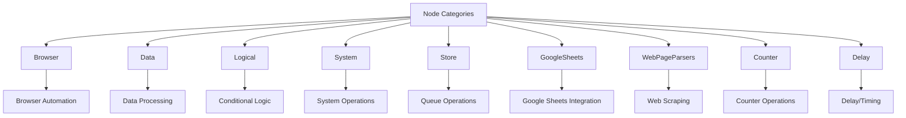
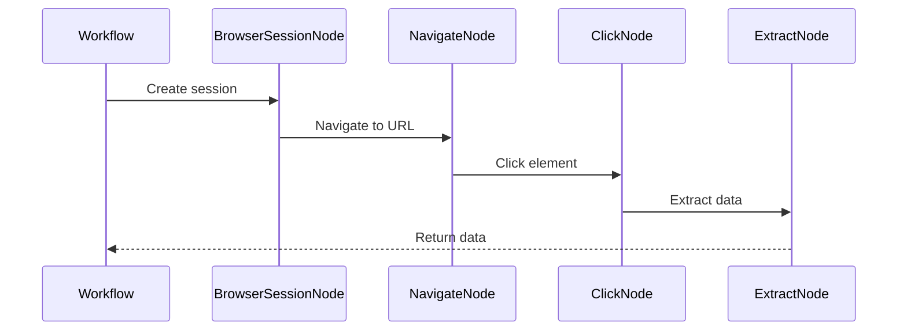
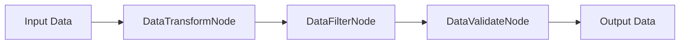
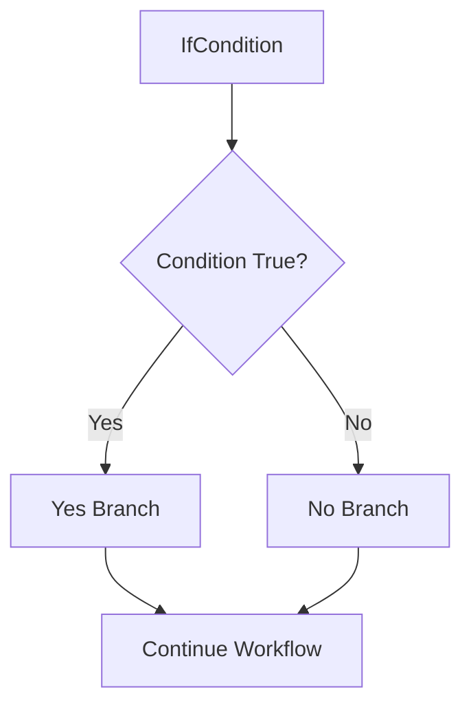
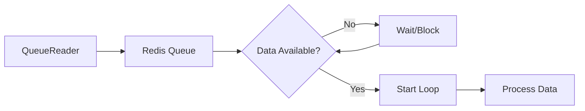
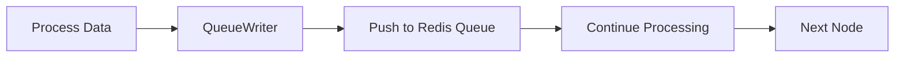
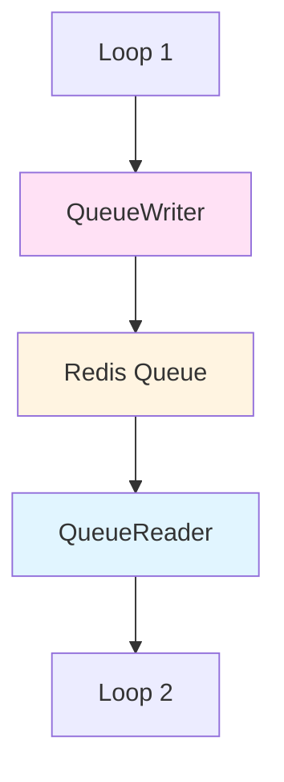
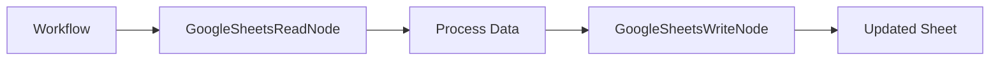

# Node Types

This document provides an overview of available node implementations organized by category. Each category contains nodes designed for specific use cases.

## Navigation

- [← Back to Development Documentation](Development.md)
- [← Previous: Node System](04-Node-System.md)
- [Next: Storage System →](06-Storage-System.md)

## Overview

The node system is organized into categories based on functionality. Each category contains multiple node implementations that share common patterns and use cases.

## Node Categories



## Browser Nodes

Browser nodes provide web automation capabilities using browser sessions.

### Category Overview

- **Purpose**: Automate browser interactions, web scraping, and web-based workflows
- **Execution Pool**: Typically ASYNC (I/O-bound)
- **Common Use Cases**: Web scraping, form filling, browser automation

### Example Nodes

- **BrowserSessionNode**: Manages browser session lifecycle
- **NavigateNode**: Navigates to URLs
- **ClickNode**: Clicks elements on web pages
- **InputNode**: Fills form inputs
- **ExtractNode**: Extracts data from web pages

### Usage Pattern



## Data Nodes

Data nodes handle data processing, transformation, and manipulation.

### Category Overview

- **Purpose**: Process, transform, and manipulate data
- **Execution Pool**: ASYNC or THREAD depending on operation
- **Common Use Cases**: Data transformation, filtering, aggregation

### Example Nodes

- **DataTransformNode**: Transforms data structures
- **DataFilterNode**: Filters data based on conditions
- **DataMergeNode**: Merges multiple data sources
- **DataValidateNode**: Validates data format

### Data Flow



## Logical Nodes

Logical nodes provide conditional branching and decision-making capabilities.

### Category Overview

- **Purpose**: Conditional logic and branching
- **Node Type**: ConditionalNode (extends BlockingNode)
- **Execution Pool**: ASYNC
- **Common Use Cases**: Conditional workflows, decision trees

### Example Nodes

- **IfCondition**: Evaluates conditions and routes to yes/no branches
- **CompareNode**: Compares values and branches accordingly
- **SwitchNode**: Multi-way branching based on value

### Branching Flow



### Implementation Pattern

```python
class IfCondition(ConditionalNode):
    async def execute(self, node_data: NodeOutput) -> NodeOutput:
        condition = self.form.get_field_value("condition")
        result = self._evaluate(condition, node_data.data)
        self.set_output(result)  # Sets "yes" or "no"
        return node_data
```

## System Nodes

System nodes provide system-level operations and utilities.

### Category Overview

- **Purpose**: System operations, utilities, and infrastructure
- **Execution Pool**: Varies by operation
- **Common Use Cases**: System configuration, utilities, infrastructure

### Example Nodes

- **QueueReader**: Reads from Redis queue (ProducerNode)
- **QueueWriter**: Writes to Redis queue (NonBlockingNode)
- **DelayNode**: Introduces delays in workflow
- **CounterNode**: Maintains counters

## Store Nodes

Store nodes handle queue operations for cross-loop communication.

### Category Overview

- **Purpose**: Cross-loop communication via Redis queues
- **Node Types**: QueueReader (ProducerNode), QueueWriter (NonBlockingNode)
- **Execution Pool**: ASYNC
- **Common Use Cases**: Decoupling loops, data passing between workflows

### QueueReader (ProducerNode)

- **Purpose**: Starts loop by reading from Redis queue
- **Type**: ProducerNode
- **Behavior**: Blocks until data available, then starts loop iteration



### QueueWriter (NonBlockingNode)

- **Purpose**: Writes data to Redis queue
- **Type**: NonBlockingNode
- **Behavior**: Pushes data to queue, execution continues
- **Identifier**: `"queue-node-writer"`



### Cross-Loop Communication



## Google Sheets Nodes

Google Sheets nodes provide integration with Google Sheets for data operations.

### Category Overview

- **Purpose**: Read from and write to Google Sheets
- **Execution Pool**: ASYNC (I/O-bound)
- **Common Use Cases**: Data import/export, spreadsheet automation

### Example Nodes

- **GoogleSheetsReadNode**: Reads data from Google Sheets
- **GoogleSheetsWriteNode**: Writes data to Google Sheets
- **GoogleSheetsUpdateNode**: Updates existing rows in Google Sheets

### Data Flow



## WebPageParsers Nodes

WebPageParsers nodes provide specialized web scraping and parsing capabilities.

### Category Overview

- **Purpose**: Parse and extract data from web pages
- **Execution Pool**: ASYNC
- **Common Use Cases**: Web scraping, data extraction

### Example Nodes

- **HTMLParserNode**: Parses HTML content
- **XPathExtractorNode**: Extracts data using XPath
- **CSSSelectorNode**: Extracts data using CSS selectors

## Counter Nodes

Counter nodes provide counting and incrementing functionality.

### Category Overview

- **Purpose**: Maintain and manipulate counters
- **Execution Pool**: ASYNC
- **Common Use Cases**: Iteration counting, progress tracking

### Example Nodes

- **CounterNode**: Maintains a counter value
- **IncrementNode**: Increments a counter
- **ResetCounterNode**: Resets a counter to initial value

## Delay Nodes

Delay nodes introduce timing and delays in workflows.

### Category Overview

- **Purpose**: Introduce delays and timing controls
- **Execution Pool**: ASYNC
- **Common Use Cases**: Rate limiting, timing control, waiting

### Example Nodes

- **DelayNode**: Introduces a fixed delay
- **RandomDelayNode**: Introduces a random delay within range

## Node Selection Guide

### By Use Case

| Use Case | Recommended Node Category |
|----------|--------------------------|
| Web automation | Browser nodes |
| Data processing | Data nodes |
| Conditional logic | Logical nodes |
| Cross-loop communication | Store nodes (QueueReader/QueueWriter) |
| Spreadsheet operations | Google Sheets nodes |
| Web scraping | WebPageParsers nodes |
| Counting/iteration | Counter nodes |
| Timing control | Delay nodes |
| System operations | System nodes |

### By Execution Pool

| Pool Type | Node Categories |
|-----------|----------------|
| ASYNC | Browser, Data, Logical, Store, Google Sheets, WebPageParsers, Counter, Delay |
| THREAD | Data (CPU-bound operations) |
| PROCESS | Data (intensive processing) |

## Creating Custom Nodes

To create a new node in an existing category or a new category:

1. **Choose Category**: Select appropriate category or create new one
2. **Choose Node Type**: ProducerNode, BlockingNode, NonBlockingNode, or ConditionalNode
3. **Implement Node**: Follow node implementation pattern
4. **Create Form**: Define configuration form
5. **Register**: NodeRegistry auto-discovers new nodes

**Related Documentation**: [Adding New Nodes](09-Adding-New-Nodes.md)

## Node Discovery

All nodes are automatically discovered by NodeRegistry:

```mermaid
flowchart TD
    A[Node.Nodes Package] --> B[NodeRegistry Discovery]
    B --> C[Walk Package Tree]
    C --> D[Import Modules]
    D --> E[Find Node Classes]
    E --> F[Get identifier()]
    F --> G[Register in Dict]
    G --> H[Available for Use]
```

**Discovery Requirements**:
- Node must inherit from ProducerNode, BlockingNode, or NonBlockingNode
- Node must implement `identifier()` classmethod
- Node must be in `Node.Nodes` package tree

## Best Practices

### Node Organization

- **Group by Functionality**: Organize nodes into logical categories
- **Consistent Naming**: Use consistent naming conventions within categories
- **Shared Patterns**: Reuse common patterns within categories

### Node Design

- **Single Responsibility**: Each node should do one thing well
- **Clear Purpose**: Node purpose should be immediately clear from name
- **Proper Type**: Choose correct node type (Producer, Blocking, NonBlocking, Conditional)

### Execution Pool Selection

- **Default to ASYNC**: Most nodes should use ASYNC pool
- **Use THREAD for CPU-bound**: When operation can release GIL
- **Use PROCESS sparingly**: Only for true parallelism needs

## Related Documentation

- [Node System](04-Node-System.md) - Node architecture and lifecycle
- [Adding New Nodes](09-Adding-New-Nodes.md) - Step-by-step guide for creating nodes
- [Form System](07-Form-System.md) - Node configuration forms
- [Execution System](03-Execution-System.md) - How nodes are executed

---

[← Back to Development Documentation](Development.md) | [← Previous: Node System](04-Node-System.md) | [Next: Storage System →](06-Storage-System.md)

