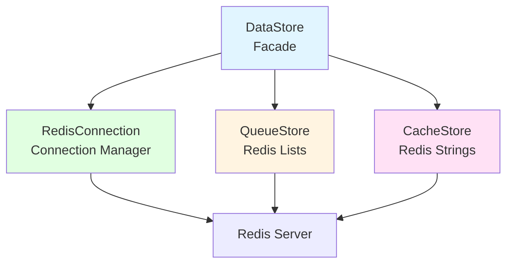
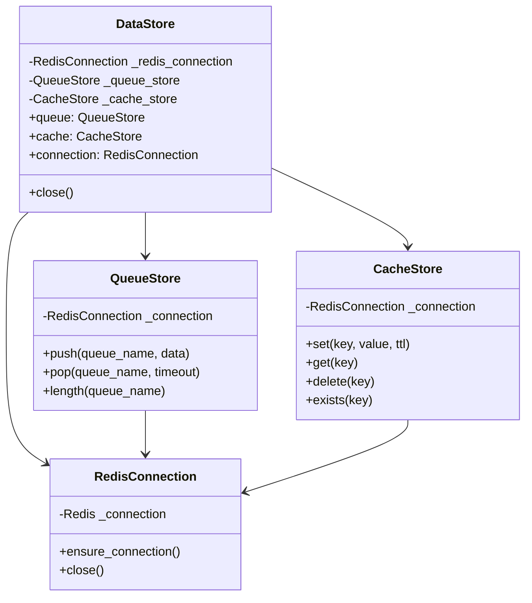
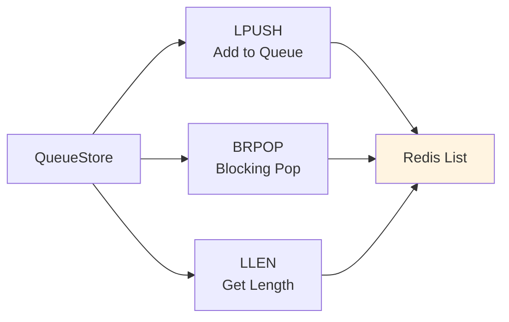
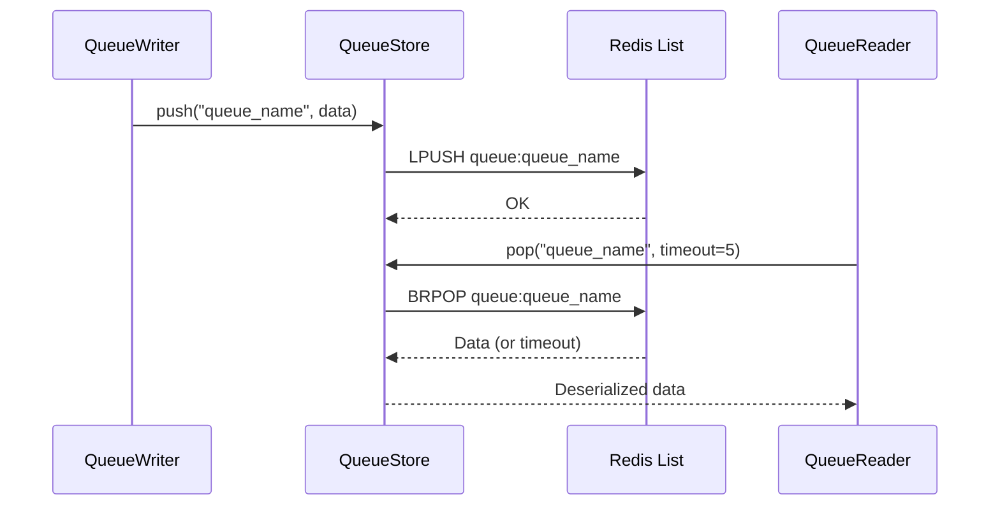
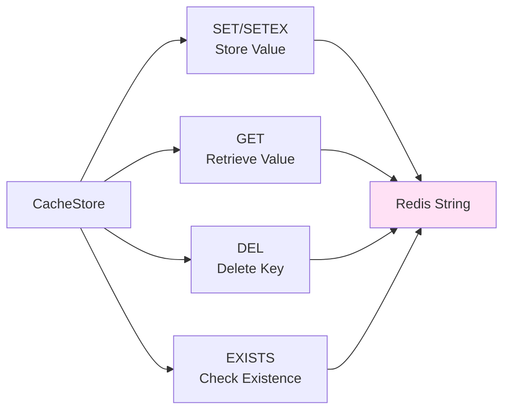
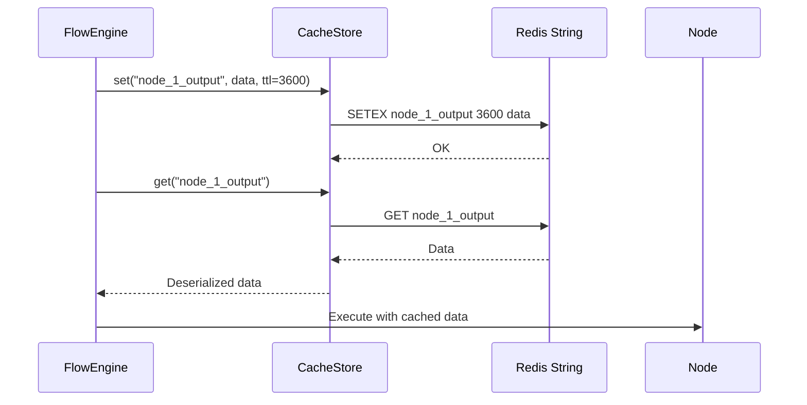
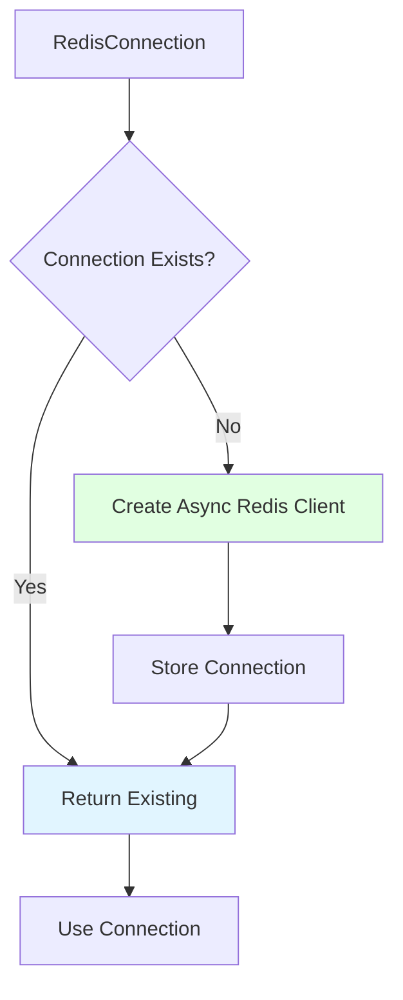
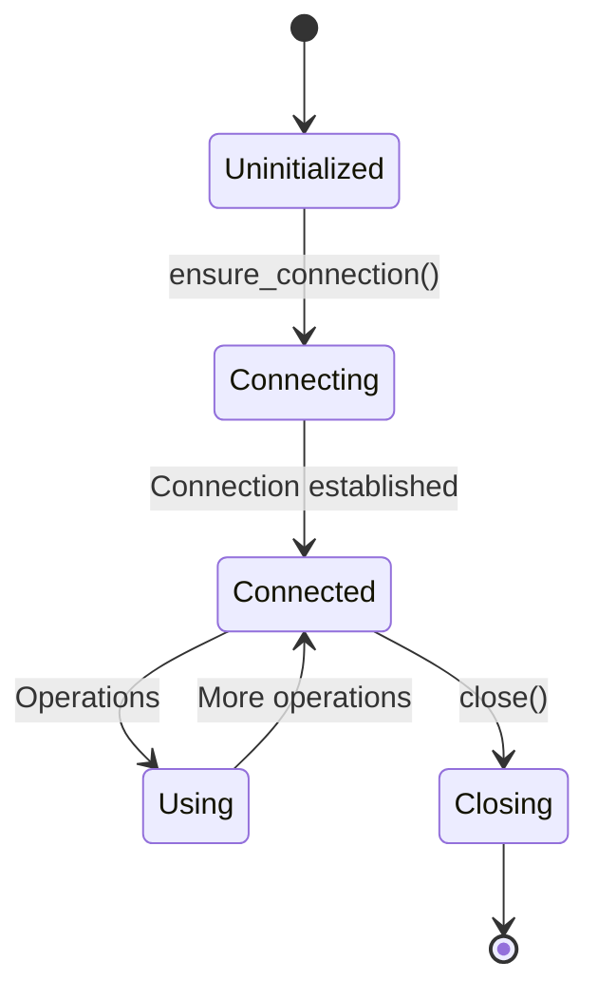
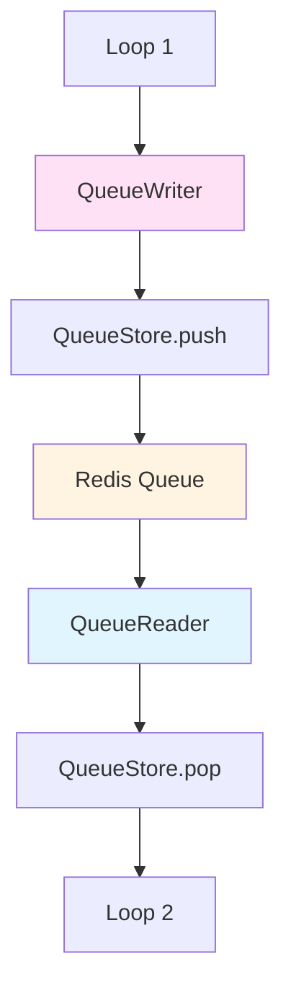
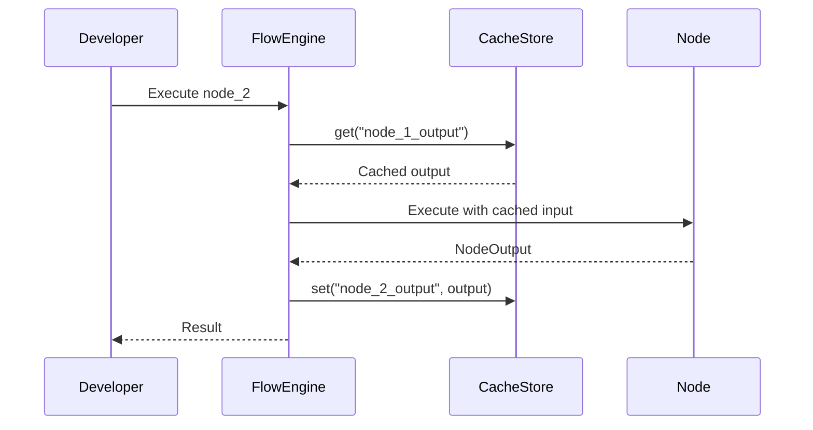

# Storage System

The Storage System provides unified access to Redis for queues and caching. It follows the Single Responsibility Principle with specialized classes for different storage concerns, coordinated through a Facade pattern.

## Navigation

- [← Back to Development Documentation](Development.md)
- [← Previous: Node Types](05-Node-Types.md)
- [Next: Form System →](07-Form-System.md)

## Overview

The Storage System consists of four main components:

1. **DataStore**: Facade providing unified interface to storage services
2. **QueueStore**: Redis List-based queues for cross-loop communication
3. **CacheStore**: Redis String-based cache for development mode and temporary data
4. **RedisConnection**: Connection lifecycle manager for async Redis operations

## Architecture



### Component Responsibilities



## DataStore (Facade)

The `DataStore` class acts as a facade, providing a unified interface to all storage services.

### Purpose

- **Single Entry Point**: One interface for all storage operations
- **Simplified API**: Hides complexity of underlying storage systems
- **Resource Management**: Coordinates connection lifecycle

### Usage

```python
data_store = DataStore()

# Queue operations
await data_store.queue.push("my_queue", {"key": "value"})
item = await data_store.queue.pop("my_queue", timeout=5)
length = await data_store.queue.length("my_queue")

# Cache operations
await data_store.cache.set("my_key", {"data": 123}, ttl=3600)
value = await data_store.cache.get("my_key")
await data_store.cache.delete("my_key")
exists = await data_store.cache.exists("my_key")
```

### Initialization

```python
data_store = DataStore(
    host="127.0.0.1",
    port=6379,
    db=0,
    password=None,
    pool_size=10
)
```

**Key Features**:
- Lazy connection initialization
- Shared connection across stores
- Automatic resource management

## QueueStore

Handles queue operations using Redis Lists. Provides multi-process safe queue operations for cross-loop communication.

### Architecture



### Operations

| Method | Redis Command | Purpose | Behavior |
|--------|--------------|---------|----------|
| `push(queue_name, data)` | `LPUSH` | Add item to queue | Left push (FIFO order) |
| `pop(queue_name, timeout)` | `BRPOP` | Remove item from queue | Blocking right pop with timeout |
| `length(queue_name)` | `LLEN` | Get queue length | Returns current queue size |

### Queue Flow



### Key Features

- **Multi-process Safe**: Multiple processes can push/pop from the same queue
- **Blocking Pop**: `BRPOP` with configurable timeout for efficient waiting
- **JSON Serialization**: Data is JSON-serialized before storage
- **FIFO Order**: First-in-first-out queue semantics

### Implementation Example

```python
async def push(self, queue_name: str, data: Dict):
    queue_key = f"{self._prefix}queue:{queue_name}"
    serialized_data = serialize(data)  # JSON serialization
    conn = await self._connection.ensure_connection()
    await conn.lpush(queue_key, [serialized_data])

async def pop(self, queue_name: str, timeout: Optional[float] = None):
    queue_key = f"{self._prefix}queue:{queue_name}"
    conn = await self._connection.ensure_connection()
    result = await conn.brpop([queue_key], timeout=timeout)
    return deserialize(result.value) if result else None
```

### Use Cases

- **Cross-Loop Communication**: QueueWriter pushes, QueueReader pops
- **Job Queues**: Distributing work across multiple loops
- **Event Processing**: Asynchronous event handling

## CacheStore

Handles key-value cache operations using Redis Strings. Provides temporary storage for development mode and session data.

### Architecture



### Operations

| Method | Redis Command | Purpose | Behavior |
|--------|--------------|---------|----------|
| `set(key, value, ttl)` | `SET` / `SETEX` | Store value | Optional TTL for expiration |
| `get(key)` | `GET` | Retrieve value | Returns None if not found |
| `delete(key)` | `DEL` | Remove key | Deletes key from cache |
| `exists(key)` | `EXISTS` | Check if key exists | Returns boolean |

### Cache Flow



### Key Features

- **TTL Support**: Optional time-to-live for automatic expiration
- **JSON Serialization**: Values are JSON-serialized
- **Development Mode**: Stores node outputs for step-by-step execution
- **Session Data**: Temporary workflow state storage

### Implementation Example

```python
async def set(self, key: str, value: Dict, ttl: Optional[int] = None):
    cache_key = f"{self._prefix}cache:{key}"
    serialized_value = serialize(value)  # JSON serialization
    conn = await self._connection.ensure_connection()
    
    if ttl:
        await conn.setex(cache_key, ttl, serialized_value)
    else:
        await conn.set(cache_key, serialized_value)

async def get(self, key: str) -> Optional[Dict]:
    cache_key = f"{self._prefix}cache:{key}"
    conn = await self._connection.ensure_connection()
    value = await conn.get(cache_key)
    return deserialize(value) if value else None
```

### Use Cases

- **Development Mode**: Cache node outputs for step-by-step execution
- **Session Data**: Store temporary workflow state
- **Configuration**: Cache frequently accessed settings
- **Intermediate Results**: Store computation results

## RedisConnection

Manages Redis connection lifecycle. Provides connection pooling and async operation support.

### Architecture



### Connection Lifecycle



### Key Features

- **Lazy Initialization**: Connection created on first use
- **Connection Reuse**: Single connection shared across stores
- **Async Operations**: Full async/await support
- **Resource Management**: Proper cleanup on close

### Implementation

```python
class RedisConnection:
    async def ensure_connection(self):
        """Get or create async Redis connection."""
        if self._connection is None:
            self._connection = await asyncio_redis.Connection.create(
                host=self._host,
                port=self._port,
                db=self._db,
                password=self._password
            )
        return self._connection
    
    async def close(self):
        """Close the Redis connection."""
        if self._connection:
            await self._connection.close()
            self._connection = None
```

## Serialization

Both QueueStore and CacheStore use JSON serialization for data storage.

### Serialization Utilities

```python
def serialize(data: Dict) -> str:
    """Convert dict to JSON string for Redis storage."""
    return json.dumps(data)

def deserialize(data: str) -> Dict:
    """Convert JSON string back to dict."""
    return json.loads(data)
```

### Requirements

- **JSON-Serializable**: All data must be JSON-serializable
- **Type Preservation**: Basic types (str, int, float, bool, list, dict) preserved
- **Custom Types**: Custom objects must be converted to dicts

## Cross-Loop Communication

QueueStore enables decoupled communication between isolated execution loops.

### Communication Pattern



### Queue Naming

Queue names are automatically assigned by QueueMapper post-processor:

- **Pattern**: `queue_{source_id}_{target_id}`
- **Example**: `queue_node_5_node_8`
- **Uniqueness**: Each QueueWriter-QueueReader pair gets unique name

**Related Documentation**: [Post-Processing](08-Post-Processing.md)

## Development Mode Caching

CacheStore enables step-by-step node execution in Development Mode.

### Caching Flow



### Cache Keys

- **Pattern**: `{node_id}_output`
- **Example**: `node_1_output`, `node_2_output`
- **TTL**: Optional expiration for cleanup

## Error Handling

### Connection Errors

- **Connection Failure**: Raises exception, retry logic in application
- **Timeout**: Handled by BRPOP timeout parameter
- **Serialization Errors**: Raises exception if data not JSON-serializable

### Queue Operations

- **Empty Queue**: `pop()` returns `None` after timeout
- **Queue Full**: Redis handles memory limits (configurable)

### Cache Operations

- **Key Not Found**: `get()` returns `None`
- **Expired Key**: `get()` returns `None` after TTL expiration

## Best Practices

### Queue Usage

1. **Use Descriptive Names**: Clear queue names for debugging
2. **Handle Timeouts**: Always specify timeout for `pop()` operations
3. **Check for None**: Handle `None` return from `pop()`
4. **Monitor Queue Length**: Use `length()` for monitoring

### Cache Usage

1. **Set Appropriate TTL**: Use TTL to prevent cache bloat
2. **Use Unique Keys**: Avoid key collisions
3. **Handle Missing Keys**: Always check for `None` from `get()`
4. **Clean Up**: Delete keys when no longer needed

### Connection Management

1. **Reuse DataStore**: Create once, reuse across operations
2. **Close Properly**: Call `close()` when done
3. **Handle Errors**: Implement retry logic for connection failures

## Performance Considerations

### Queue Performance

- **LPUSH/BRPOP**: O(1) operations, very fast
- **Blocking Pop**: Efficient waiting, no polling
- **Serialization**: JSON overhead, but acceptable for most use cases

### Cache Performance

- **SET/GET**: O(1) operations, very fast
- **TTL**: Automatic cleanup, no manual maintenance
- **Memory**: Monitor Redis memory usage

## Related Documentation

- [Workflow Engine](02-Workflow-Engine.md) - FlowEngine integration
- [Execution System](03-Execution-System.md) - Cross-loop communication
- [Post-Processing](08-Post-Processing.md) - QueueMapper automatic assignment
- [Development Workflow](10-Development-Workflow.md) - Development mode usage

---

[← Back to Development Documentation](Development.md) | [← Previous: Node Types](05-Node-Types.md) | [Next: Form System →](07-Form-System.md)

