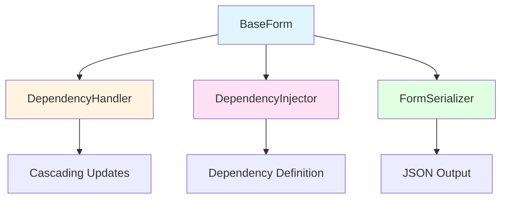
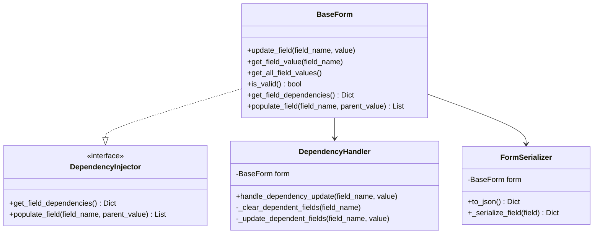
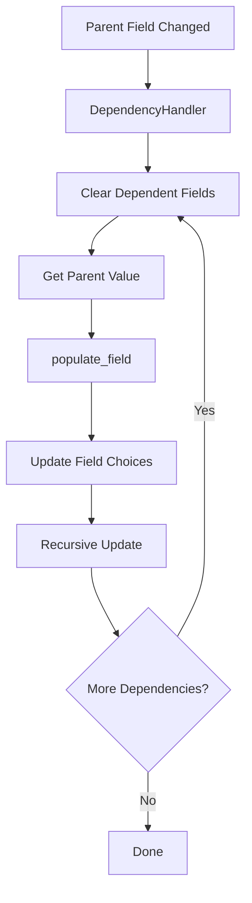
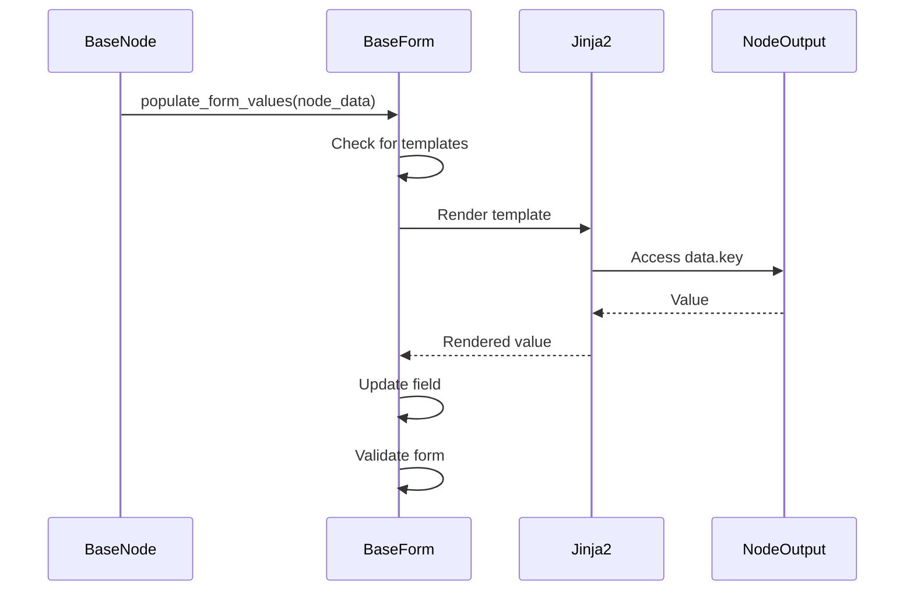
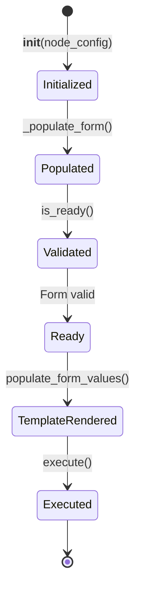
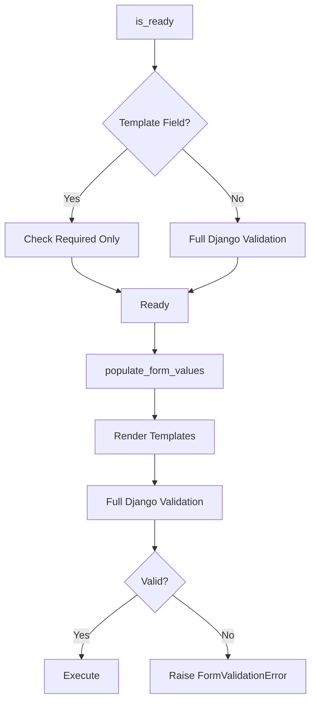

# Form System

The Form System provides a Django-based configuration interface for nodes, supporting cascading field dependencies and Jinja template rendering. This document explains BaseForm, DependencyHandler, FormSerializer, and how forms integrate with the node system.

## Navigation

- [← Back to Development Documentation](Development.md)
- [← Previous: Storage System](06-Storage-System.md)
- [Next: Post-Processing →](08-Post-Processing.md)

## Overview

The Form System follows the Single Responsibility Principle with specialized classes:

1. **BaseForm**: Core form functionality (validation, field values, rebinding)
2. **DependencyHandler**: Manages field dependency cascading
3. **DependencyInjector**: Abstract interface for dependency configuration
4. **FormSerializer**: JSON serialization of forms for API/UI consumption

## Architecture



### Component Responsibilities



## BaseForm

`BaseForm` extends Django's `Form` with incremental update support and dependency handling.

### Key Features

- **Incremental Updates**: Update single fields without full form rebinding
- **Dependency Cascading**: Automatic updates when parent fields change
- **Django Validation**: Full Django validation integration
- **Template Support**: Jinja template rendering in fields

### Core Methods

| Method | Purpose |
|--------|---------|
| `update_field(field_name, value)` | Update a single field and trigger dependency cascading |
| `get_field_value(field_name)` | Get current field value from any source |
| `get_all_field_values()` | Get all field values as a dictionary |
| `is_valid()` | Validate the form (Django validation) |

### Usage Example

```python
class LocationForm(BaseForm):
    country = forms.ChoiceField(choices=[...])
    state = forms.ChoiceField(choices=[])  # Populated based on country
    city = forms.ChoiceField(choices=[])   # Populated based on state
    
    def get_field_dependencies(self):
        return {
            'country': ['state'],
            'state': ['city']
        }
    
    def populate_field(self, field_name, parent_value):
        if field_name == 'state':
            return get_states_for_country(parent_value)
        elif field_name == 'city':
            return get_cities_for_state(parent_value)
        return []

# Usage
form = LocationForm()
form.update_field('country', 'US')  # Triggers state field update
form.update_field('state', 'CA')    # Triggers city field update
```

## Cascading Field Dependencies

Forms can define parent-child field relationships where changing a parent field updates child field choices.

### Dependency Flow



### Dependency Definition

```python
def get_field_dependencies(self):
    """
    Define parent-child field relationships.
    
    Returns:
        Dict mapping parent field names to lists of dependent field names.
    """
    return {
        'country': ['state'],      # country changes → update state
        'state': ['city']          # state changes → update city
    }
```

### Field Population

```python
def populate_field(self, field_name, parent_value):
    """
    Populate a dependent field based on parent value.
    
    Args:
        field_name: Name of the field to populate
        parent_value: Value of the parent field
        
    Returns:
        List of choices for the field (for ChoiceField)
    """
    if field_name == 'state':
        return get_states_for_country(parent_value)
    elif field_name == 'city':
        return get_cities_for_state(parent_value)
    return []
```

### DependencyHandler Behavior

1. **Clear Dependencies**: When a parent field changes, clears all dependent fields recursively
2. **Populate Fields**: Calls `populate_field()` to get new choices for dependent fields
3. **Update Choices**: Updates field choices in the form
4. **Recursive**: Handles multi-level dependencies (country → state → city)

## Jinja Template Support

Form fields can contain Jinja2 templates that are rendered at runtime with data from previous nodes.

### Template Syntax

```json
{
  "form": {
    "message": "Hello {{ data.user_name }}, your score is {{ data.score }}",
    "url": "https://api.example.com/users/{{ data.user_id }}"
  }
}
```

### Template Rendering Flow



### Template Detection

```python
JINJA_PATTERN = re.compile(r'\{\{.*?\}\}')

def contains_jinja_template(value) -> bool:
    """Check if a value contains Jinja template syntax."""
    if value is None:
        return False
    return bool(JINJA_PATTERN.search(str(value)))
```

### Rendering Process

1. **During `is_ready()`**: Template fields are only checked for non-empty values
2. **During `populate_form_values()`**: Templates are rendered using `NodeOutput.data`
3. **After Rendering**: Full Django validation is performed

### Template Context

Templates have access to `data` dictionary from `NodeOutput`:

```python
# NodeOutput.data = {"user_name": "John", "score": 95}

# Template: "Hello {{ data.user_name }}, your score is {{ data.score }}"
# Rendered: "Hello John, your score is 95"
```

## FormSerializer

Converts Django forms to JSON for API responses and UI rendering.

### Serialization Structure

```python
serializer = FormSerializer(form)
json_output = serializer.to_json()

# Output structure:
{
    "fields": [
        {
            "tag": "select",
            "name": "country",
            "label": "Country",
            "options": [{"value": "us", "text": "United States"}],
            "value": "us",
            "errors": []
        }
    ],
    "non_field_errors": []
}
```

### Field Serialization

Each field is serialized with:
- **tag**: HTML tag type (input, select, textarea, etc.)
- **name**: Field name
- **label**: Field label
- **type**: Input type (for input fields)
- **options**: Choices (for select fields)
- **value**: Current field value
- **errors**: Validation errors
- **required**: Whether field is required

### Usage

```python
form = MyNodeForm()
form.update_field('country', 'US')

serializer = FormSerializer(form)
json_data = serializer.to_json()

# Send to frontend via API
return JsonResponse(json_data)
```

## Node Form Integration

Nodes declare their form by implementing `get_form()`:

```python
class MyNode(BlockingNode):
    def get_form(self) -> Optional[BaseForm]:
        return MyNodeForm()
```

### Form Lifecycle



### Form Population

The form is automatically:
1. **Populated with config data** during `__init__()`
2. **Validated** during `is_ready()`
3. **Template-rendered** during `run()`

## Validation Flow

### Two-Phase Validation



### Validation Rules

- **Non-template fields**: Full Django validation during `is_ready()`
- **Template fields**: Only required check during `is_ready()`, full validation after rendering
- **After rendering**: All fields get full Django validation

### Error Handling

```python
class FormValidationError(Exception):
    """Exception raised when form validation fails after Jinja template rendering."""
    def __init__(self, form, message="Form validation failed after rendering"):
        self.form = form
        self.message = message
        super().__init__(self.message)
```

## Form Field Types

### Supported Django Field Types

- **CharField**: Text input
- **ChoiceField**: Select dropdown
- **IntegerField**: Number input
- **BooleanField**: Checkbox
- **EmailField**: Email input
- **URLField**: URL input
- **TextField**: Textarea

### Custom Field Types

Forms can use any Django field type. FormSerializer handles serialization automatically.

## Best Practices

### Form Design

1. **Use Dependencies**: Define cascading dependencies for related fields
2. **Support Templates**: Allow Jinja templates for dynamic values
3. **Clear Validation**: Provide clear error messages
4. **Default Values**: Set sensible defaults where possible

### Dependency Management

1. **Define Clearly**: Use `get_field_dependencies()` to define relationships
2. **Handle Edge Cases**: Check for None/empty values in `populate_field()`
3. **Cache Choices**: Cache expensive choice lookups if needed

### Template Usage

1. **Use Sparingly**: Only use templates when values are truly dynamic
2. **Validate Structure**: Ensure template variables exist in NodeOutput.data
3. **Error Handling**: Handle missing template variables gracefully

## Related Documentation

- [Node System](04-Node-System.md) - How nodes use forms
- [Adding New Nodes](09-Adding-New-Nodes.md) - Creating forms for new nodes
- [Development Workflow](10-Development-Workflow.md) - Form development practices

---

[← Back to Development Documentation](Development.md) | [← Previous: Storage System](06-Storage-System.md) | [Next: Post-Processing →](08-Post-Processing.md)

