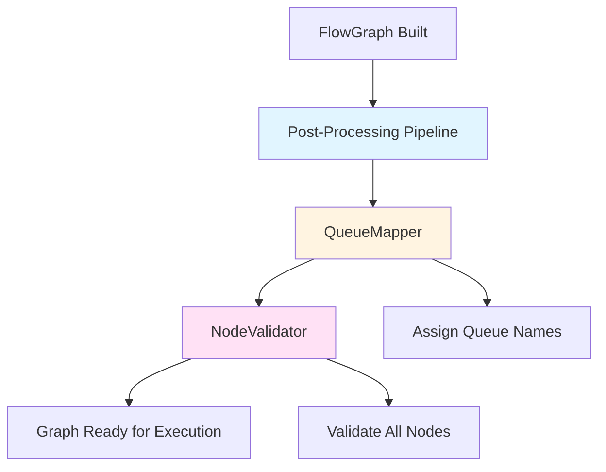
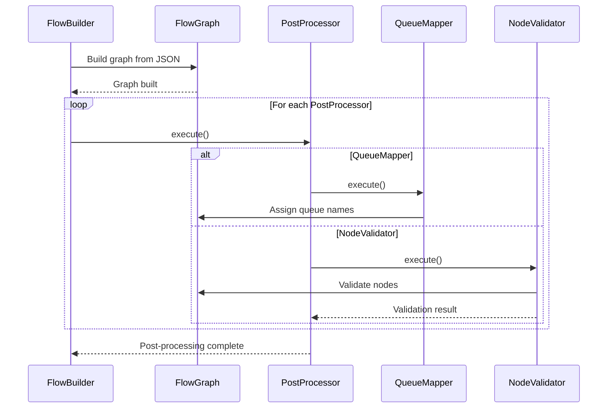
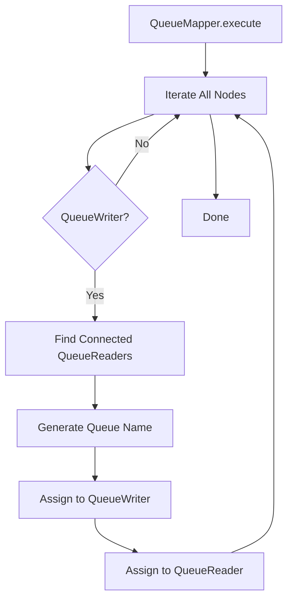
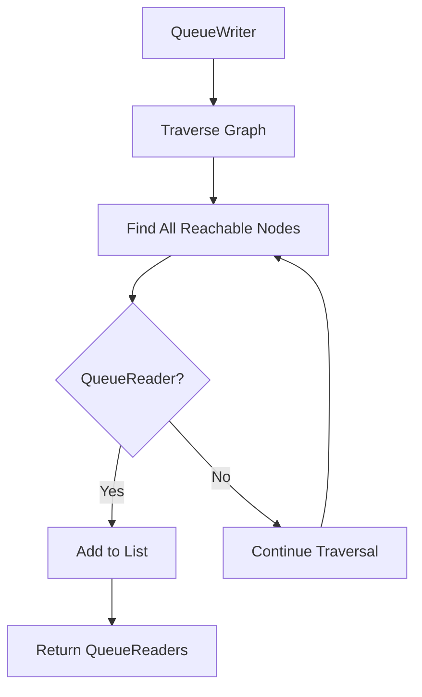
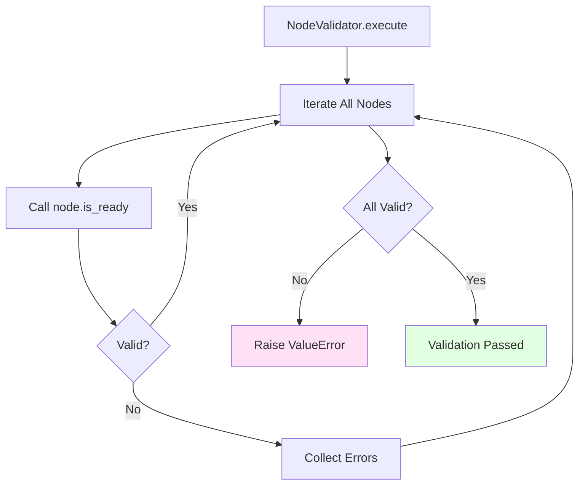
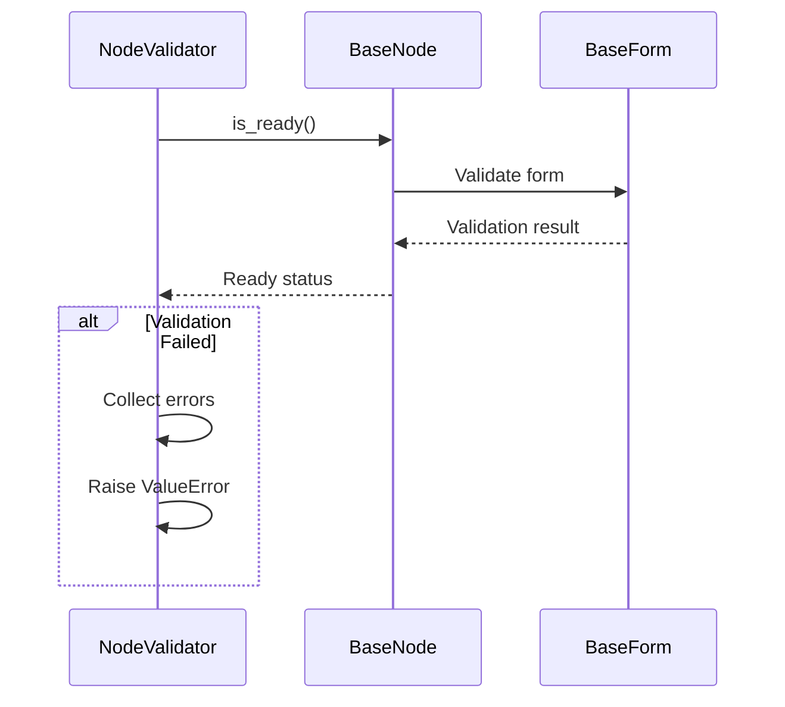
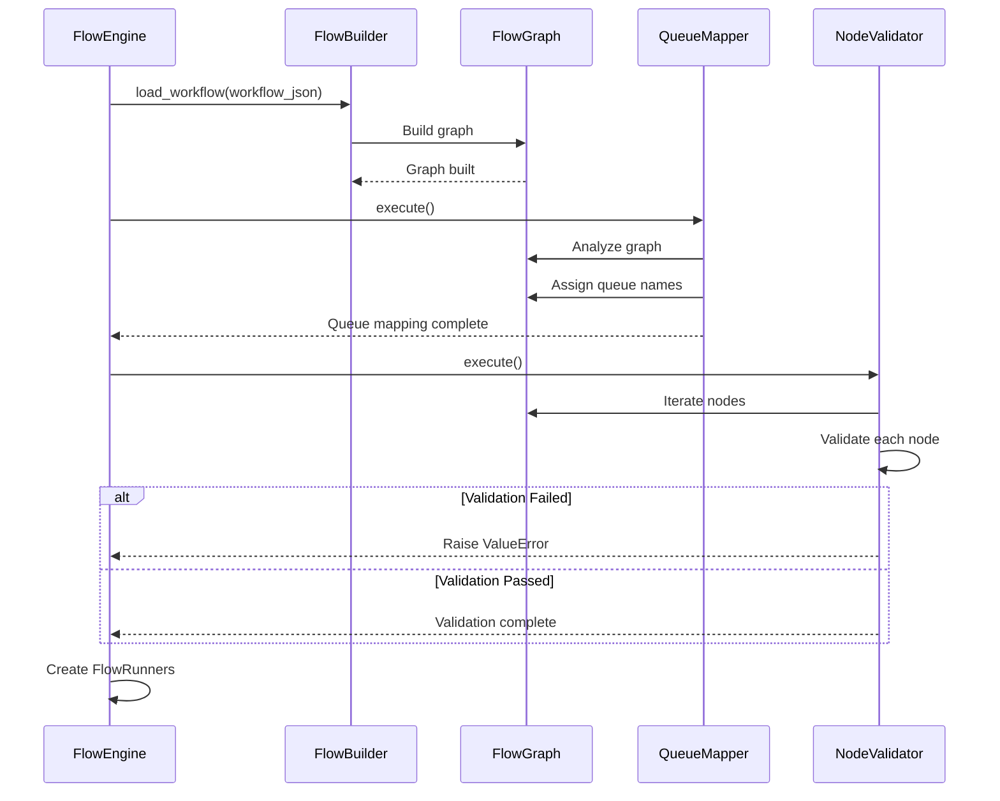

# Post-Processing

After the workflow graph is built from JSON, a series of post-processors validate and enhance the graph before execution. This document explains the PostProcessor architecture, QueueMapper, and NodeValidator.

## Navigation

- [← Back to Development Documentation](Development.md)
- [← Previous: Form System](07-Form-System.md)
- [Next: Adding New Nodes →](09-Adding-New-Nodes.md)

## Overview

Post-processors are applied after the workflow graph is constructed but before execution begins. They perform validation, enhancement, and optimization operations on the graph.

## Architecture



### Post-Processing Flow



## PostProcessor Abstract Base

All post-processors inherit from `PostProcessor`:

```python
class PostProcessor(ABC):
    def __init__(self, graph: FlowGraph):
        self.graph = graph

    @abstractmethod
    def execute(self) -> None:
        """Execute the post-processing operation."""
        pass
```

### PostProcessor Registration

Post-processors are registered in `FlowEngine`:

```python
class FlowEngine:
    _post_processors: List[Type[PostProcessor]] = [QueueMapper, NodeValidator]
    
    def load_workflow(self, workflow_json: Dict[str, Any]):
        self.flow_builder.load_workflow(workflow_json)
        
        # Run post-processors
        for processor_class in self._post_processors:
            processor = processor_class(self.flow_graph)
            processor.execute()
```

## QueueMapper

Automatically assigns unique queue names to connected `QueueWriter`-`QueueReader` pairs.

### Purpose

- **Automatic Queue Assignment**: Eliminates manual queue name configuration
- **Unique Naming**: Ensures each QueueWriter-QueueReader pair has a unique queue
- **Graph Analysis**: Traverses graph to find connected queue nodes

### Process



### Queue Name Generation

**Pattern**: `queue_{source_id}_{target_id}`

**Example**:
- QueueWriter "node_5" → QueueReader "node_8"
- Generated queue name: `"queue_node_5_node_8"`

### Implementation

```python
class QueueMapper(PostProcessor):
    def execute(self) -> None:
        for node_id, flow_node in self.graph.node_map.items():
            if isinstance(flow_node.instance, QueueWriter):
                # Find connected QueueReader nodes
                queue_readers = self._find_queue_readers(flow_node)
                
                for queue_reader in queue_readers:
                    # Generate unique queue name
                    queue_name = f"queue_{node_id}_{queue_reader.id}"
                    
                    # Assign to both nodes
                    flow_node.instance.node_config.data.config['queue_name'] = queue_name
                    queue_reader.instance.node_config.data.config['queue_name'] = queue_name
```

### Finding Connected QueueReaders



## NodeValidator

Validates all nodes are ready for execution before workflow starts.

### Purpose

- **Pre-execution Validation**: Catches configuration errors early
- **Form Validation**: Ensures all node forms are valid
- **Error Collection**: Collects all validation errors for reporting

### Process



### Validation Flow



### Error Collection

```python
class NodeValidator(PostProcessor):
    def execute(self) -> None:
        errors = []
        
        for node_id, flow_node in self.graph.node_map.items():
            node = flow_node.instance
            
            if not node.is_ready():
                # Collect form errors
                if node.form and node.form.errors:
                    for field_name, field_errors in node.form.errors.items():
                        for error in field_errors:
                            errors.append(f"Node '{node_id}': {field_name}: {error}")
                else:
                    errors.append(f"Node '{node_id}': Validation failed")
        
        if errors:
            error_message = "Workflow validation failed:\n" + "\n".join(errors)
            raise ValueError(error_message)
```

### Error Output Format

```
Workflow validation failed:
Node 'node_5': queue_name: This field is required.
Node 'node_8': api_key: Invalid format.
Node 'node_12': url: Enter a valid URL.
```

## Post-Processing Sequence

### Complete Flow



## Custom Post-Processors

Create custom post-processors by extending `PostProcessor`:

```python
class MyCustomProcessor(PostProcessor):
    def execute(self) -> None:
        for node_id, flow_node in self.graph.node_map.items():
            # Custom processing logic
            pass
```

### Registration

Register custom post-processors in `FlowEngine`:

```python
FlowEngine._post_processors.append(MyCustomProcessor)
```

### Use Cases for Custom Post-Processors

- **Graph Optimization**: Optimize graph structure
- **Resource Allocation**: Assign resources to nodes
- **Security Validation**: Validate security constraints
- **Performance Analysis**: Analyze performance characteristics

## Post-Processing Order

Post-processors are executed in registration order:

1. **QueueMapper**: Assigns queue names (must run before validation)
2. **NodeValidator**: Validates nodes (runs after queue assignment)

**Important**: Order matters! QueueMapper must run before NodeValidator because NodeValidator may check queue names.

## Error Handling

### QueueMapper Errors

- **Missing QueueReader**: Warning logged, queue not assigned
- **Graph Traversal Error**: Exception raised, workflow loading fails

### NodeValidator Errors

- **Validation Failure**: `ValueError` raised with detailed error list
- **Form Errors**: Collected and included in error message
- **Missing Configuration**: Detected and reported

## Best Practices

### Post-Processor Design

1. **Single Responsibility**: Each post-processor should do one thing
2. **Idempotent**: Should be safe to run multiple times
3. **Error Handling**: Provide clear error messages
4. **Performance**: Keep operations efficient

### QueueMapper Usage

1. **Automatic Assignment**: Let QueueMapper handle queue names
2. **Manual Override**: Can manually set queue names if needed
3. **Naming Convention**: Follow `queue_{source}_{target}` pattern

### NodeValidator Usage

1. **Early Validation**: Catch errors before execution
2. **Clear Messages**: Provide actionable error messages
3. **Form Validation**: Ensure forms are properly configured

## Related Documentation

- [Workflow Engine](02-Workflow-Engine.md) - How post-processors are integrated
- [Node System](04-Node-System.md) - Node validation process
- [Storage System](06-Storage-System.md) - Queue operations
- [Form System](07-Form-System.md) - Form validation

---

[← Back to Development Documentation](Development.md) | [← Previous: Form System](07-Form-System.md) | [Next: Adding New Nodes →](09-Adding-New-Nodes.md)

