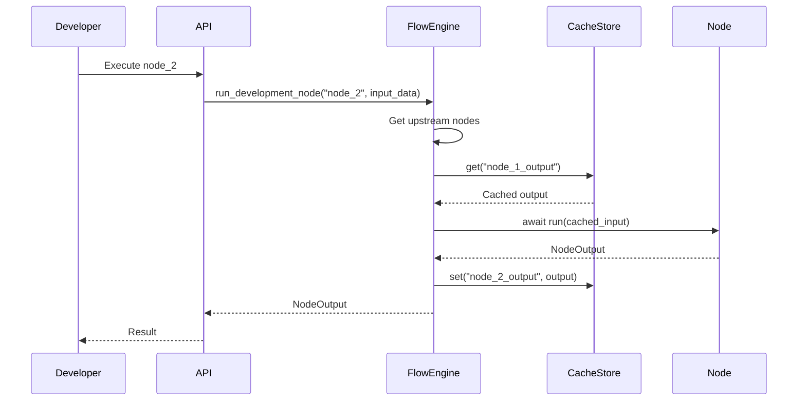

# Development Workflow

This guide covers development practices, debugging strategies, testing approaches, and code organization principles for working with the backend workflow system.

## Navigation

- [← Back to Development Documentation](Development.md)
- [← Previous: Adding New Nodes](09-Adding-New-Nodes.md)
- [Next: API Reference →](11-API-Reference.md)

## Overview

This document provides practical guidance for:
- Development mode usage
- Debugging workflows
- Testing strategies
- Code organization principles (SRP)
- Best practices

## Development Mode

Development Mode enables iterative, step-by-step execution of individual nodes for testing and debugging.

### Enabling Development Mode

Development Mode is automatically used when executing individual nodes via the API:

```python
# API endpoint: POST /api/dev/execute
{
    "node_id": "node_1",
    "input_data": {
        "key": "value"
    }
}
```

### Development Mode Flow



### Using Development Mode

1. **Execute Nodes Individually**: Test each node in isolation
2. **Check Cache**: View cached outputs between steps
3. **Iterate Quickly**: Make changes and re-execute
4. **Debug Issues**: Identify problems at specific nodes

### Cache Management

Development Mode uses Redis cache to store node outputs:

- **Cache Keys**: `{node_id}_output`
- **TTL**: Optional expiration
- **Access**: Via CacheStore API

## Debugging Workflows

### Logging

The system uses **structlog** for structured logging:

```python
import structlog

logger = structlog.get_logger(__name__)

logger.info("Processing data", node_id=self.node_config.id, data_size=len(node_data.data))
logger.debug("Completed processing", result_count=10)
logger.error("Operation failed", error=str(e), exc_info=True)
```

### Log Levels

- **INFO**: General workflow execution
- **DEBUG**: Detailed node execution
- **WARNING**: Non-critical issues
- **ERROR**: Errors and exceptions

### Log Output

- **Console**: Pretty-printed, colored logs for development
- **File**: JSON Lines format (`.jsonl`) for machine processing
- **Location**: `logs/workflow.jsonl` (rotates daily)

### Debugging Strategies

1. **Check Logs**: Review structured logs for execution flow
2. **Inspect Cache**: Check cached node outputs
3. **Test Nodes Individually**: Use Development Mode
4. **Validate Forms**: Check form validation errors
5. **Trace Execution**: Follow node execution sequence

## Testing Strategies

### Unit Testing

Test individual nodes in isolation:

```python
import pytest
from Node.Core.Node.Core.Data import NodeConfig, NodeOutput
from YourNode.node import YourNode

@pytest.mark.asyncio
async def test_node_execution():
    config = NodeConfig(
        id="test_node",
        type="your-node",
        data={"form": {"field": "value"}, "config": {}}
    )
    
    node = YourNode(config)
    await node.init()
    
    input_data = NodeOutput(data={"key": "value"})
    output = await node.run(input_data)
    
    assert output.data["result"] == expected
```

### Integration Testing

Test node interactions:

```python
@pytest.mark.asyncio
async def test_node_chain():
    # Create multiple nodes
    node1 = Node1(config1)
    node2 = Node2(config2)
    
    # Execute chain
    output1 = await node1.run(input_data)
    output2 = await node2.run(output1)
    
    assert output2.data["final_result"] == expected
```

### Workflow Testing

Test complete workflows:

```python
@pytest.mark.asyncio
async def test_workflow_execution():
    workflow_json = {...}  # Workflow definition
    
    engine = FlowEngine()
    engine.load_workflow(workflow_json)
    
    # Test in development mode
    result = await engine.run_development_node("node_id", input_data)
    
    assert result.data["output"] == expected
```

### Test Organization

```
backend/
└── core/
    └── Node/
        └── Nodes/
            └── YourCategory/
                └── YourNode/
                    └── tests/
                        ├── test_node.py
                        └── test_integration.py
```

## Code Organization Principles

### Single Responsibility Principle (SRP)

Each component should have one clear responsibility:

#### Backend Views

- **Responsibility**: Handle HTTP request/response only
- **Don't**: Include business logic
- **Do**: Delegate to services

```python
# Good
class WorkflowView(APIView):
    def post(self, request):
        service = WorkflowService()
        result = service.create_workflow(request.data)
        return Response(result)

# Bad
class WorkflowView(APIView):
    def post(self, request):
        # Business logic in view - violates SRP
        workflow = Workflow.objects.create(...)
        # Complex processing...
        return Response(...)
```

#### Backend Services

- **Responsibility**: Contain business logic
- **Don't**: Handle HTTP concerns
- **Do**: Be testable without HTTP

```python
# Good
class WorkflowService:
    def create_workflow(self, data):
        # Business logic only
        workflow = self._validate_and_create(data)
        return workflow

# Bad
class WorkflowService:
    def create_workflow(self, request):
        # HTTP concerns in service - violates SRP
        data = request.data
        return Response(...)
```

#### Nodes

- **Responsibility**: Implement `execute()` logic only
- **Don't**: Include configuration logic
- **Do**: Move config to Form

```python
# Good
class MyNode(BlockingNode):
    async def execute(self, node_data):
        # Execution logic only
        value = self.form.get_field_value("field")
        return await self._process(value)

# Bad
class MyNode(BlockingNode):
    async def execute(self, node_data):
        # Configuration logic mixed with execution - violates SRP
        config = self.node_config.data.config
        if config.get("option") == "value":
            # Complex config handling...
            pass
```

#### Forms

- **Responsibility**: Define fields and validation only
- **Don't**: Include execution logic
- **Do**: Keep logic in Node

```python
# Good
class MyNodeForm(BaseForm):
    field = forms.CharField(label="Field")

# Bad
class MyNodeForm(BaseForm):
    field = forms.CharField(label="Field")
    
    def process_data(self, data):
        # Execution logic in form - violates SRP
        return processed_data
```

### Self-Check Questions

Before committing code, ask:

1. **Can I describe this component's job in one sentence?**
   - If no → Too many responsibilities

2. **If business logic changes, do I edit only one file?**
   - If no → Logic leaked into multiple files

3. **Can I unit test this without its dependencies?**
   - If no → Too tightly coupled

4. **Does this component have only one reason to change?**
   - If no → Violates SRP

## Best Practices

### Async/Await Usage

- **Always use async/await** for I/O operations
- **Don't mix sync and async** unnecessarily
- **Use proper error handling** with try/except

```python
# Good
async def execute(self, node_data):
    async with aiohttp.ClientSession() as session:
        response = await session.get(url)
        return await response.json()

# Bad
async def execute(self, node_data):
    response = requests.get(url)  # Blocking call in async function
    return response.json()
```

### Error Handling

- **Fail-fast**: Don't retry automatically
- **Log errors**: Use structured logging
- **Clean up resources**: Ensure cleanup in finally blocks

```python
# Good
async def execute(self, node_data):
    try:
        result = await self._do_work()
        return NodeOutput(data={"result": result})
    except Exception as e:
        logger.error("Operation failed", error=str(e), exc_info=True)
        raise

# Bad
async def execute(self, node_data):
    result = await self._do_work()  # No error handling
    return NodeOutput(data={"result": result})
```

### Resource Management

- **Initialize in setup()**: Don't initialize in `__init__()`
- **Clean up in cleanup()**: Release resources properly
- **Handle errors**: Ensure cleanup happens even on errors

```python
# Good
async def setup(self):
    self.client = aiohttp.ClientSession()

async def cleanup(self, node_data=None):
    if hasattr(self, 'client'):
        await self.client.close()

# Bad
def __init__(self, config):
    self.client = aiohttp.ClientSession()  # Resource in __init__
```

### Form Design

- **Use dependencies**: Define cascading dependencies
- **Support templates**: Allow Jinja templates
- **Clear validation**: Provide actionable error messages

```python
# Good
class MyForm(BaseForm):
    def get_field_dependencies(self):
        return {'parent': ['child']}
    
    def populate_field(self, field_name, parent_value):
        if field_name == 'child':
            return get_choices(parent_value)
        return []

# Bad
class MyForm(BaseForm):
    # No dependency handling
    pass
```

## Development Checklist

Before submitting code:

- [ ] Code follows SRP
- [ ] All async operations use async/await
- [ ] Error handling implemented
- [ ] Resources cleaned up properly
- [ ] Logging added for important operations
- [ ] Tests written and passing
- [ ] Documentation updated
- [ ] Code reviewed

## Related Documentation

- [Adding New Nodes](09-Adding-New-Nodes.md) - Creating new nodes
- [Node System](04-Node-System.md) - Node architecture
- [Execution System](03-Execution-System.md) - Execution details
- [Form System](07-Form-System.md) - Form architecture

---

[← Back to Development Documentation](Development.md) | [← Previous: Adding New Nodes](09-Adding-New-Nodes.md) | [Next: API Reference →](11-API-Reference.md)

