# Webhook Node

The Webhook Node system enables external systems to trigger workflow execution via HTTP POST requests. This document explains the complete architecture, data flow, execution modes, and integration with different node types.

## Navigation

- [← Back to Development Documentation](Development.md)
- [← Previous: API Reference](11-API-Reference.md)

## Overview

The Webhook Node system consists of three main components working together:

1. **WebhookReceiverView**: HTTP endpoint that receives POST requests from external systems
2. **WebhookPubSubStore**: Redis pub/sub store that manages webhook data distribution
3. **WebhookProducerNode**: ProducerNode that subscribes to webhook channels and triggers workflow execution

### Key Characteristics

- **Event-Driven**: Workflows start when external systems POST to webhook endpoints
- **Publish-Subscribe Pattern**: Uses Redis pub/sub for decoupled communication
- **ProducerNode**: Webhook nodes act as ProducerNodes, starting workflow loops
- **Blocking Subscription**: Node blocks indefinitely until webhook data arrives
- **Multi-Mode Support**: Works in Production, Development, and Standalone modes

## Architecture

```mermaid
flowchart TD
    A[External System] -->|POST /api/webhooks/{webhook_id}| B[WebhookReceiverView]
    B -->|Publish| C[WebhookPubSubStore]
    C -->|Redis PUBLISH| D[Redis Channel: webhook:{id}]
    D -->|Subscribe| E[WebhookProducerNode]
    E -->|NodeOutput| F[FlowRunner]
    F -->|Execute| G[Downstream Nodes]
    G -->|BlockingNode| H[Sequential Execution]
    G -->|NonBlockingNode| I[Async Execution]
    G -->|ConditionalNode| J[Branch Selection]
    
    style B fill:#e1f5ff
    style C fill:#fff4e1
    style E fill:#ffe1f5
    style F fill:#e1ffe1
```

### Component Relationships

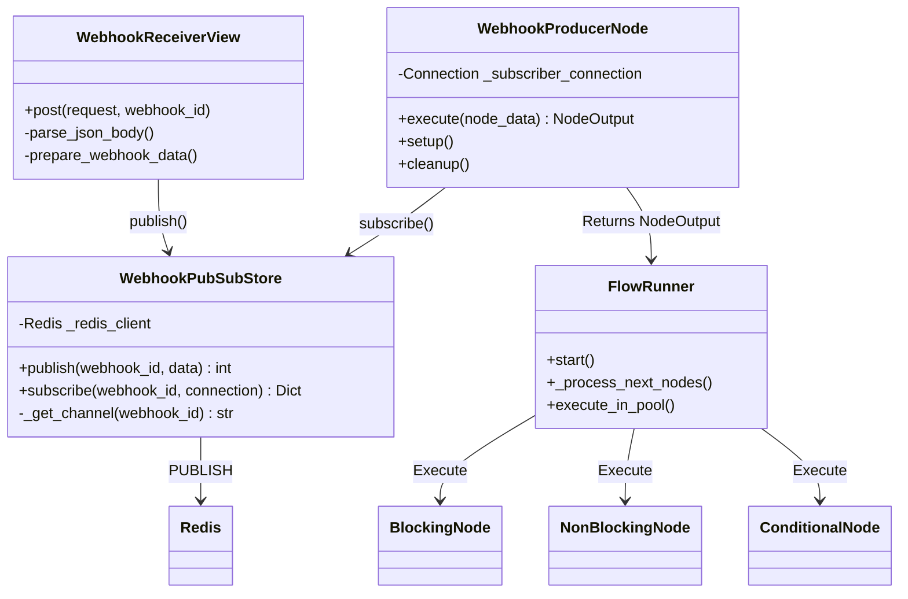

## Data Flow

### Complete Request-to-Execution Flow

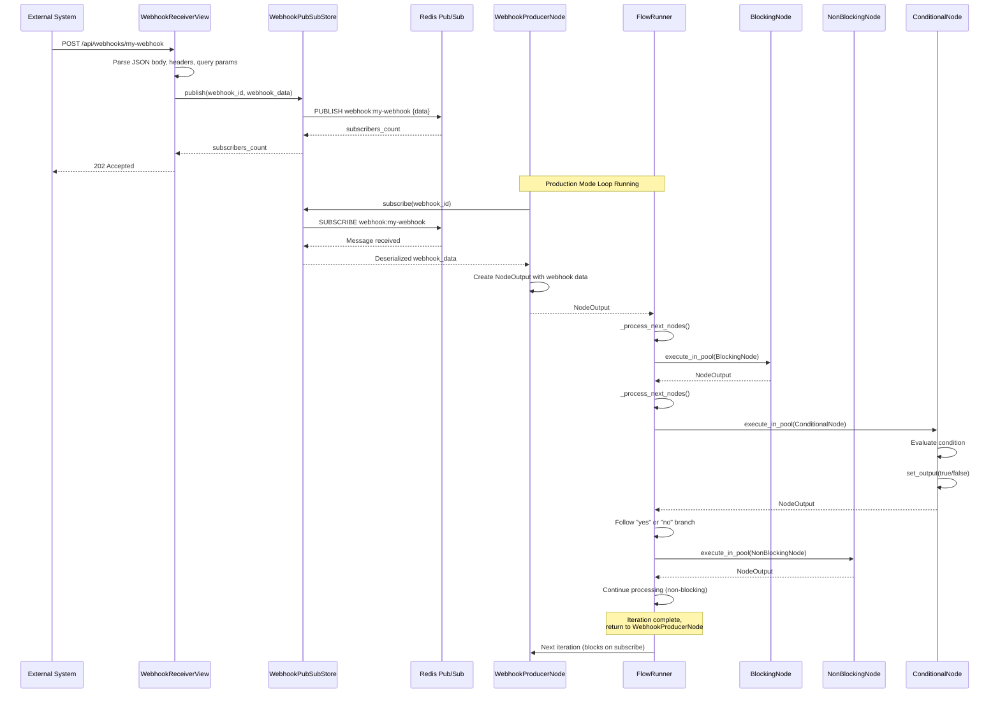

### Webhook Data Structure

The webhook data published to Redis and received by the node has the following structure:

```python
webhook_data = {
    'body': {},           # Parsed JSON body from POST request
    'headers': {},        # HTTP headers as dictionary
    'method': 'POST',     # HTTP method
    'query_params': {}    # URL query parameters
}
```

### NodeOutput Structure

The WebhookProducerNode creates a NodeOutput with webhook data:

```python
NodeOutput(
    id=node_data.id,
    data={
        'webhook': {
            'webhook_id': 'my-webhook',
            'data': {
                'body': {...},
                'headers': {...},
                'method': 'POST',
                'query_params': {...}
            },
            'timestamp': '2024-01-01T12:00:00Z'
        }
    },
    metadata={
        'sourceNodeID': 'node_1',
        'sourceNodeName': 'webhook-producer',
        'operation': 'webhook_receive',
        'webhook_id': 'my-webhook',
        'iteration': 1
    }
)
```

## Component Details

### WebhookReceiverView

The HTTP endpoint that receives webhook POST requests.

**Location**: `apps/workflow/Views/WebhookReceiver.py`

**Endpoint**: `POST /api/webhooks/{webhook_id}`

**Characteristics**:
- Public endpoint (no authentication required)
- Accepts JSON body, headers, query parameters
- Returns 202 Accepted (publish-and-forget pattern)
- Always returns 202, even on errors (prevents external retries)

**Implementation**:

```python
class WebhookReceiverView(APIView):
    authentication_classes = []  # Public endpoint
    permission_classes = []      # No authentication required
    
    def post(self, request, webhook_id: str):
        # Parse JSON body
        body_data = json.loads(request.body) if request.body else {}
        
        # Prepare webhook data
        webhook_data = {
            'body': body_data,
            'headers': dict(request.headers),
            'method': request.method,
            'query_params': dict(request.GET),
        }
        
        # Publish to Redis
        subscribers = webhook_pubsub_store.publish(webhook_id, webhook_data)
        
        # Return 202 Accepted
        return Response({
            'status': 'accepted',
            'webhook_id': webhook_id,
            'subscribers': subscribers,
            'message': 'Webhook data published' if subscribers > 0 else 'No subscribers listening'
        }, status=status.HTTP_202_ACCEPTED)
```

**Response Format**:

```json
{
    "status": "accepted",
    "webhook_id": "my-webhook",
    "subscribers": 1,
    "message": "Webhook data published"
}
```

**Key Behaviors**:
- **Publish-and-Forget**: If no subscribers are listening, the message is lost (Redis pub/sub behavior)
- **Always 202**: Returns 202 even on errors to prevent external systems from retrying
- **No Authentication**: Public endpoint for easy integration with external systems

### WebhookPubSubStore

Manages Redis pub/sub operations for webhook data distribution.

**Location**: `core/Workflow/storage/webhook_pubsub_store.py`

**Responsibilities**:
- Publishing webhook data to Redis channels
- Subscribing to webhook channels and waiting for messages
- Channel name management (`webhook:{webhook_id}`)

**Architecture**:

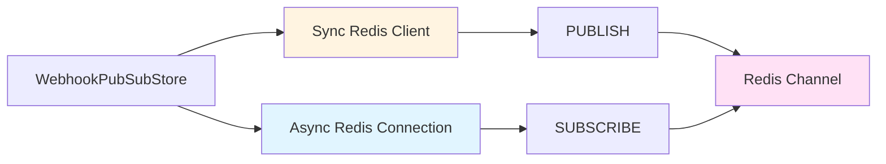

**Publish Method**:

```python
def publish(self, webhook_id: str, data: Dict[str, Any]) -> int:
    """
    Publish data to a webhook channel.
    
    Returns:
        int: Number of subscribers that received the message (0 if none)
    """
    channel = f"webhook:{webhook_id}"
    message = json.dumps(data)
    subscribers = self._redis_client.publish(channel, message)
    return subscribers
```

**Subscribe Method**:

```python
async def subscribe(
    self, 
    webhook_id: str, 
    connection: Optional[Connection] = None
) -> Dict[str, Any]:
    """
    Subscribe to a webhook channel and wait for a message.
    
    Blocks indefinitely until a message is received.
    Uses a separate Redis connection for subscription (required for pub/sub).
    
    Returns:
        Dict: Received webhook data (deserialized)
    """
    channel = f"webhook:{webhook_id}"
    
    # Create separate connection if needed
    if connection is None:
        connection = await Connection.create(host='localhost', port=6379, db=0)
    
    # Create subscriber and subscribe to channel
    subscriber = await connection.start_subscribe()
    await subscriber.subscribe([channel])
    
    # Wait for message (blocks indefinitely)
    message = await subscriber.next_published()
    
    # Deserialize and return
    data = json.loads(message.value)
    return data
```

**Key Features**:
- **Separate Connections**: Uses sync Redis for publishing (from HTTP endpoint) and async Redis for subscribing (in nodes)
- **Blocking Subscribe**: Blocks indefinitely until message arrives
- **Channel Format**: `webhook:{webhook_id}` for channel naming
- **JSON Serialization**: Data is JSON-serialized for Redis storage

### WebhookProducerNode

ProducerNode that subscribes to webhook channels and triggers workflow execution.

**Location**: `core/Node/Nodes/System/WebhookProducer/node.py`

**Node Type**: ProducerNode

**Execution Pool**: ASYNC (I/O-bound operation)

**Node Identifier**: `"webhook-producer"`

**Lifecycle**:

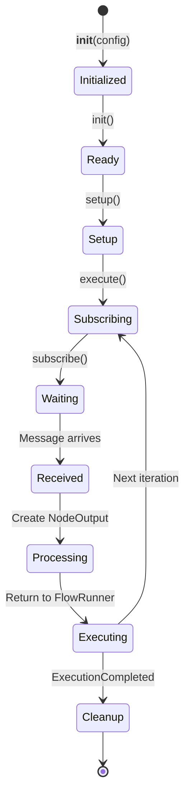

**Implementation**:

```python
class WebhookProducerNode(ProducerNode):
    def __init__(self, config):
        super().__init__(config)
        self._subscriber_connection = None
    
    @property
    def execution_pool(self) -> PoolType:
        return PoolType.ASYNC  # I/O operation (Redis pub/sub)
    
    async def execute(self, node_data: NodeOutput) -> NodeOutput:
        # Get webhook_id from form
        webhook_id = self.form.get_field_value('webhook_id')
        
        if not webhook_id:
            raise ValueError("webhook_id is required")
        
        # Subscribe and wait for data (blocks indefinitely)
        received_data = await webhook_pubsub_store.subscribe(
            webhook_id,
            connection=self._subscriber_connection
        )
        
        # Store received data in output
        output_key = self.get_unique_output_key(node_data, 'webhook')
        node_data.data[output_key] = {
            'webhook_id': webhook_id,
            'data': received_data,
            'timestamp': node_data.metadata.get('timestamp') if hasattr(node_data, 'metadata') else None
        }
        
        return NodeOutput(
            id=node_data.id,
            data=node_data.data,
            metadata={
                "sourceNodeID": self.node_config.id,
                "sourceNodeName": self.node_config.type,
                "operation": "webhook_receive",
                "webhook_id": webhook_id,
                "iteration": self.execution_count + 1
            }
        )
    
    async def cleanup(self, node_data: Optional[NodeOutput] = None):
        """Clean up subscription connection."""
        if self._subscriber_connection is not None:
            self._subscriber_connection.close()
            self._subscriber_connection = None
```

**Key Behaviors**:
- **Blocking Subscription**: Blocks indefinitely until webhook data arrives
- **ProducerNode**: Starts workflow loop iterations
- **Connection Management**: Manages Redis subscription connection lifecycle
- **Data Storage**: Stores webhook data in NodeOutput with unique key

## Execution Modes

### Production Mode

In Production Mode, WebhookProducerNode runs in a continuous loop managed by FlowRunner.

**Flow**:

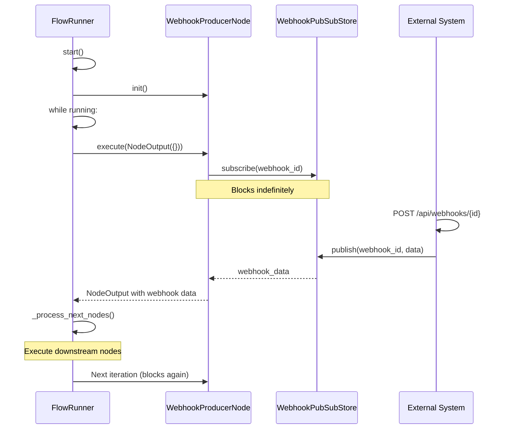

**Characteristics**:
- Loop runs continuously until stopped
- Node blocks on subscription between iterations
- Each webhook POST triggers one loop iteration
- Multiple webhook POSTs queue up in Redis pub/sub

### Development Mode

In Development Mode, nodes execute individually without FlowRunner loops.

**Flow**:

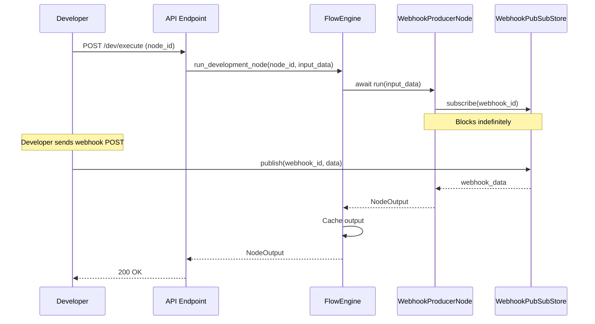

**Characteristics**:
- Direct node execution (no FlowRunner)
- Still blocks on subscription
- Output cached in Redis for dependency resolution
- Useful for testing webhook node in isolation

### Standalone Mode

WebhookProducerNode can also run standalone (outside workflow context) for testing.

**Characteristics**:
- Can be instantiated and executed directly
- Same blocking subscription behavior
- Useful for integration testing

## Node Type Integration

WebhookProducerNode works seamlessly with all node types in the workflow. The FlowRunner manages execution based on node type.

### BlockingNode Execution

BlockingNodes execute sequentially, and the Producer waits for completion before continuing.

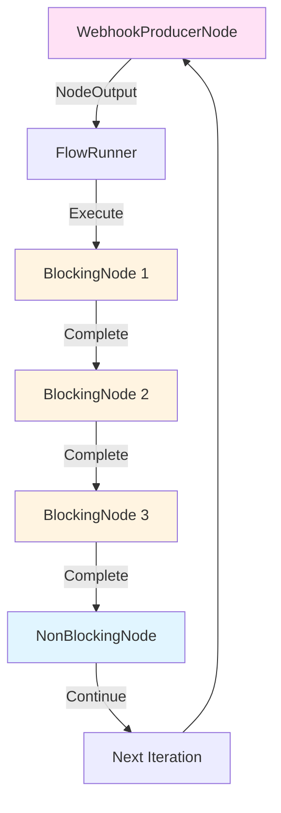

**Example Flow**:

```python
# WebhookProducerNode receives data
webhook_output = await webhook_producer.execute(NodeOutput({}))

# FlowRunner processes next nodes
# BlockingNode 1 - HTTP Request
http_output = await http_request_node.execute(webhook_output)

# BlockingNode 2 - Data Transform
transform_output = await transform_node.execute(http_output)

# BlockingNode 3 - Database Write
db_output = await db_write_node.execute(transform_output)

# NonBlockingNode - Queue Writer (doesn't block)
await queue_writer.execute(db_output)

# Return to WebhookProducerNode for next iteration
```

### NonBlockingNode Execution

NonBlockingNodes don't block the Producer from continuing to the next iteration.

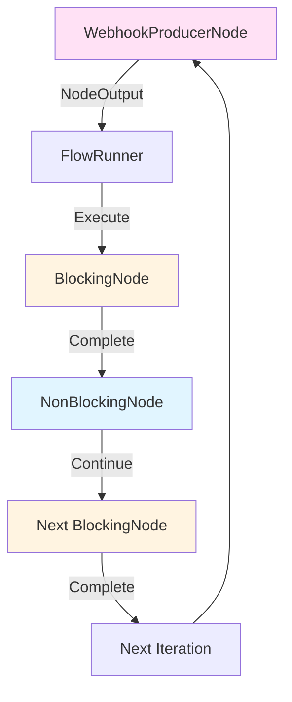

**Behavior**:
- FlowRunner awaits NonBlockingNode execution
- After execution, continues processing (doesn't wait for completion)
- Producer can start next iteration while NonBlockingNode is still processing
- **Note**: NonBlockingNode doesn't block the Producer from continuing

### ConditionalNode Execution

ConditionalNodes route execution to different branches based on conditions.

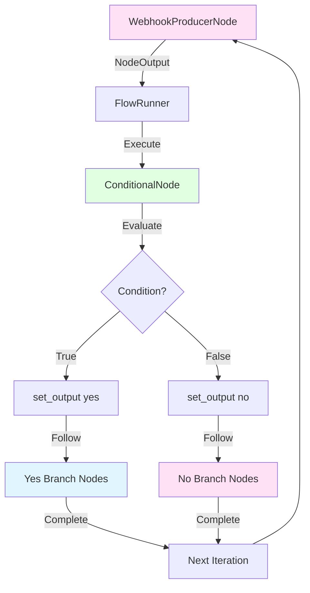

**Example**:

```python
# WebhookProducerNode receives data
webhook_output = await webhook_producer.execute(NodeOutput({}))

# ConditionalNode evaluates condition
if_condition = await if_condition_node.execute(webhook_output)
# if_condition.output = "yes" or "no"

# FlowRunner follows selected branch
if if_condition.output == "yes":
    # Execute "yes" branch nodes
    await success_node.execute(if_condition)
else:
    # Execute "no" branch nodes
    await failure_node.execute(if_condition)
```

## FlowRunner Integration

WebhookProducerNode integrates with FlowRunner to manage loop execution.

### Loop Initialization

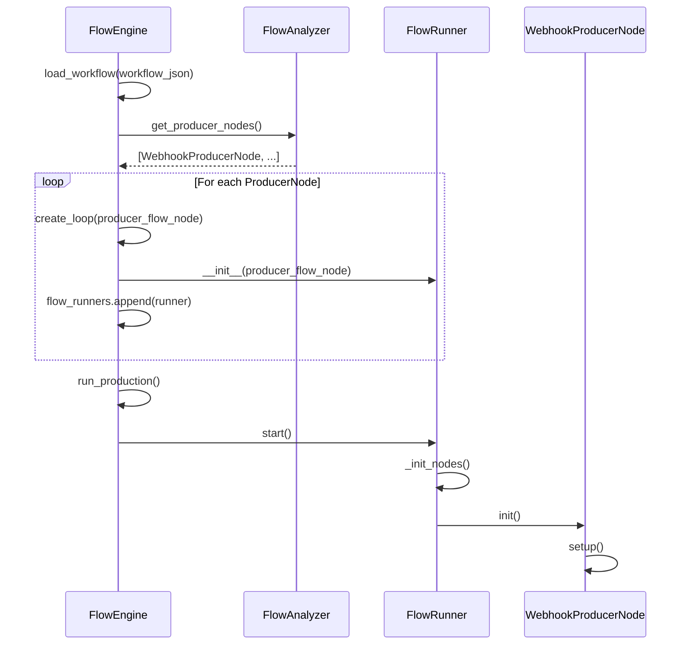

### Loop Execution Cycle

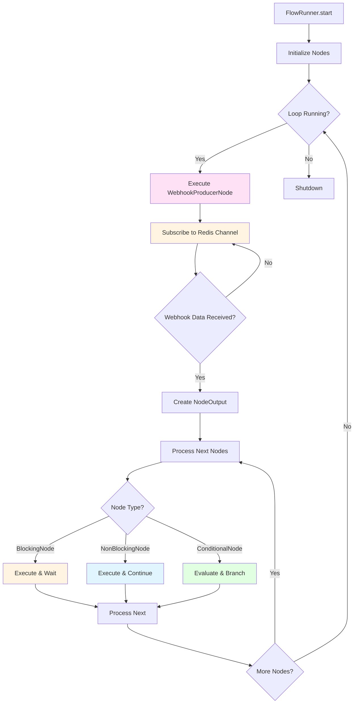

### Branch Selection Logic

FlowRunner handles branching based on node type and execution state:

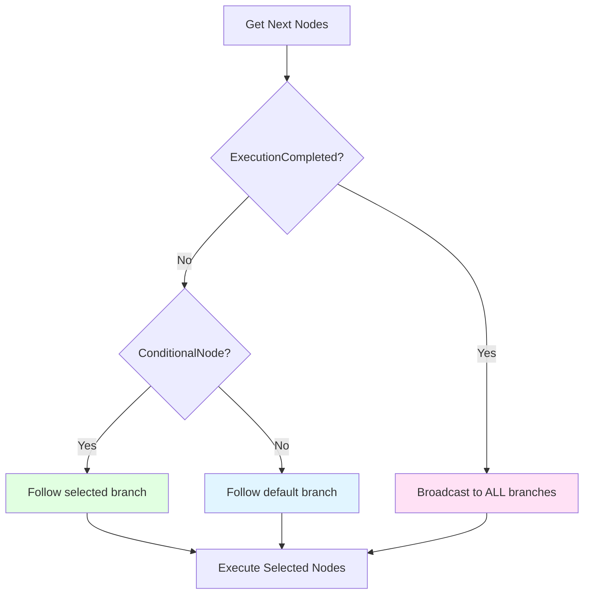

**Branch Selection Rules**:

1. **ExecutionCompleted (Sentinel)**: Broadcasts to ALL downstream nodes regardless of logic
2. **ConditionalNode**: Follows the branch specified by `instance.output` ("yes" or "no")
3. **Other Nodes**: Follows the "default" branch

### PoolExecutor Integration

WebhookProducerNode uses ASYNC pool for execution:

```python
@property
def execution_pool(self) -> PoolType:
    return PoolType.ASYNC  # I/O operation (Redis pub/sub)
```

**Execution Flow**:

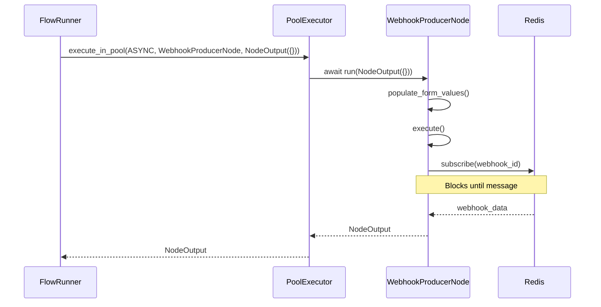

## Configuration

### Form Fields

WebhookProducerNode uses `WebhookProducerForm` for configuration.

**Location**: `core/Node/Nodes/System/WebhookProducer/form.py`

**Fields**:

| Field | Type | Required | Description |
|-------|------|----------|-------------|
| `webhook_id` | CharField | Yes | Unique identifier for the webhook. External systems POST to `/api/webhooks/{webhook_id}` |

**Validation**:
- Webhook ID must be alphanumeric with hyphens and underscores only
- Whitespace is automatically stripped
- Maximum length: 255 characters

**Form Implementation**:

```python
class WebhookProducerForm(BaseForm):
    webhook_id = forms.CharField(
        label="Webhook ID",
        required=True,
        max_length=255,
        help_text="Unique identifier for this webhook. External systems will POST to /api/webhooks/{webhook_id}",
        widget=forms.TextInput(attrs={
            'placeholder': 'my-webhook-id'
        })
    )
    
    def clean_webhook_id(self):
        """Validate webhook_id format."""
        webhook_id = self.cleaned_data.get('webhook_id')
        if webhook_id:
            webhook_id = webhook_id.strip()
            if not all(c.isalnum() or c in ['-', '_'] for c in webhook_id):
                raise forms.ValidationError(
                    "Webhook ID can only contain letters, numbers, hyphens, and underscores"
                )
        return webhook_id
```

### Workflow JSON Configuration

Example workflow JSON with WebhookProducerNode:

```json
{
  "nodes": [
    {
      "id": "node_1",
      "type": "webhook-producer",
      "data": {
        "form": {
          "webhook_id": "my-webhook"
        },
        "config": {}
      }
    },
    {
      "id": "node_2",
      "type": "http-request",
      "data": {
        "form": {
          "url": "https://api.example.com/process",
          "method": "POST",
          "body": "{{ data.webhook.data.body }}"
        },
        "config": {}
      }
    }
  ],
  "edges": [
    {
      "source": "node_1",
      "target": "node_2",
      "sourceHandle": null
    }
  ]
}
```

### URL Configuration

The webhook endpoint is configured in `apps/workflow/urls.py`:

```python
urlpatterns = [
    path('webhooks/<str:webhook_id>/', WebhookReceiverView.as_view(), name='webhook-receiver'),
    # ... other routes
]
```

**Endpoint**: `POST /api/webhooks/{webhook_id}`

## Error Handling

### WebhookReceiverView Errors

**JSON Parse Errors**:
- If JSON body is invalid, empty dict `{}` is used
- Request still processed (headers and query params included)
- Always returns 202 Accepted

**Publish Errors**:
- Redis connection errors are logged
- Still returns 202 Accepted (prevents external retries)
- Error details logged for debugging

**Implementation**:

```python
try:
    # Parse and publish
    webhook_data = {...}
    subscribers = webhook_pubsub_store.publish(webhook_id, webhook_data)
    return Response({...}, status=202)
except Exception as e:
    logger.error("Error processing webhook", error=str(e), exc_info=True)
    # Still return 202 to prevent retries
    return Response({
        'status': 'error',
        'webhook_id': webhook_id,
        'message': 'Error processing webhook'
    }, status=202)
```

### WebhookPubSubStore Errors

**Publish Errors**:
- Redis connection failures raise exceptions
- Logged with full error details
- Propagate to WebhookReceiverView

**Subscribe Errors**:
- Connection failures raise exceptions
- Logged with full error details
- Propagate to WebhookProducerNode

**Implementation**:

```python
try:
    subscribers = self._redis_client.publish(channel, message)
    return subscribers
except Exception as e:
    logger.error(
        "Failed to publish webhook data",
        webhook_id=webhook_id,
        channel=channel,
        error=str(e),
        exc_info=True
    )
    raise
```

### WebhookProducerNode Errors

**Missing webhook_id**:
- Raises `ValueError` if webhook_id is not configured
- Prevents node from executing
- Logged as error

**Subscription Errors**:
- Redis connection errors are logged
- Exception propagates to FlowRunner
- FlowRunner handles with error recovery (logs, pauses, continues)

**Implementation**:

```python
async def execute(self, node_data: NodeOutput) -> NodeOutput:
    webhook_id = self.form.get_field_value('webhook_id')
    
    if not webhook_id:
        raise ValueError("webhook_id is required")
    
    try:
        received_data = await webhook_pubsub_store.subscribe(webhook_id, ...)
        # Process data
    except Exception as e:
        logger.error(
            "Error receiving webhook data",
            node_id=self.node_config.id,
            webhook_id=webhook_id,
            error=str(e),
            exc_info=True
        )
        raise
```

### FlowRunner Error Recovery

FlowRunner implements error recovery for node execution failures:

```python
try:
    data = await self.executor.execute_in_pool(...)
    # Process data
except Exception as e:
    logger.exception("Error in loop", error=str(e))
    await asyncio.sleep(1)  # Brief pause
    # Continue to next iteration
```

**Error Recovery Behavior**:
- Logs exception with full details
- Pauses briefly (1 second)
- Continues to next iteration
- Failed payloads are not automatically retried (fail-fast policy)

## Best Practices

### Webhook ID Naming

1. **Use Descriptive Names**: Choose webhook IDs that clearly indicate their purpose
   - Good: `payment-webhook`, `user-signup`, `order-completed`
   - Bad: `webhook1`, `test`, `abc123`

2. **Follow Naming Conventions**: Use kebab-case for consistency
   - Good: `payment-webhook`, `user-signup`
   - Bad: `PaymentWebhook`, `user_signup`

3. **Avoid Conflicts**: Ensure webhook IDs are unique across workflows
   - Consider prefixing with workflow or service name
   - Example: `workflow-1-payment-webhook`

### Security Considerations

1. **No Authentication**: WebhookReceiverView is a public endpoint
   - Consider adding authentication if needed
   - Validate webhook signatures if required by external systems

2. **Input Validation**: Validate webhook data in downstream nodes
   - Don't trust external data
   - Use form validation and data transformation nodes

3. **Rate Limiting**: Consider rate limiting for webhook endpoints
   - Prevent abuse from external systems
   - Implement at Django middleware level

### Performance Optimization

1. **Connection Reuse**: WebhookProducerNode manages subscription connection
   - Connection is reused across iterations
   - Properly closed in cleanup()

2. **Async Operations**: All operations use async/await
   - Non-blocking I/O for Redis operations
   - Efficient event loop usage

3. **Error Handling**: Implement proper error handling
   - Log errors for debugging
   - Don't crash the loop on single webhook failure

### Testing

1. **Unit Testing**: Test individual components
   - WebhookReceiverView with mock requests
   - WebhookPubSubStore with mock Redis
   - WebhookProducerNode with mock pub/sub

2. **Integration Testing**: Test complete flow
   - Send POST request to endpoint
   - Verify data published to Redis
   - Verify node receives data

3. **Development Mode**: Use Development Mode for testing
   - Execute webhook node individually
   - Test with different webhook payloads
   - Verify data flow to downstream nodes

### Monitoring

1. **Logging**: Comprehensive logging at all levels
   - WebhookReceiverView logs all requests
   - WebhookPubSubStore logs publish/subscribe operations
   - WebhookProducerNode logs receive operations

2. **Metrics**: Track webhook metrics
   - Number of webhooks received
   - Number of subscribers
   - Processing time
   - Error rates

3. **Alerting**: Set up alerts for errors
   - Redis connection failures
   - High error rates
   - Missing subscribers

## Related Documentation

- [Workflow Engine](02-Workflow-Engine.md) - FlowEngine and graph management
- [Execution System](03-Execution-System.md) - FlowRunner and PoolExecutor
- [Node System](04-Node-System.md) - Node architecture and lifecycle
- [Storage System](06-Storage-System.md) - Redis integration and pub/sub
- [API Reference](11-API-Reference.md) - API endpoints and usage

---

[← Back to Development Documentation](Development.md) | [← Previous: API Reference](11-API-Reference.md)
