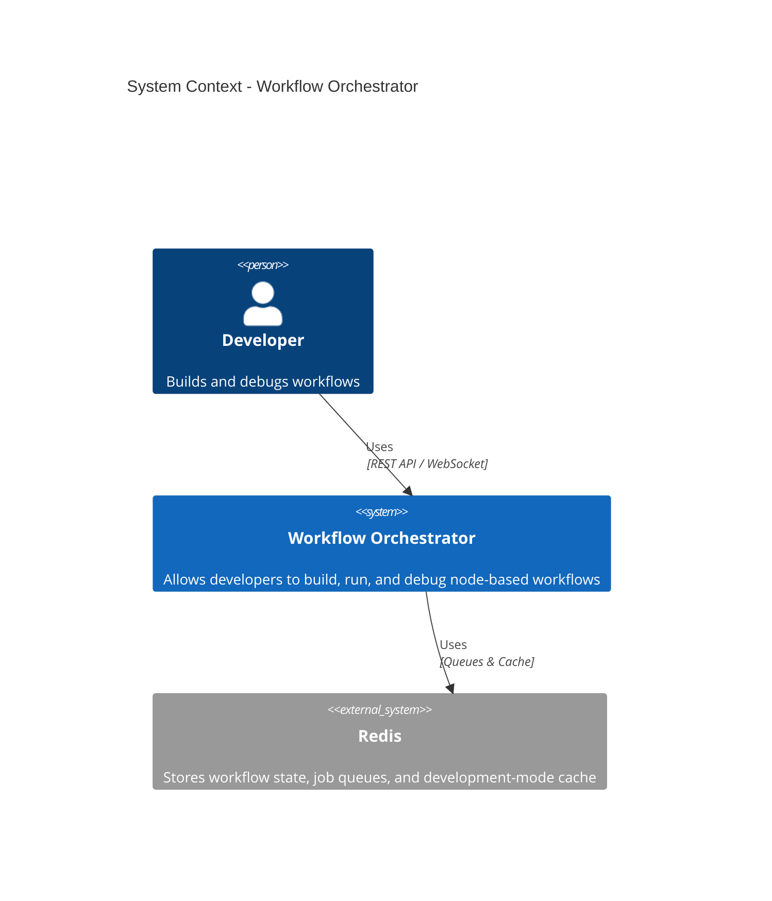

# Backend Development Documentation

Welcome to the Backend Development Documentation for TheOneEye Workflow Orchestrator. This documentation provides comprehensive guides for understanding, developing, and extending the workflow-based automation system.

## Overview

TheOneEye Backend is a sophisticated workflow orchestration system built with Django that enables developers to create, manage, and execute complex node-based workflows. The system operates in two distinct modes:

- **Production Mode**: High-performance, autonomous execution of complete workflows via LoopManagers
- **Development Mode**: Flexible, iterative testing and debugging of individual nodes

## System Architecture



## Quick Navigation

### Core Architecture
- **[01. Architecture Overview](01-Architecture-Overview.md)** - High-level system architecture and C4 model diagrams
- **[02. Workflow Engine](02-Workflow-Engine.md)** - Core orchestration system (FlowEngine, FlowGraph, FlowBuilder, FlowAnalyzer)
- **[03. Execution System](03-Execution-System.md)** - Node execution mechanisms (FlowRunner, PoolExecutor)

### Node System
- **[04. Node System](04-Node-System.md)** - Node architecture, types, lifecycle, and NodeRegistry
- **[05. Node Types](05-Node-Types.md)** - Available node implementations and categories
- **[07. Form System](07-Form-System.md)** - Node configuration system with Django forms and Jinja templates

### Storage & Communication
- **[06. Storage System](06-Storage-System.md)** - Data persistence, queues, and Redis integration

### Workflow Processing
- **[08. Post-Processing](08-Post-Processing.md)** - Workflow validation and enhancement (QueueMapper, NodeValidator)

### Development Guides
- **[09. Adding New Nodes](09-Adding-New-Nodes.md)** - Step-by-step guide for extending the system
- **[10. Development Workflow](10-Development-Workflow.md)** - Development practices, debugging, and testing
- **[11. API Reference](11-API-Reference.md)** - API endpoints and usage documentation

### Specialized Topics
- **[12. Webhook Node](12-Webhook-Node.md)** - Webhook architecture, data flow, and integration with different node types

## Getting Started

### Prerequisites

- Python 3.10+ (with Conda environment `theoneeye`)
- Redis server running on `localhost:6379`
- Django 5.2+
- Understanding of async/await patterns in Python

### Quick Start

1. **Activate Conda environment**:
   ```bash
   conda activate theoneeye
   ```

2. **Start Redis**:
   ```bash
   redis-server
   ```

3. **Run Django server**:
   ```bash
   cd backend
   python manage.py runserver 7878
   ```

4. **Explore the documentation**:
   - Start with [Architecture Overview](01-Architecture-Overview.md) for high-level understanding
   - Read [Workflow Engine](02-Workflow-Engine.md) to understand core orchestration
   - Check [Node System](04-Node-System.md) to learn about nodes
   - Follow [Adding New Nodes](09-Adding-New-Nodes.md) to extend the system

## Key Concepts

### Workflow Execution Model

The system executes workflows as **loops** - continuous execution tracks controlled by ProducerNodes. Each loop runs in an isolated execution pool (ASYNC, THREAD, or PROCESS) and communicates with other loops via Redis queues.

### Node Types

- **ProducerNode**: Starts loop iterations (e.g., QueueReader)
- **BlockingNode**: Must complete before continuing (sequential operations)
- **NonBlockingNode**: Creates async boundaries, doesn't block downstream processing
- **ConditionalNode**: Conditional branching (extends BlockingNode)

### Execution Pools

- **ASYNC**: Default, best for I/O-bound operations
- **THREAD**: For CPU-bound tasks that can release GIL
- **PROCESS**: For true parallelism with CPU-intensive tasks

### Cross-Loop Communication

Loops communicate via Redis-backed queues managed by the QueueManager. This enables decoupled, multi-process safe communication between isolated execution tracks.

## Documentation Structure

This documentation is organized hierarchically:

1. **Architecture & Design** (01-02): System structure and core components
2. **Implementation Details** (03-08): Specific subsystems and their operation
3. **Development Guides** (09-11): Practical guides for extending and using the system
4. **Specialized Topics** (12+): Deep dives into specific node implementations and features

Each document includes:
- Visual Mermaid diagrams
- Detailed component explanations
- Code examples where relevant
- Links to related documentation
- Navigation back to this main page

## Contributing

When contributing to the backend:

1. Follow the **Single Responsibility Principle (SRP)**
2. Use async/await patterns throughout
3. Add comprehensive logging using structlog
4. Write tests for new functionality
5. Update relevant documentation

For detailed guidelines, see [Development Workflow](10-Development-Workflow.md).

## Related Resources

- **Core Documentation**: This documentation set in `backend/docs/`
- **Code Implementation**: `backend/core/Workflow/` and `backend/core/Node/`

---

**Last Updated**: 2024
**Maintained By**: TheOneEye Development Team

