# System Components Explanation

This document explains all classes in `backend/core` and how they are linked together with their responsibilities.

## Table of Contents

1. [Core Architecture Overview](#core-architecture-overview)
2. [Workflow Classes](#workflow-classes)
3. [Execution Classes](#execution-classes)
4. [Storage Classes](#storage-classes)
5. [Event System](#event-system)
6. [Post-Processing Classes](#post-processing-classes)
7. [Complete Execution Flow](#complete-execution-flow)

---

## Core Architecture Overview

The core system follows a layered architecture with clear separation of concerns:

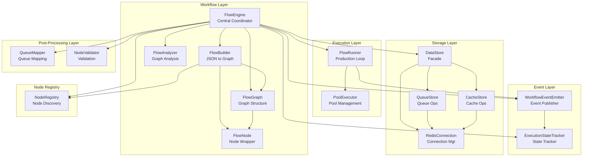

---

## Workflow Classes

### FlowNode

**Location:** `backend/core/Workflow/flow_node.py`

**Responsibility:** Data structure representing a single node in the workflow graph. Contains only node data and connection management.

**Key Features:**
- Wraps a `BaseNode` instance with an ID
- Manages connections to next nodes via `Dict[str, List[FlowNode]]`
- Supports multiple branches per key (e.g., multiple "default" branches)
- Provides serialization via `to_dict()`

**Structure:**
```python
@dataclass
class FlowNode:
    id: str                    # Unique node identifier
    instance: BaseNode         # The actual node implementation
    next: Dict[str, List[FlowNode]]  # Branch key -> List of next nodes
```

**Connection Flow:**
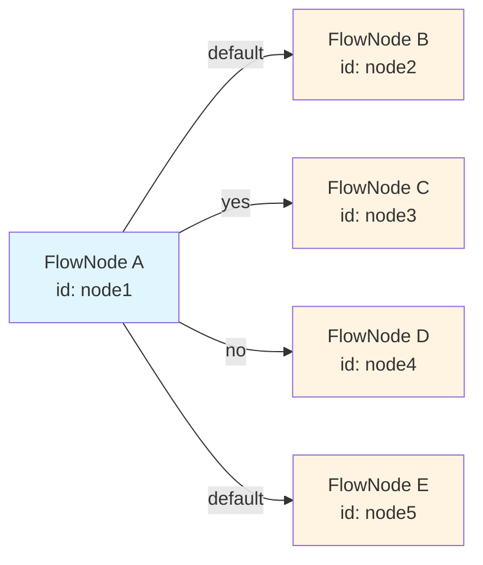

**Note:** Multiple nodes can share the same branch key (e.g., two "default" branches), stored as a list.

---

### FlowGraph

**Location:** `backend/core/Workflow/flow_graph.py`

**Responsibility:** Manages the graph structure of workflow nodes and their connections. Provides operations for adding nodes, connecting nodes, and querying graph relationships.

**Key Methods:**
- `add_node(flow_node)`: Add a node to the graph
- `connect_nodes(from_id, to_id, key)`: Connect two existing nodes
- `get_node(node_id)`: Get FlowNode by ID
- `get_upstream_nodes(node_id)`: Get all parent nodes

**Graph Management Flow:**
```mermaid
graph TB
    subgraph "FlowGraph Operations"
        AddNode[add_node<br/>Adds node to node_map]
        Connect[connect_nodes<br/>Creates edge]
        Query[get_node/get_upstream_nodes<br/>Graph queries]
    end
    
    subgraph "Internal Storage"
        NodeMap[node_map: Dict[str, FlowNode]]
    end
    
    AddNode --> NodeMap
    Connect --> NodeMap
    Query --> NodeMap
    
    style AddNode fill:#e1f5ff
    style Connect fill:#e1f5ff
    style Query fill:#e1f5ff
    style NodeMap fill:#fff4e1
```

---

### FlowBuilder

**Location:** `backend/core/Workflow/flow_builder.py`

**Responsibility:** Handles building flow graph from JSON workflow definitions. Converts JSON nodes and edges into FlowNode instances and connects them.

**Workflow:**
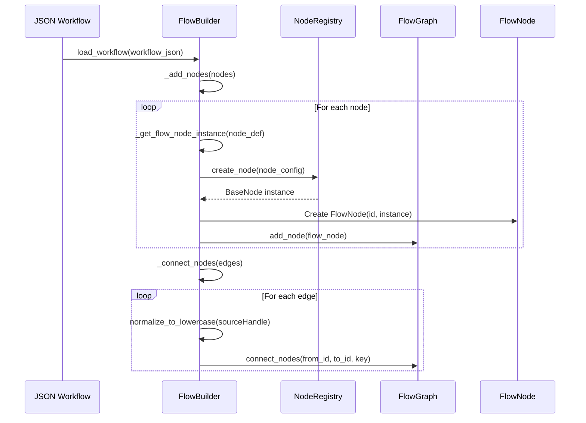

**Key Responsibilities:**
- Parses JSON workflow definition
- Creates FlowNode instances via NodeRegistry
- Normalizes branch keys (Yes/No/null → yes/no/default)
- Connects nodes based on edges

---

### FlowAnalyzer

**Location:** `backend/core/Workflow/flow_analyzer.py`

**Responsibility:** Handles all graph traversal and analysis operations. Provides query methods for finding specific node types and graph patterns.

**Analysis Operations:**
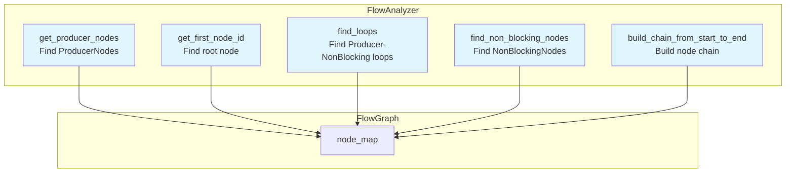

**Key Methods:**
- `get_producer_nodes()`: Find all ProducerNode instances
- `get_first_node_id()`: Find the root node (no incoming edges)
- `find_loops()`: Find ProducerNode → NonBlockingNode loops
- `find_non_blocking_nodes()`: Find all NonBlockingNode instances

---

### FlowEngine

**Location:** `backend/core/Workflow/flow_engine.py`

**Responsibility:** Central coordination system for flow execution. Orchestrates workflow loading, execution, and lifecycle management.

**Orchestration Flow:**
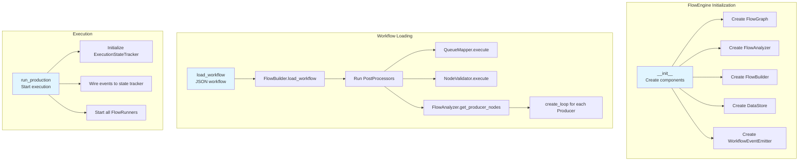

**Key Responsibilities:**
- Coordinates all workflow components
- Manages workflow lifecycle (load → validate → execute)
- Creates FlowRunner instances for each ProducerNode
- Wires event system to state tracker
- Handles graceful shutdown

---

### NodeRegistry

**Location:** `backend/core/Workflow/node_registry.py`

**Responsibility:** Registry class responsible for discovering and creating node instances. Auto-discovers node classes from the `Node.Nodes` package.

**Discovery Flow:**
```mermaid
graph TB
    subgraph "Node Discovery"
        Discover[_discover_node_classes<br/>Scan Node.Nodes package]
        Discover --> WalkPackages[Walk package tree]
        WalkPackages --> ImportModules[Import modules]
        ImportModules --> CheckClasses[Check if BaseNode subclass]
        CheckClasses --> GetIdentifier[Get identifier]
        GetIdentifier --> StoreMapping[Store in registry]
    end
    
    subgraph "Node Creation"
        Create[create_node<br/>NodeConfig]
        Create --> Lookup[Lookup in registry]
        Lookup --> Instantiate[Instantiate node class]
        Instantiate --> Return[Return BaseNode instance]
    end
    
    style Discover fill:#e1f5ff
    style Create fill:#e1f5ff
```

**Key Features:**
- Lazy discovery (only when first accessed)
- Caches discovered classes
- Creates node instances from NodeConfig
- Raises error for unknown node types

---

## Execution Classes

### FlowRunner

**Location:** `backend/core/Workflow/execution/flow_runner.py`

**Responsibility:** Manages a single flow loop in Production Mode. Executes ProducerNode in a continuous loop and processes downstream nodes.

**Execution Flow:**
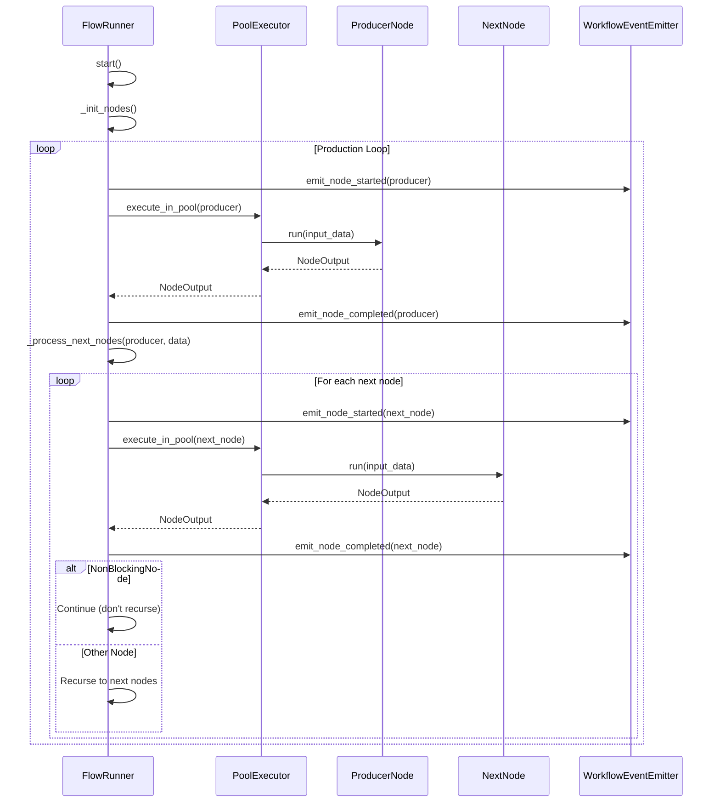

**Branch Handling:**
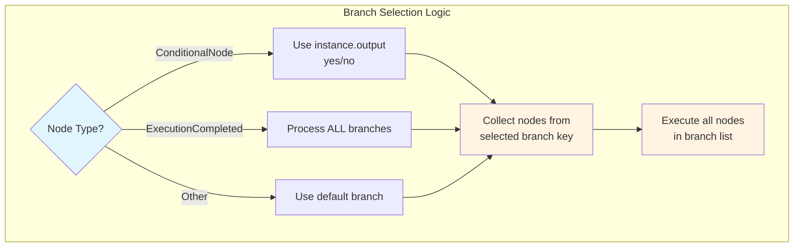

**Key Responsibilities:**
- Runs ProducerNode in continuous loop
- Processes downstream nodes recursively
- Handles branch selection (conditional vs default)
- Manages node initialization
- Emits execution events
- Handles graceful shutdown

---

### PoolExecutor

**Location:** `backend/core/Workflow/execution/pool_executor.py`

**Responsibility:** Executes nodes in different execution pools (async, thread, process). Manages pool lifecycle and handles serialization for process pool.

**Pool Execution Flow:**
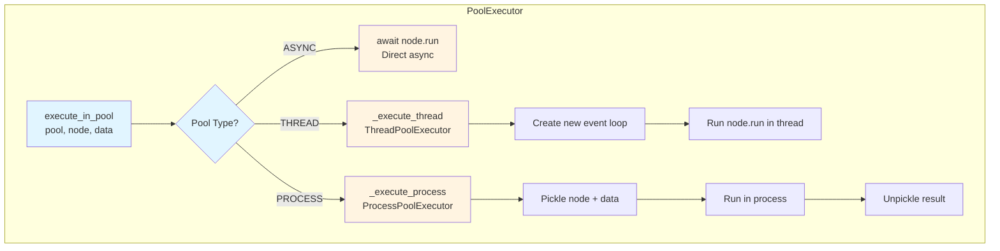

**Pool Types:**
- **ASYNC**: Direct async execution (same event loop)
- **THREAD**: ThreadPoolExecutor with new event loop per thread
- **PROCESS**: ProcessPoolExecutor with pickle serialization

---

## Storage Classes

### DataStore (Facade)

**Location:** `backend/core/Workflow/storage/data_store.py`

**Responsibility:** Facade providing unified access to storage services. Coordinates access to QueueStore, CacheStore, and RedisConnection.

**Architecture:**
```mermaid
graph TB
    subgraph "DataStore Facade"
        DS[DataStore]
        DS --> QueueProp[queue property]
        DS --> CacheProp[cache property]
        DS --> ConnProp[connection property]
    end
    
    subgraph "Storage Services"
        QueueProp --> QS[QueueStore<br/>Queue operations]
        CacheProp --> CS[CacheStore<br/>Cache operations]
        ConnProp --> RC[RedisConnection<br/>Connection manager]
    end
    
    QS --> RC
    CS --> RC
    
    subgraph "Redis"
        RC --> Redis[(Redis Server)]
    end
    
    style DS fill:#e1f5ff
    style QS fill:#fff4e1
    style CS fill:#fff4e1
    style RC fill:#fff4e1
```

**Usage Pattern:**
```python
data_store = DataStore()
await data_store.queue.push("queue_name", data)  # Queue operations
await data_store.cache.set("key", value, ttl=3600)  # Cache operations
```

---

### QueueStore

**Location:** `backend/core/Workflow/storage/queue_store.py`

**Responsibility:** Handles queue operations using Redis Lists. Single responsibility: queue operations only (push, pop, length).

**Operations:**
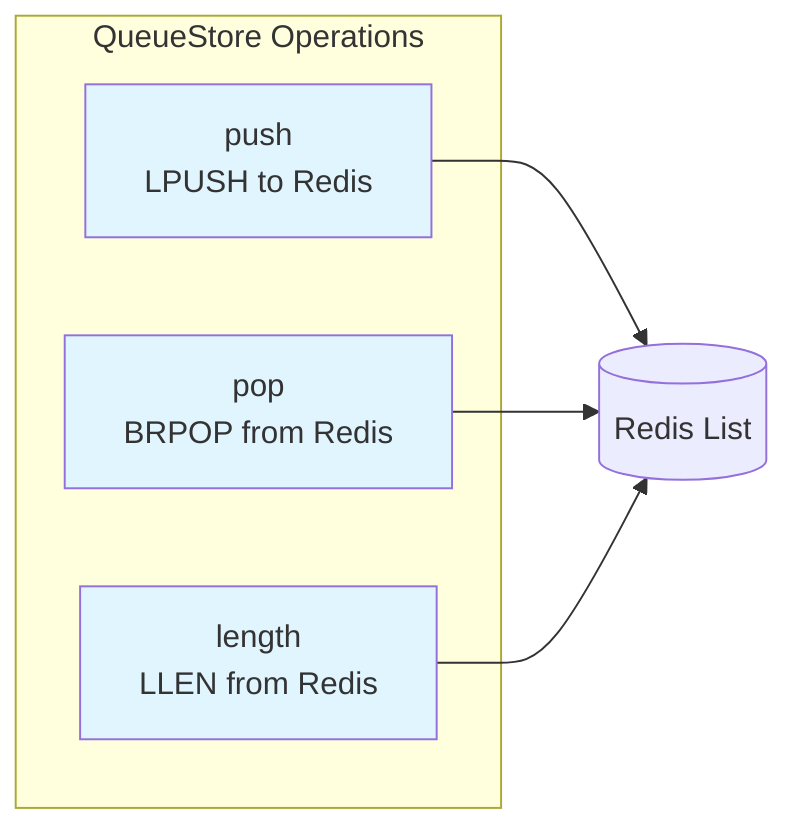

**Key Features:**
- Process-safe operations (multiple consumers supported)
- Blocking pop with timeout support
- JSON serialization/deserialization
- Key prefixing for namespacing

---

### CacheStore

**Location:** `backend/core/Workflow/storage/cache_store.py`

**Responsibility:** Handles cache operations using Redis Strings. Single responsibility: cache operations only (set, get, delete, exists).

**Operations:**
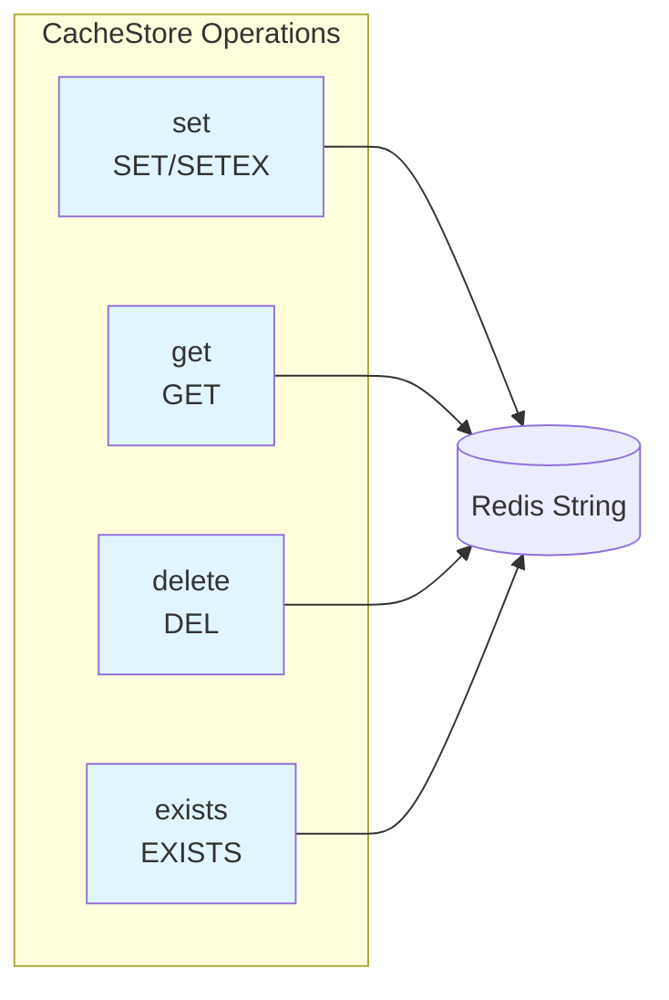

**Key Features:**
- TTL support for expiration
- JSON serialization/deserialization
- Process-safe operations
- Key prefixing for namespacing

---

### RedisConnection

**Location:** `backend/core/Workflow/storage/redis_connection.py`

**Responsibility:** Manages Redis connection lifecycle. Single responsibility: connection management only (establish, maintain, close).

**Connection Lifecycle:**
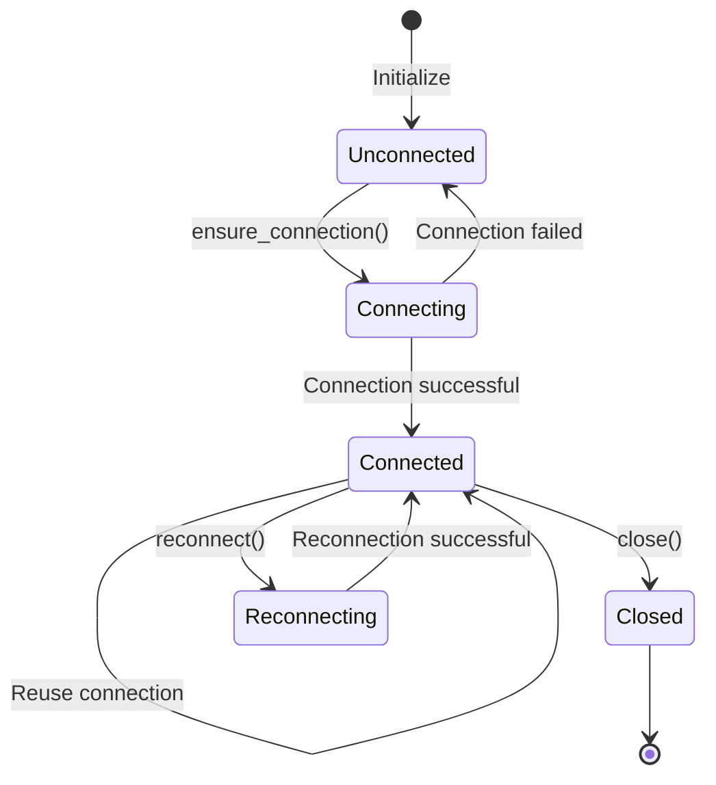

**Key Features:**
- Lazy connection (on first use)
- Connection reuse
- Reconnection support
- Thread-safe connection management

---

## Event System

### WorkflowEventEmitter

**Location:** `backend/core/Workflow/events/event_emitter.py`

**Responsibility:** Event emitter for workflow execution events. Publishes events for node lifecycle and workflow state changes.

**Event Types:**
- `node_started`: Node begins execution
- `node_completed`: Node finishes execution
- `node_failed`: Node execution fails
- `workflow_completed`: Workflow completes
- `workflow_failed`: Workflow fails

**Event Flow:**
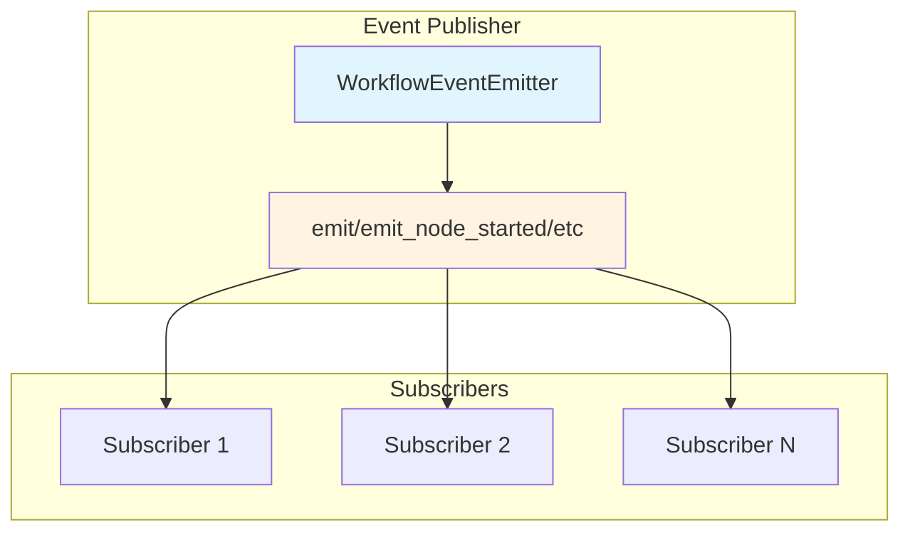

**Subscription Pattern:**
```python
emitter.subscribe(WorkflowEventEmitter.NODE_STARTED, callback)
emitter.emit_node_started(node_id, node_type)  # Triggers all callbacks
```

---

### ExecutionStateTracker

**Location:** `backend/core/Workflow/events/state_tracker.py`

**Responsibility:** Tracks real-time execution state for a workflow. Thread-safe state tracking for parallel execution.

**State Management:**
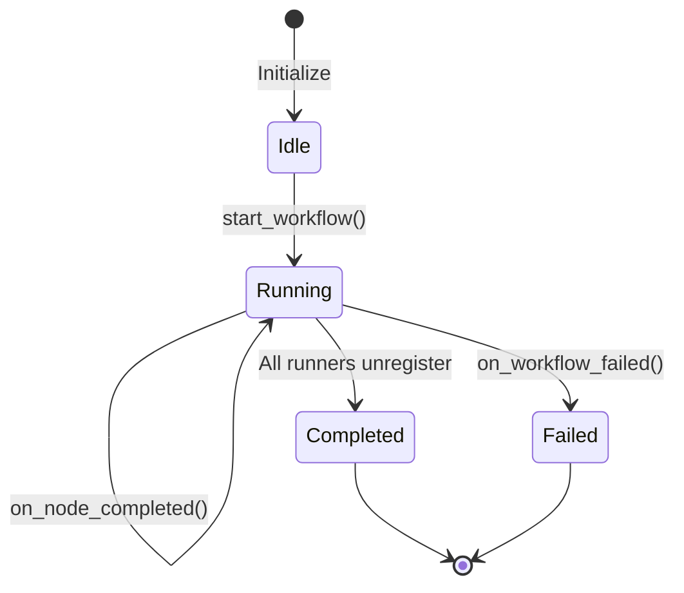

**State Structure:**
```mermaid
graph TB
    subgraph "ExecutionStateTracker State"
        Status[status: idle/running/completed/failed]
        Executing[executing_nodes: Dict[node_id, NodeExecutionInfo]]
        Completed[completed_nodes: List[CompletedNodeInfo]]
        Metadata[started_at, completed_at, error, etc.]
    end
    
    Status --> Executing
    Status --> Completed
    Status --> Metadata
    
    style Status fill:#e1f5ff
    style Executing fill:#fff4e1
    style Completed fill:#fff4e1
```

**Key Features:**
- Thread-safe operations (Lock-based)
- Real-time state tracking
- Full state snapshot for WebSocket sync
- Duration calculation for nodes

---

## Post-Processing Classes

### PostProcessor (Abstract Base)

**Location:** `backend/core/Workflow/PostProcessing/__init__.py`

**Responsibility:** Abstract base class for all workflow post-processing operations. Each processor handles one concern.

**Interface:**
```python
class PostProcessor(ABC):
    def __init__(self, graph: FlowGraph)
    @abstractmethod
    def execute(self) -> None
```

---

### QueueMapper

**Location:** `backend/core/Workflow/PostProcessing/queue_mapper.py`

**Responsibility:** Handles automatic queue name assignment for connected QueueWriter-QueueReader pairs.

**Mapping Flow:**
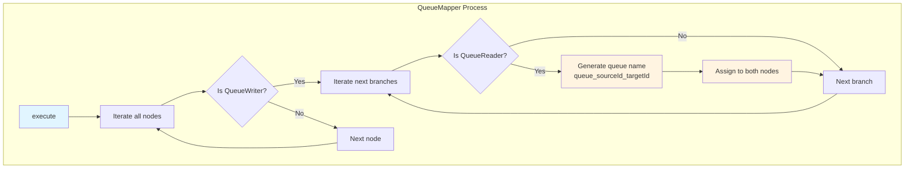

**Key Features:**
- Auto-discovers QueueWriter-QueueReader pairs
- Generates unique queue names
- Handles multiple branches per QueueWriter
- Only assigns if queue_name is None or "default"

---

### NodeValidator

**Location:** `backend/core/Workflow/PostProcessing/node_validator.py`

**Responsibility:** Handles validation of all nodes in the workflow graph. Validates by calling `is_ready()` on each node.

**Validation Flow:**
```mermaid
graph TB
    subgraph "NodeValidator Process"
        Start[execute]
        Start --> IterateNodes[Iterate all nodes]
        IterateNodes --> CheckReady{node.is_ready()?}
        CheckReady -->|False| CollectError[Collect error message]
        CheckReady -->|True| NextNode[Next node]
        CollectError --> NextNode
        NextNode --> IterateNodes
        IterateNodes --> AllChecked{All checked?}
        AllChecked -->|Has errors| RaiseError[Raise ValueError]
        AllChecked -->|No errors| Success[Validation successful]
    end
    
    style Start fill:#e1f5ff
    style CheckReady fill:#e1f5ff
    style RaiseError fill:#ffcccc
    style Success fill:#ccffcc
```

**Key Features:**
- Validates all nodes before execution
- Collects all errors before raising
- Includes form validation errors in message
- Raises ValueError if any node fails

---

## Complete Execution Flow

### Workflow Loading and Execution

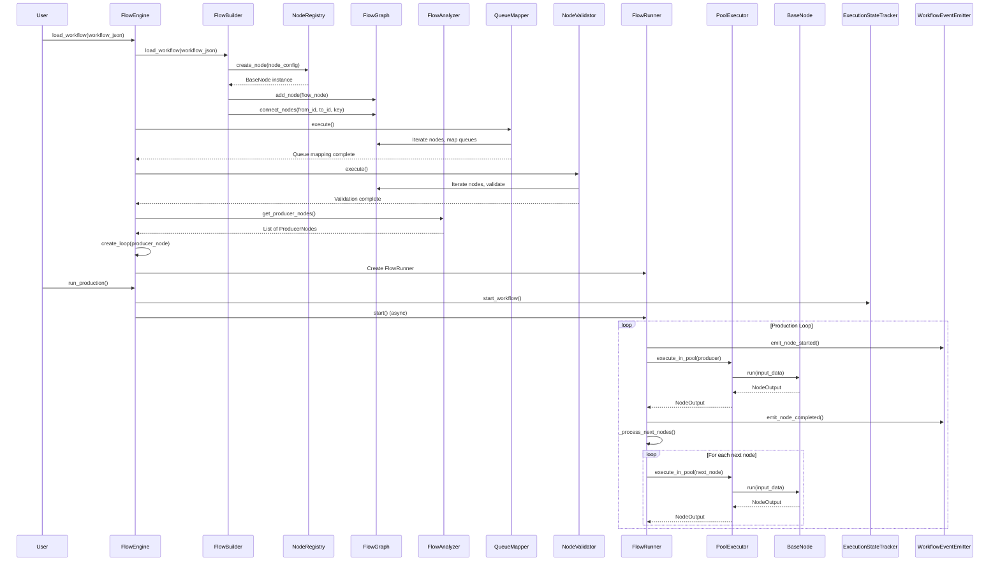

### Data Flow Through System

```mermaid
graph TB
    subgraph "Input"
        JSON[JSON Workflow Definition]
    end
    
    subgraph "Building Phase"
        JSON --> FB[FlowBuilder]
        FB --> NR[NodeRegistry]
        NR --> FN[FlowNode instances]
        FN --> FG[FlowGraph]
    end
    
    subgraph "Post-Processing Phase"
        FG --> QM[QueueMapper]
        FG --> NV[NodeValidator]
        QM --> FG
        NV --> FG
    end
    
    subgraph "Execution Phase"
        FG --> FA[FlowAnalyzer]
        FA --> FE[FlowEngine]
        FE --> FR[FlowRunner]
        FR --> PE[PoolExecutor]
        PE --> Node[BaseNode.run]
        Node --> Output[NodeOutput]
        Output --> FR
    end
    
    subgraph "Storage"
        Node --> DS[DataStore]
        DS --> Queue[QueueStore]
        DS --> Cache[CacheStore]
    end
    
    subgraph "Events"
        FR --> Emitter[WorkflowEventEmitter]
        Emitter --> Tracker[ExecutionStateTracker]
    end
    
    style JSON fill:#e1f5ff
    style Output fill:#ccffcc
```

### Branch Execution Logic

```mermaid
graph TB
    subgraph "Node Execution"
        Execute[Execute Node]
        Execute --> CheckType{Node Type?}
    end
    
    subgraph "Branch Selection"
        CheckType -->|ConditionalNode| CheckOutput{Has output?}
        CheckType -->|ExecutionCompleted| AllBranches[Process ALL branches]
        CheckType -->|Other| DefaultBranch[Process default branch]
        
        CheckOutput -->|yes| YesBranch[Process yes branch]
        CheckOutput -->|no| NoBranch[Process no branch]
        CheckOutput -->|None| DefaultBranch
    end
    
    subgraph "Node Execution"
        YesBranch --> ExecuteNodes[Execute all nodes in branch list]
        NoBranch --> ExecuteNodes
        DefaultBranch --> ExecuteNodes
        AllBranches --> ExecuteNodes
        
        ExecuteNodes --> CheckNonBlocking{Is NonBlockingNode?}
        CheckNonBlocking -->|Yes| Continue[Continue to next iteration]
        CheckNonBlocking -->|No| Recurse[Recurse to next nodes]
    end
    
    style Execute fill:#e1f5ff
    style CheckType fill:#e1f5ff
    style ExecuteNodes fill:#fff4e1
```

---

## Class Responsibility Summary

| Class | Single Responsibility | Key Methods |
|-------|----------------------|-------------|
| **FlowNode** | Node data structure and connections | `add_next()`, `get_all_next_nodes()`, `to_dict()` |
| **FlowGraph** | Graph structure management | `add_node()`, `connect_nodes()`, `get_node()`, `get_upstream_nodes()` |
| **FlowBuilder** | JSON to graph conversion | `load_workflow()`, `_add_nodes()`, `_connect_nodes()` |
| **FlowAnalyzer** | Graph traversal and analysis | `get_producer_nodes()`, `get_first_node_id()`, `find_loops()` |
| **FlowEngine** | Workflow orchestration | `load_workflow()`, `run_production()`, `create_loop()` |
| **NodeRegistry** | Node discovery and creation | `create_node()`, `_discover_node_classes()` |
| **FlowRunner** | Production loop execution | `start()`, `_process_next_nodes()`, `shutdown()` |
| **PoolExecutor** | Pool-based execution | `execute_in_pool()`, `shutdown()` |
| **DataStore** | Storage facade | `queue`, `cache`, `connection` properties |
| **QueueStore** | Queue operations | `push()`, `pop()`, `length()` |
| **CacheStore** | Cache operations | `set()`, `get()`, `delete()`, `exists()` |
| **RedisConnection** | Connection management | `ensure_connection()`, `close()`, `reconnect()` |
| **WorkflowEventEmitter** | Event publishing | `emit()`, `subscribe()`, `emit_node_started()` |
| **ExecutionStateTracker** | State tracking | `on_node_started()`, `on_node_completed()`, `get_full_state()` |
| **QueueMapper** | Queue name mapping | `execute()` |
| **NodeValidator** | Node validation | `execute()` |

---

## Design Principles

All classes follow the **Single Responsibility Principle (SRP)**:

1. **FlowGraph**: Only manages graph structure, not execution
2. **FlowBuilder**: Only converts JSON to graph, not execution
3. **FlowAnalyzer**: Only analyzes graph, not execution
4. **FlowRunner**: Only executes nodes, not graph management
5. **PoolExecutor**: Only manages execution pools, not node logic
6. **QueueStore**: Only handles queues, not cache or connections
7. **CacheStore**: Only handles cache, not queues or connections
8. **RedisConnection**: Only manages connections, not data operations
9. **WorkflowEventEmitter**: Only publishes events, not state tracking
10. **ExecutionStateTracker**: Only tracks state, not event publishing

This separation allows each class to be:
- **Testable**: Can be unit tested in isolation
- **Maintainable**: Changes to one concern don't affect others
- **Reusable**: Can be used in different contexts
- **Understandable**: Clear, single purpose
