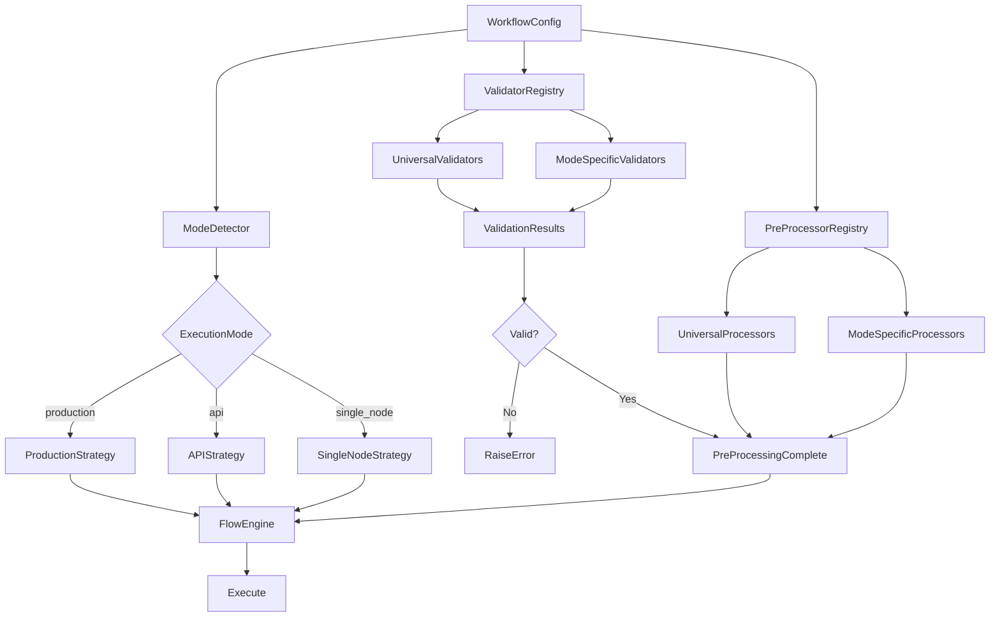

# Workflow Engine Refactoring Plan: Runtime-Adaptive Multi-Type Execution System

## Table of Contents

1. [Executive Summary](#executive-summary)
2. [Current State Analysis](#current-state-analysis)
3. [Target Architecture](#target-architecture)
4. [Implementation Phases](#implementation-phases)
5. [Detailed Task Breakdown](#detailed-task-breakdown)
6. [SOLID Violations Fixes](#solid-violations-fixes)
7. [Migration Strategy](#migration-strategy)
8. [Testing Strategy](#testing-strategy)
9. [Success Criteria](#success-criteria)
10. [Timeline & Resources](#timeline--resources)
11. [Risk Mitigation](#risk-mitigation)
12. [Appendix](#appendix)

---

## Executive Summary

### Goals

Transform the workflow engine from a hardcoded production-only system to a **runtime-adaptive, multi-type execution system** that:

1. **Automatically detects** execution mode from workflow configuration
2. **Supports multiple execution types**: Production (infinite loops), API (request-response), Single Node, and future modes
3. **Provides mode-specific validation and pre-processing** while maintaining universal validators/processors
4. **Fixes critical SOLID violations** that block extensibility
5. **Enables clean addition of new execution modes** without modifying core code

### Key Benefits

- **Runtime Adaptation**: Engine automatically adapts to workflow requirements
- **Zero Modification**: Add new execution modes without touching core code
- **Mode-Specific Logic**: Validation and pre-processing tailored to execution type
- **SOLID Compliant**: Clean architecture following all SOLID principles
- **Extensible**: Easy to add new modes, validators, and processors
- **Testable**: Each component independently testable

### Scope

**In Scope:**
- Execution mode detection system
- Execution strategy registry and implementations
- Validation system (universal + mode-specific)
- Pre-processing system (universal + mode-specific)
- FlowEngine refactoring
- Critical SOLID violations fixes
- Integration with existing workflow type system

**Out of Scope (Future):**
- Frontend implementation (separate plan)
- Database migrations (handled separately)
- Performance optimization (post-refactoring)
- Advanced features (batch mode, scheduled mode, etc.)

---

## Current State Analysis

### Architecture Overview

**Current Structure:**
```
FlowEngine (hardcoded to production)
├── FlowBuilder (builds graph)
├── PostProcessor (hardcoded list)
│   ├── QueueMapper
│   └── NodeValidator
├── FlowRunner (production loops only)
└── run_production() (hardcoded method)
```

**Key Problems:**
1. Hardcoded to production mode - cannot execute API or single node workflows
2. No abstraction for execution strategies - adding new modes requires modifying FlowEngine
3. Post-processors run on all workflows - no mode-specific logic
4. Type checking chains in FlowRunner - violates Open/Closed Principle
5. Direct instantiation in FlowEngine - violates Dependency Inversion Principle
6. Mixed responsibilities - violates Single Responsibility Principle

### SOLID Violations Summary

| Principle | Violations | Impact | Priority |
|-----------|-----------|--------|----------|
| **OCP** | FlowRunner type checking, PoolExecutor if-elif, PostProcessor hardcoded list | Blocks extensibility | High |
| **DIP** | FlowEngine direct instantiation, ServiceContainer internal creation | Hard to test, inflexible | High |
| **SRP** | BaseNode multiple responsibilities, FlowEngine orchestration+implementation | Hard to maintain | High |
| **LSP** | cleanup() signature mismatch, __init__ parameter inconsistency | Runtime errors | Medium |
| **ISP** | BaseForm forcing DependencyInjector, BaseNodeProperty requiring all metadata | Code bloat | Medium |

### Pain Points

1. **Cannot add new execution modes** without modifying FlowEngine
2. **No way to validate workflows differently** for different execution types
3. **No way to pre-process workflows differently** for different execution types
4. **Hard to test** due to direct instantiation and tight coupling
5. **Code duplication** in type checking logic
6. **Maintenance burden** from mixed responsibilities

---

## Target Architecture

### New Architecture Overview



### Design Principles

1. **Runtime Adaptation**: System detects and adapts to workflow requirements automatically
2. **Strategy Pattern**: Execution modes as pluggable strategies
3. **Registry Pattern**: Validators and processors registered dynamically
4. **Separation of Concerns**: Universal vs mode-specific logic clearly separated
5. **Dependency Injection**: All dependencies injected, no direct instantiation
6. **Open/Closed**: Open for extension, closed for modification

### Component Structure

```
backend/core/Workflow/
├── execution/
│   ├── modes/
│   │   ├── __init__.py
│   │   ├── detector.py          # Mode detection
│   │   └── registry.py          # Mode registry (optional)
│   ├── strategies/
│   │   ├── __init__.py
│   │   ├── base_strategy.py     # Abstract base
│   │   ├── registry.py          # Strategy registry
│   │   ├── production_strategy.py
│   │   ├── api_strategy.py
│   │   └── single_node_strategy.py
│   ├── flow_runner.py           # (Refactored)
│   └── pool_executor.py         # (Refactored)
├── validation/
│   ├── __init__.py
│   ├── base_validator.py
│   ├── registry.py
│   ├── universal/
│   │   ├── __init__.py
│   │   └── node_readiness_validator.py
│   └── mode_specific/
│       ├── __init__.py
│       ├── production_validator.py
│       ├── api_validator.py
│       └── single_node_validator.py
├── preprocessing/
│   ├── __init__.py
│   ├── base_processor.py
│   ├── registry.py
│   ├── universal/
│   │   ├── __init__.py
│   │   └── queue_mapper.py      # (Migrated from PostProcessing)
│   └── mode_specific/
│       ├── __init__.py
│       ├── production_processor.py
│       └── api_processor.py
└── flow_engine.py                # (Refactored)
```

---

## Implementation Phases

### Phase 1: Execution Mode Detection System

**Goal**: Create system to automatically detect execution mode from workflow configuration

**Key Components**:
- `ExecutionMode` enum (PRODUCTION, API, SINGLE_NODE)
- `ExecutionModeDetector` class with detection logic

**Detection Priority**:
1. Explicit `workflow_type` field in config
2. Structure analysis (has ProducerNode = production)
3. Node count (single node = single_node mode)
4. Default to API mode

**Files to Create**:
- `backend/core/Workflow/execution/modes/__init__.py`
- `backend/core/Workflow/execution/modes/detector.py`

**Estimated Time**: 4 hours

---

### Phase 2: Execution Strategy System

**Goal**: Create pluggable execution strategies for different modes

**Key Components**:
- `ExecutionStrategy` abstract base class
- `ExecutionStrategyRegistry` for strategy management
- `ProductionStrategy` (migrate from FlowEngine.run_production())
- `APIStrategy` (new - request-response execution)
- `SingleNodeStrategy` (new - single node execution)

**Files to Create**:
- `backend/core/Workflow/execution/strategies/__init__.py`
- `backend/core/Workflow/execution/strategies/base_strategy.py`
- `backend/core/Workflow/execution/strategies/registry.py`
- `backend/core/Workflow/execution/strategies/production_strategy.py`
- `backend/core/Workflow/execution/strategies/api_strategy.py`
- `backend/core/Workflow/execution/strategies/single_node_strategy.py`

**Estimated Time**: 11 hours

**Dependencies**: Phase 1

---

### Phase 3: Validation System

**Goal**: Create universal + mode-specific validation system

**Key Components**:
- `WorkflowValidator` abstract base class
- `WorkflowValidatorRegistry` for validator management
- Universal validators (run on all workflows)
- Mode-specific validators (run only for their modes)

**Files to Create**:
- `backend/core/Workflow/validation/__init__.py`
- `backend/core/Workflow/validation/base_validator.py`
- `backend/core/Workflow/validation/registry.py`
- `backend/core/Workflow/validation/universal/node_readiness_validator.py`
- `backend/core/Workflow/validation/mode_specific/production_validator.py`
- `backend/core/Workflow/validation/mode_specific/api_validator.py`
- `backend/core/Workflow/validation/mode_specific/single_node_validator.py`

**Estimated Time**: 9 hours

**Dependencies**: Phase 1

---

### Phase 4: Pre-Processing System

**Goal**: Create universal + mode-specific pre-processing system

**Key Components**:
- `WorkflowPreProcessor` abstract base class
- `WorkflowPreProcessorRegistry` for processor management
- Universal processors (run on all workflows)
- Mode-specific processors (run only for their modes)

**Files to Create**:
- `backend/core/Workflow/preprocessing/__init__.py`
- `backend/core/Workflow/preprocessing/base_processor.py`
- `backend/core/Workflow/preprocessing/registry.py`
- `backend/core/Workflow/preprocessing/universal/queue_mapper.py` (migrate from PostProcessing)
- `backend/core/Workflow/preprocessing/mode_specific/production_processor.py`
- `backend/core/Workflow/preprocessing/mode_specific/api_processor.py`

**Estimated Time**: 8 hours

**Dependencies**: Phase 1

---

### Phase 5: SOLID Violations Fixes

**Goal**: Fix critical SOLID violations blocking extensibility

**Key Fixes**:
1. FlowRunner type checking (OCP) - Use polymorphism instead of isinstance()
2. FlowEngine dependency injection (DIP) - Inject all dependencies
3. WorkflowLoader extraction (SRP) - Separate loading logic
4. PoolExecutor strategy pattern (OCP) - Use strategy pattern instead of if-elif

**Files to Modify**:
- `backend/core/Node/Core/Node/Core/BaseNode.py`
- `backend/core/Workflow/execution/flow_runner.py`
- `backend/core/Workflow/flow_engine.py`
- `backend/core/Workflow/execution/pool_executor.py`

**Estimated Time**: 10 hours

**Dependencies**: None (can be done in parallel)

---

### Phase 6: Integration & Testing

**Goal**: Integrate all components and comprehensive testing

**Key Tasks**:
1. Refactor FlowEngine to use new systems
2. Update FlowEngineService for different execution modes
3. Create comprehensive test suite
4. Update documentation

**Files to Modify**:
- `backend/core/Workflow/flow_engine.py`
- `backend/apps/workflow/services/flow_engine_service.py`

**Estimated Time**: 19 hours

**Dependencies**: Phases 1-5

---

## Detailed Task Breakdown

### Phase 1: Execution Mode Detection System

#### Task 1.1: Create Execution Mode Enum
**File**: `backend/core/Workflow/execution/modes/__init__.py`

**Subtasks**:
- [ ] Create `ExecutionMode` enum with values: PRODUCTION, API, SINGLE_NODE
- [ ] Add docstrings explaining each mode
- [ ] Export enum for use in other modules

**Estimated Time**: 30 minutes

#### Task 1.2: Create Mode Detector
**File**: `backend/core/Workflow/execution/modes/detector.py`

**Subtasks**:
- [ ] Create `ExecutionModeDetector` class
- [ ] Implement `detect(workflow_config)` static method with detection logic:
  - [ ] Priority 1: Check explicit `workflow_type` field
  - [ ] Priority 2: Analyze structure (has ProducerNode = production)
  - [ ] Priority 3: Node count (single node = single_node mode)
  - [ ] Priority 4: Default to API mode
- [ ] Implement `validate_mode(workflow_config, mode)` static method
- [ ] Add comprehensive logging
- [ ] Add error handling
- [ ] Create unit tests

**Estimated Time**: 2 hours

#### Task 1.3: Create Mode Registry (Optional)
**File**: `backend/core/Workflow/execution/modes/registry.py`

**Subtasks**:
- [ ] Create registry for mode metadata (if needed for future extensibility)
- [ ] Add mode registration support

**Estimated Time**: 1 hour

**Total Phase 1 Time**: ~4 hours

---

### Phase 2: Execution Strategy System

#### Task 2.1: Create Base Strategy Interface
**File**: `backend/core/Workflow/execution/strategies/base_strategy.py`

**Subtasks**:
- [ ] Create `ExecutionStrategy` ABC
- [ ] Define abstract methods:
  - [ ] `execute(**kwargs) -> Any`
  - [ ] `prepare(workflow_config: Dict) -> None`
  - [ ] `shutdown(force: bool) -> None`
  - [ ] `validate(workflow_config: Dict) -> List[str]`
- [ ] Add constructor accepting: `workflow_id`, `flow_graph`, `events`
- [ ] Add comprehensive docstrings

**Estimated Time**: 1 hour

#### Task 2.2: Create Strategy Registry
**File**: `backend/core/Workflow/execution/strategies/registry.py`

**Subtasks**:
- [ ] Create `ExecutionStrategyRegistry` class
- [ ] Implement `register(mode, strategy_class)` class method
- [ ] Implement `get(mode)` class method
- [ ] Implement `create(mode, workflow_id, flow_graph, events)` factory method
- [ ] Implement `get_available_modes()` class method
- [ ] Add error handling for unregistered modes
- [ ] Create unit tests

**Estimated Time**: 1.5 hours

#### Task 2.3: Implement Production Strategy
**File**: `backend/core/Workflow/execution/strategies/production_strategy.py`

**Subtasks**:
- [ ] Create `ProductionStrategy` class inheriting from `ExecutionStrategy`
- [ ] Migrate logic from `FlowEngine.run_production()`:
  - [ ] FlowRunner creation
  - [ ] State tracker initialization
  - [ ] Event wiring
  - [ ] Task management
- [ ] Implement `validate()`: Check for ProducerNodes
- [ ] Implement `prepare()`: Create FlowRunners for each ProducerNode
- [ ] Implement `execute()`: Run production loops continuously
- [ ] Implement `shutdown()`: Cleanup runners and tasks
- [ ] Add comprehensive logging
- [ ] Create unit tests

**Estimated Time**: 3 hours

#### Task 2.4: Implement API Strategy
**File**: `backend/core/Workflow/execution/strategies/api_strategy.py`

**Subtasks**:
- [ ] Create `APIStrategy` class inheriting from `ExecutionStrategy`
- [ ] Implement `validate()`: Check no ProducerNodes, has entry point
- [ ] Implement `prepare()`: Find entry node, create executor
- [ ] Implement `execute(input_data)`: Single execution from entry node
- [ ] Implement `_execute_from_node()`: Recursive execution helper
- [ ] Handle NonBlockingNode stopping recursion
- [ ] Return structured result dict with success/error/output
- [ ] Add comprehensive logging
- [ ] Create unit tests

**Estimated Time**: 3 hours

#### Task 2.5: Implement Single Node Strategy
**File**: `backend/core/Workflow/execution/strategies/single_node_strategy.py`

**Subtasks**:
- [ ] Create `SingleNodeStrategy` class inheriting from `ExecutionStrategy`
- [ ] Implement `validate()`: Check exactly one node
- [ ] Implement `prepare()`: Find single node
- [ ] Implement `execute(input_data)`: Execute single node
- [ ] Return structured result dict
- [ ] Add comprehensive logging
- [ ] Create unit tests

**Estimated Time**: 2 hours

#### Task 2.6: Register All Strategies
**File**: `backend/core/Workflow/execution/strategies/__init__.py`

**Subtasks**:
- [ ] Import all strategy classes
- [ ] Import ExecutionMode
- [ ] Register ProductionStrategy for PRODUCTION mode
- [ ] Register APIStrategy for API mode
- [ ] Register SingleNodeStrategy for SINGLE_NODE mode
- [ ] Add registration logging

**Estimated Time**: 30 minutes

**Total Phase 2 Time**: ~11 hours

---

### Phase 3: Validation System

#### Task 3.1: Create Base Validator Interface
**File**: `backend/core/Workflow/validation/base_validator.py`

**Subtasks**:
- [ ] Create `WorkflowValidator` ABC
- [ ] Define abstract methods:
  - [ ] `validate(workflow_config: Dict) -> List[str]`
  - [ ] `name` property
- [ ] Add constructor accepting `flow_graph`
- [ ] Add comprehensive docstrings

**Estimated Time**: 30 minutes

#### Task 3.2: Create Validator Registry
**File**: `backend/core/Workflow/validation/registry.py`

**Subtasks**:
- [ ] Create `WorkflowValidatorRegistry` class
- [ ] Implement `register_universal(validator_class, priority)` class method
- [ ] Implement `register_for_mode(mode, validator_class, priority)` class method
- [ ] Implement `get_validators(mode)` class method (returns universal + mode-specific)
- [ ] Implement `validate_workflow(flow_graph, workflow_config, mode)` class method
- [ ] Add priority-based sorting
- [ ] Add comprehensive error collection
- [ ] Create unit tests

**Estimated Time**: 2 hours

#### Task 3.3: Create Universal Validators
**File**: `backend/core/Workflow/validation/universal/node_readiness_validator.py`

**Subtasks**:
- [ ] Create `NodeReadinessValidator` class
- [ ] Migrate logic from `NodeValidator` in PostProcessing:
  - [ ] Validate all nodes are ready
  - [ ] Collect form errors
  - [ ] Return error list
- [ ] Add comprehensive logging
- [ ] Create unit tests

**Estimated Time**: 2 hours

#### Task 3.4: Create Mode-Specific Validators
**Files**: 
- `backend/core/Workflow/validation/mode_specific/production_validator.py`
- `backend/core/Workflow/validation/mode_specific/api_validator.py`
- `backend/core/Workflow/validation/mode_specific/single_node_validator.py`

**Subtasks**:
- [ ] Create `ProductionValidator`:
  - [ ] Validate has ProducerNodes
  - [ ] Validate no API-specific nodes (Terminal, Response)
  - [ ] Return error list
- [ ] Create `APIValidator`:
  - [ ] Validate no ProducerNodes
  - [ ] Validate has entry point
  - [ ] Optional: Warn if no terminal node
  - [ ] Return error list
- [ ] Create `SingleNodeValidator`:
  - [ ] Validate exactly one node
  - [ ] Return error list
- [ ] Add comprehensive logging for each
- [ ] Create unit tests for each

**Estimated Time**: 4 hours

#### Task 3.5: Register All Validators
**File**: `backend/core/Workflow/validation/__init__.py`

**Subtasks**:
- [ ] Import all validator classes
- [ ] Import ExecutionMode
- [ ] Register NodeReadinessValidator as universal (priority=10)
- [ ] Register ProductionValidator for PRODUCTION mode (priority=20)
- [ ] Register APIValidator for API mode (priority=20)
- [ ] Register SingleNodeValidator for SINGLE_NODE mode (priority=20)
- [ ] Add registration logging

**Estimated Time**: 30 minutes

**Total Phase 3 Time**: ~9 hours

---

### Phase 4: Pre-Processing System

#### Task 4.1: Create Base Processor Interface
**File**: `backend/core/Workflow/preprocessing/base_processor.py`

**Subtasks**:
- [ ] Create `WorkflowPreProcessor` ABC
- [ ] Define abstract methods:
  - [ ] `process(workflow_config: Dict) -> None`
  - [ ] `name` property
- [ ] Add constructor accepting `flow_graph`
- [ ] Add comprehensive docstrings

**Estimated Time**: 30 minutes

#### Task 4.2: Create Pre-Processor Registry
**File**: `backend/core/Workflow/preprocessing/registry.py`

**Subtasks**:
- [ ] Create `WorkflowPreProcessorRegistry` class
- [ ] Implement `register_universal(processor_class, priority)` class method
- [ ] Implement `register_for_mode(mode, processor_class, priority)` class method
- [ ] Implement `get_processors(mode)` class method (returns universal + mode-specific)
- [ ] Implement `process_workflow(flow_graph, workflow_config, mode)` class method
- [ ] Add priority-based sorting
- [ ] Add comprehensive logging
- [ ] Create unit tests

**Estimated Time**: 2 hours

#### Task 4.3: Migrate QueueMapper to Universal Processor
**File**: `backend/core/Workflow/preprocessing/universal/queue_mapper.py`

**Subtasks**:
- [ ] Copy `QueueMapper` from `PostProcessing/queue_mapper.py`
- [ ] Update to inherit from `WorkflowPreProcessor`
- [ ] Keep all existing logic (queue mapping, assignment)
- [ ] Update imports
- [ ] Add comprehensive logging
- [ ] Create unit tests

**Estimated Time**: 2 hours

#### Task 4.4: Create Mode-Specific Processors
**Files**:
- `backend/core/Workflow/preprocessing/mode_specific/production_processor.py`
- `backend/core/Workflow/preprocessing/mode_specific/api_processor.py`

**Subtasks**:
- [ ] Create `ProductionPreProcessor`:
  - [ ] Set up production-specific configurations
  - [ ] Initialize loop counters if needed
  - [ ] Add production metadata
- [ ] Create `APIPreProcessor`:
  - [ ] Set up API-specific configurations
  - [ ] Mark entry points
  - [ ] Set up response handling if needed
- [ ] Add comprehensive logging for each
- [ ] Create unit tests for each

**Estimated Time**: 3 hours

#### Task 4.5: Register All Processors
**File**: `backend/core/Workflow/preprocessing/__init__.py`

**Subtasks**:
- [ ] Import all processor classes
- [ ] Import ExecutionMode
- [ ] Register QueueMapper as universal (priority=10)
- [ ] Register ProductionPreProcessor for PRODUCTION mode (priority=20)
- [ ] Register APIPreProcessor for API mode (priority=20)
- [ ] Add registration logging

**Estimated Time**: 30 minutes

**Total Phase 4 Time**: ~8 hours

---

### Phase 5: SOLID Violations Fixes

#### Task 5.1: Fix FlowRunner Type Checking (OCP)
**Files to Modify**:
- `backend/core/Node/Core/Node/Core/BaseNode.py`
- `backend/core/Workflow/execution/flow_runner.py`

**Subtasks**:
- [ ] Add `get_branch_keys(input_data, available_branches) -> Set[str]` method to `BaseNode`:
  - [ ] Default implementation returns `{"default"}` or all branches for ExecutionCompleted
- [ ] Add `should_continue_after_execution() -> bool` method to `BaseNode`:
  - [ ] Default returns `True`
- [ ] Override `get_branch_keys()` in `ConditionalNode`:
  - [ ] Return `{self.output}` if set, else empty set
- [ ] Override `should_continue_after_execution()` in `NonBlockingNode`:
  - [ ] Return `False`
- [ ] Refactor `FlowRunner._process_next_nodes()`:
  - [ ] Remove `isinstance()` checks
  - [ ] Use `instance.get_branch_keys()` instead
  - [ ] Use `instance.should_continue_after_execution()` instead
- [ ] Add unit tests
- [ ] Update documentation

**Estimated Time**: 3 hours

#### Task 5.2: Fix FlowEngine Dependency Injection (DIP)
**File**: `backend/core/Workflow/flow_engine.py`

**Subtasks**:
- [ ] Update `FlowEngine.__init__()`:
  - [ ] Add optional parameters for dependencies:
    - [ ] `data_store: Optional[IDataStore] = None`
    - [ ] `flow_graph: Optional[IFlowGraph] = None`
    - [ ] `execution_strategy: Optional[ExecutionStrategy] = None`
    - [ ] `event_emitter: Optional[IEventEmitter] = None`
  - [ ] Use injected dependencies or create defaults
- [ ] Create protocol interfaces (if needed):
  - [ ] `IDataStore`
  - [ ] `IFlowGraph`
  - [ ] `IEventEmitter`
- [ ] Update all callers to use new constructor
- [ ] Add unit tests with mocked dependencies
- [ ] Update documentation

**Estimated Time**: 2 hours

#### Task 5.3: Extract WorkflowLoader (SRP)
**File**: `backend/core/Workflow/workflow_loader.py` (new)

**Subtasks**:
- [ ] Create `WorkflowLoader` class:
  - [ ] Move workflow loading logic from `FlowEngine`
  - [ ] Accept `flow_builder`, `flow_analyzer`, `post_processors`
  - [ ] Implement `load(workflow_json, flow_graph)` method
  - [ ] Return producer nodes list
- [ ] Update `FlowEngine.load_workflow()`:
  - [ ] Use `WorkflowLoader` instead of direct logic
- [ ] Add unit tests
- [ ] Update documentation

**Estimated Time**: 2 hours

#### Task 5.4: Fix PoolExecutor Strategy Pattern (OCP)
**File**: `backend/core/Workflow/execution/pool_executor.py`

**Subtasks**:
- [ ] Create `PoolExecutorStrategy` ABC
- [ ] Create `AsyncPoolExecutor`, `ThreadPoolExecutor`, `ProcessPoolExecutor` strategies
- [ ] Update `PoolExecutor` to use strategy registry
- [ ] Remove if-elif chain
- [ ] Add unit tests
- [ ] Update documentation

**Estimated Time**: 3 hours

**Total Phase 5 Time**: ~10 hours

---

### Phase 6: Integration & Testing

#### Task 6.1: Refactor FlowEngine for Runtime Adaptation
**File**: `backend/core/Workflow/flow_engine.py`

**Subtasks**:
- [ ] Update `FlowEngine.__init__()`:
  - [ ] Accept `workflow_config` parameter
  - [ ] Call `_adapt_to_workflow()` if config provided
- [ ] Implement `_adapt_to_workflow()` method:
  - [ ] Detect execution mode using `ExecutionModeDetector`
  - [ ] Create execution strategy using `ExecutionStrategyRegistry`
  - [ ] Log adaptation
- [ ] Update `load_workflow()` method:
  - [ ] Build graph using `FlowBuilder`
  - [ ] Run validation (universal + mode-specific) using `WorkflowValidatorRegistry`
  - [ ] Run pre-processing (universal + mode-specific) using `WorkflowPreProcessorRegistry`
  - [ ] Create and prepare execution strategy
- [ ] Update `execute()` method:
  - [ ] Delegate to execution strategy
- [ ] Remove or refactor `run_production()` method (make it delegate to `execute()`)
- [ ] Add comprehensive logging
- [ ] Create unit tests

**Estimated Time**: 4 hours

#### Task 6.2: Update FlowEngineService
**File**: `backend/apps/workflow/services/flow_engine_service.py`

**Subtasks**:
- [ ] Update `run_workflow()` method:
  - [ ] Pass `workflow_config` to `FlowEngine` constructor
  - [ ] Handle different execution modes:
    - [ ] API mode: Execute with input_data, return result
    - [ ] Single node mode: Execute with input_data, return result
    - [ ] Production mode: Run continuously
  - [ ] Update error handling
- [ ] Add mode-specific logging
- [ ] Create unit tests

**Estimated Time**: 2 hours

#### Task 6.3: Integration Tests
**Files**: `backend/core/Workflow/tests/integration/`

**Subtasks**:
- [ ] Create integration test suite:
  - [ ] Test production workflow execution
  - [ ] Test API workflow execution
  - [ ] Test single node execution
  - [ ] Test mode detection
  - [ ] Test validation system
  - [ ] Test pre-processing system
- [ ] Test error cases:
  - [ ] Invalid workflow structure
  - [ ] Validation failures
  - [ ] Mode mismatch
- [ ] Test edge cases

**Estimated Time**: 6 hours

#### Task 6.4: End-to-End Tests
**Files**: `backend/core/Workflow/tests/e2e/`

**Subtasks**:
- [ ] Create E2E test suite:
  - [ ] Full production workflow execution
  - [ ] Full API workflow execution
  - [ ] Full single node execution
- [ ] Test with real workflows
- [ ] Test with different node types
- [ ] Test error scenarios

**Estimated Time**: 4 hours

#### Task 6.5: Update Documentation
**Files**: 
- `backend/docs/02-Workflow-Engine.md`
- `backend/docs/03-Execution-System.md`
- `backend/docs/08-Post-Processing.md` (update to validation/preprocessing)

**Subtasks**:
- [ ] Update architecture documentation
- [ ] Update execution system documentation
- [ ] Add examples for each execution mode
- [ ] Document validation system
- [ ] Document pre-processing system
- [ ] Update API documentation

**Estimated Time**: 3 hours

**Total Phase 6 Time**: ~19 hours

---

## SOLID Violations Fixes

### Critical Fixes (Phase 5)

#### 1. FlowRunner Type Checking (OCP Violation)

**Current Problem**: `FlowRunner._process_next_nodes()` uses `isinstance()` checks for ConditionalNode and NonBlockingNode

**Solution**: Use polymorphism - add methods to BaseNode that subclasses override

**Changes**:
- Add `get_branch_keys()` to `BaseNode` with default implementation
- Add `should_continue_after_execution()` to `BaseNode` with default implementation
- Override in `ConditionalNode` and `NonBlockingNode`
- Refactor `FlowRunner` to use these methods instead of `isinstance()`

**Files**:
- `backend/core/Node/Core/Node/Core/BaseNode.py`
- `backend/core/Workflow/execution/flow_runner.py`

#### 2. FlowEngine Dependency Injection (DIP Violation)

**Current Problem**: `FlowEngine` directly instantiates all dependencies

**Solution**: Accept dependencies via constructor with defaults

**Changes**:
- Update `FlowEngine.__init__()` to accept optional dependencies
- Use injected dependencies or create defaults
- Create protocol interfaces for key dependencies

**Files**:
- `backend/core/Workflow/flow_engine.py`

#### 3. WorkflowLoader Extraction (SRP Violation)

**Current Problem**: `FlowEngine` mixes workflow loading with execution orchestration

**Solution**: Extract loading logic to separate `WorkflowLoader` class

**Changes**:
- Create `WorkflowLoader` class
- Move loading logic from `FlowEngine`
- Update `FlowEngine` to use loader

**Files**:
- `backend/core/Workflow/workflow_loader.py` (new)
- `backend/core/Workflow/flow_engine.py`

#### 4. PoolExecutor Strategy Pattern (OCP Violation)

**Current Problem**: `PoolExecutor.execute_in_pool()` uses if-elif chain for pool types

**Solution**: Use strategy pattern with registry

**Changes**:
- Create `PoolExecutorStrategy` ABC
- Create strategy classes for each pool type
- Update `PoolExecutor` to use strategy registry

**Files**:
- `backend/core/Workflow/execution/pool_executor.py`

### Additional Fixes (Future Phases)

These can be addressed in future refactoring cycles:

5. **BaseNode Responsibilities (SRP)**: Extract form management, validation, template rendering
6. **NodeExecutor Responsibilities (SRP)**: Extract session management, timeout handling
7. **ServiceContainer (DIP)**: Use factory pattern
8. **BaseForm ISP**: Separate dependency injection from base form

---

## Migration Strategy

### Step 1: Create New Components (Non-Breaking)
**Duration**: Phases 1-4

- Create all new directories and files
- Implement new systems alongside old code
- Register strategies, validators, processors
- **No changes to existing code yet**
- **Status**: Non-breaking, can be done incrementally

### Step 2: Update FlowEngine (Breaking)
**Duration**: Phase 6, Task 6.1

- Refactor `FlowEngine` to use new systems
- Remove old `run_production()` logic (or make it delegate)
- Update `load_workflow()` to use validation/pre-processing
- **This breaks existing code temporarily**
- **Mitigation**: Comprehensive testing before deployment

### Step 3: Update Services (Breaking)
**Duration**: Phase 6, Task 6.2

- Update `FlowEngineService` to use new FlowEngine
- Update workflow execution tasks
- **This breaks existing workflows temporarily**
- **Mitigation**: Deploy during low-traffic period, have rollback plan

### Step 4: Testing & Validation
**Duration**: Phase 6, Tasks 6.3-6.4

- Run comprehensive test suite
- Test with existing workflows
- Fix any issues
- **Stabilize system**

### Step 5: Cleanup
**Duration**: Post-deployment

- Remove old PostProcessing code (after migration complete)
- Remove deprecated methods
- Update all documentation
- **Final cleanup**

### Rollback Plan

If issues arise:
1. Revert `FlowEngine` changes
2. Revert `FlowEngineService` changes
3. Keep new components (they're not used yet)
4. Fix issues and redeploy

---

## Testing Strategy

### Unit Tests

**Coverage Target**: 90%+

**Focus Areas**:
- Mode detection logic
- Strategy execution
- Validation rules
- Pre-processing logic
- SOLID fixes

**Test Files**:
- `backend/core/Workflow/execution/modes/test_detector.py`
- `backend/core/Workflow/execution/strategies/test_*.py`
- `backend/core/Workflow/validation/test_*.py`
- `backend/core/Workflow/preprocessing/test_*.py`

### Integration Tests

**Test Scenarios**:
- Full workflow execution for each mode
- Validation system integration
- Pre-processing system integration
- Error handling
- Mode detection accuracy

**Test Files**:
- `backend/core/Workflow/tests/integration/test_production_execution.py`
- `backend/core/Workflow/tests/integration/test_api_execution.py`
- `backend/core/Workflow/tests/integration/test_single_node_execution.py`
- `backend/core/Workflow/tests/integration/test_validation.py`
- `backend/core/Workflow/tests/integration/test_preprocessing.py`

### End-to-End Tests

**Test Scenarios**:
- Real workflow execution
- Different node types
- Error scenarios
- Performance benchmarks

**Test Files**:
- `backend/core/Workflow/tests/e2e/test_production_workflow.py`
- `backend/core/Workflow/tests/e2e/test_api_workflow.py`
- `backend/core/Workflow/tests/e2e/test_single_node_workflow.py`

### Test Execution Order

1. Unit tests (fast, run on every commit)
2. Integration tests (medium, run before merge)
3. E2E tests (slow, run before release)

---

## Success Criteria

### Functional Requirements

- [ ] System detects execution mode automatically from workflow config
- [ ] Production workflows execute correctly (infinite loops)
- [ ] API workflows execute correctly (request-response, single execution)
- [ ] Single node execution works
- [ ] Validation system works (universal + mode-specific)
- [ ] Pre-processing system works (universal + mode-specific)
- [ ] New execution modes can be added without modifying core code
- [ ] Node compatibility checking works (from request-response plan)

### Non-Functional Requirements

- [ ] All critical SOLID violations fixed
- [ ] 90%+ test coverage
- [ ] No performance regression (benchmark before/after)
- [ ] Comprehensive documentation
- [ ] Code review passed
- [ ] All tests passing

### Quality Metrics

- [ ] Code review passed
- [ ] All tests passing (unit, integration, E2E)
- [ ] No critical bugs
- [ ] Documentation complete
- [ ] Performance benchmarks met

---

## Timeline & Resources

### Phase Timeline

| Phase | Tasks | Estimated Time | Dependencies | Can Parallel? |
|-------|-------|----------------|--------------|---------------|
| Phase 1 | 3 tasks | 4 hours | None | Yes |
| Phase 2 | 6 tasks | 11 hours | Phase 1 | No |
| Phase 3 | 5 tasks | 9 hours | Phase 1 | Yes (with Phase 2) |
| Phase 4 | 5 tasks | 8 hours | Phase 1 | Yes (with Phase 2, 3) |
| Phase 5 | 4 tasks | 10 hours | None | Yes (with all) |
| Phase 6 | 5 tasks | 19 hours | Phases 1-5 | No |
| **Total** | **28 tasks** | **~61 hours** | | |

**With 20% buffer**: ~73 hours (~9 working days)

### Resource Allocation

**Recommended Team Structure**:
- 1 Senior Developer: Phases 1-2 (core architecture)
- 1 Mid-level Developer: Phases 3-4 (validation/preprocessing)
- 1 Developer: Phase 5 (SOLID fixes, can be parallel)
- All team: Phase 6 (integration & testing)

**Timeline with Team**:
- Week 1: Phases 1-2 (core architecture)
- Week 2: Phases 3-4 (validation/preprocessing) + Phase 5 (parallel)
- Week 3: Phase 6 (integration & testing)

---

## Risk Mitigation

### Risk 1: Breaking Existing Workflows

**Probability**: Medium  
**Impact**: High

**Mitigation**:
- Comprehensive testing before deployment
- Gradual rollout (test with subset of workflows first)
- Rollback plan ready
- Monitor closely after deployment

### Risk 2: Performance Regression

**Probability**: Low  
**Impact**: Medium

**Mitigation**:
- Performance benchmarks before/after
- Profiling during development
- Optimization if needed
- Load testing

### Risk 3: Integration Issues

**Probability**: Medium  
**Impact**: Medium

**Mitigation**:
- Early integration testing
- Incremental integration
- Continuous testing
- Code reviews

### Risk 4: Mode Detection Accuracy

**Probability**: Low  
**Impact**: High

**Mitigation**:
- Comprehensive test cases for detection logic
- Explicit mode field takes priority
- Fallback to structure analysis
- Logging for debugging

### Risk 5: SOLID Fixes Breaking Existing Code

**Probability**: Medium  
**Impact**: Medium

**Mitigation**:
- Fix one violation at a time
- Comprehensive tests for each fix
- Update callers incrementally
- Code reviews

---

## Appendix

### A. Code Examples

#### Example 1: Adding a New Execution Mode

```python
# 1. Add to ExecutionMode enum
class ExecutionMode(Enum):
    PRODUCTION = "production"
    API = "api"
    SINGLE_NODE = "single_node"
    BATCH = "batch"  # NEW

# 2. Create strategy
class BatchStrategy(ExecutionStrategy):
    async def execute(self, batch_data: List[Dict]) -> List[Dict]:
        results = []
        for item in batch_data:
            result = await self._execute_single(item)
            results.append(result)
        return results

# 3. Register strategy
ExecutionStrategyRegistry.register(ExecutionMode.BATCH, BatchStrategy)

# That's it! No changes to FlowEngine needed.
```

#### Example 2: Adding a Custom Validator

```python
# Create validator
class NodeCompatibilityValidator(WorkflowValidator):
    @property
    def name(self) -> str:
        return "NodeCompatibility"
    
    def validate(self, workflow_config: Dict) -> List[str]:
        errors = []
        mode = workflow_config.get('workflow_type', 'production')
        # Validation logic...
        return errors

# Register as universal (runs on all workflows)
WorkflowValidatorRegistry.register_universal(
    NodeCompatibilityValidator, 
    priority=15
)
```

#### Example 3: Adding a Mode-Specific Pre-Processor

```python
# Create processor
class APIResponseProcessor(WorkflowPreProcessor):
    @property
    def name(self) -> str:
        return "APIResponse"
    
    def process(self, workflow_config: Dict) -> None:
        # Set up API response handling
        pass

# Register for API mode only
WorkflowPreProcessorRegistry.register_for_mode(
    ExecutionMode.API,
    APIResponseProcessor,
    priority=30
)
```

### B. Architecture Diagrams

See "Target Architecture" section for main diagram.

### C. References

- [Dependency-Inversion-Violations.md](Dependency-Inversion-Violations.md)
- [Interface-Segregation-Principle-Violations.md](Interface-Segregation-Principle-Violations.md)
- [Liskov-Substitution-Principle-Violations.md](Liskov-Substitution-Principle-Violations.md)
- [Open-Closed-Principle-Violations.md](Open-Closed-Principle-Violations.md)
- [Single-Responsibility-Principle-Violations.md](Single-Responsibility-Principle-Violations.md)
- [Request-Response Workflow Plan](.cursor/plans/request-response_workflow_frontend_implementation_1bd79172.plan%20copy.md)

### D. Key Decisions

1. **No Backward Compatibility**: Clean break, no legacy code maintenance
2. **Runtime Adaptation**: System adapts automatically, no manual configuration
3. **Registry Pattern**: All components registered dynamically
4. **Priority-Based Execution**: Universal components run first, then mode-specific
5. **SOLID First**: Fix critical violations during refactoring

---

## Next Steps

1. **Review this plan** with the team
2. **Prioritize phases** based on business needs
3. **Assign tasks** to developers
4. **Set up tracking** (Jira, GitHub Issues, etc.)
5. **Begin Phase 1** implementation

---

**Document Version**: 1.0  
**Last Updated**: [Current Date]  
**Author**: Development Team  
**Status**: Ready for Review
